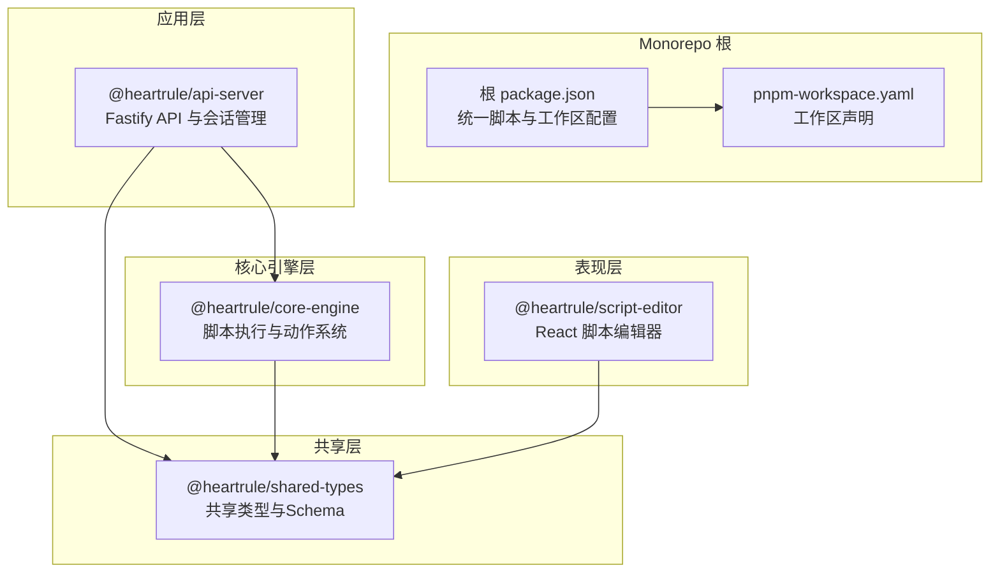
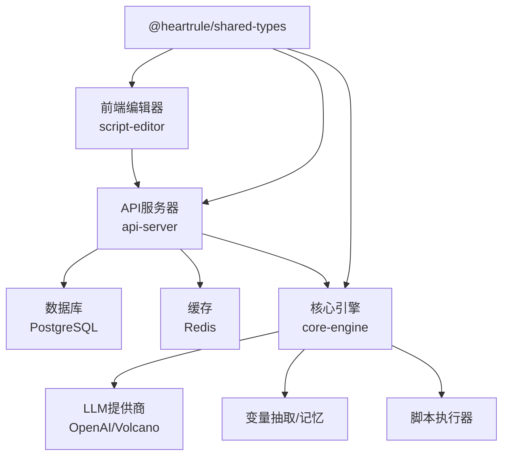
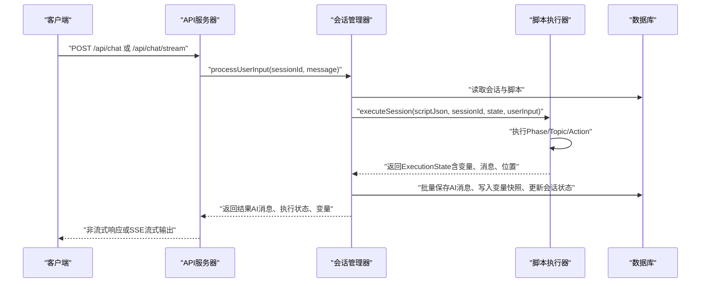
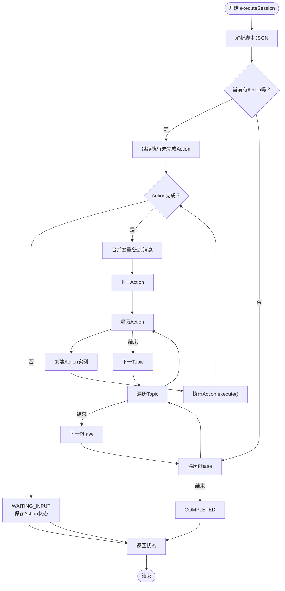
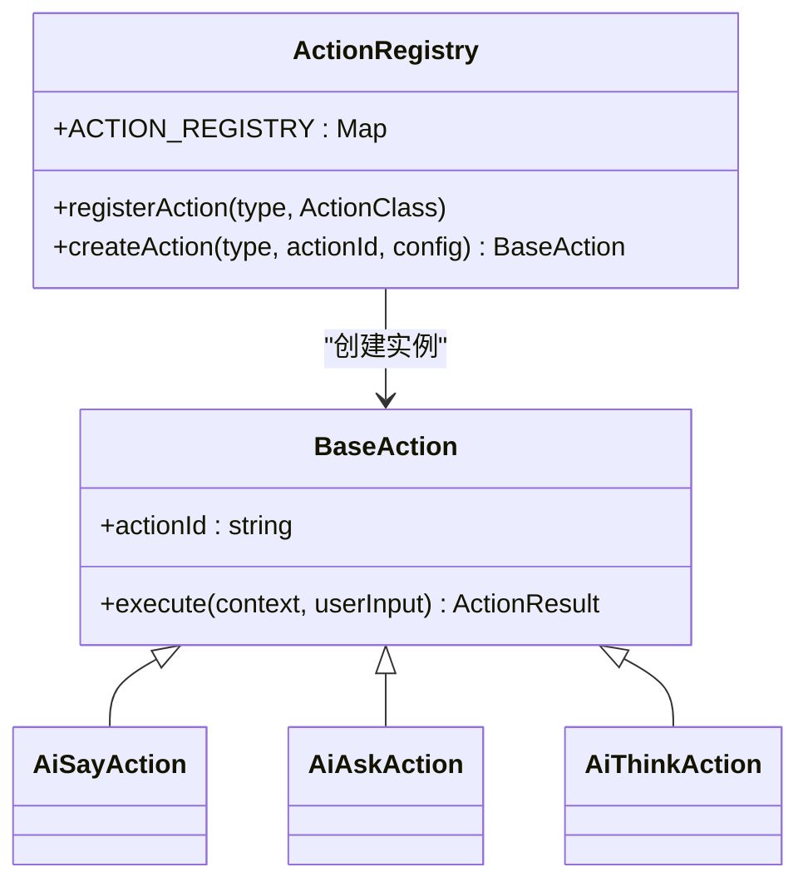
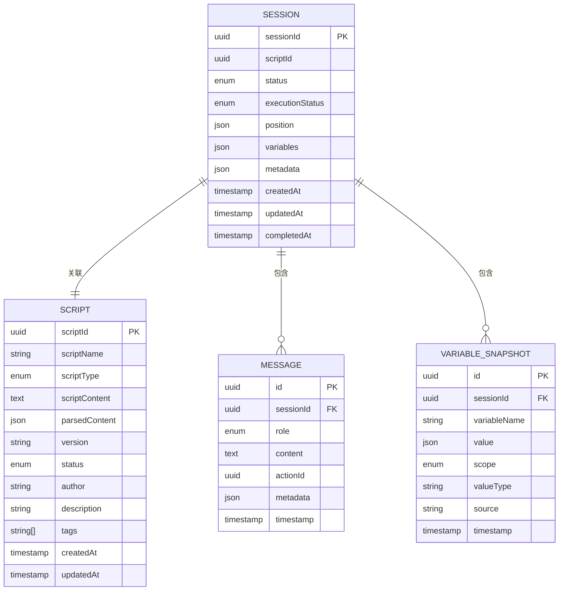
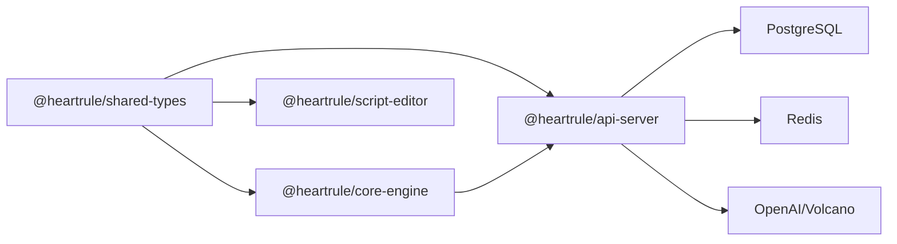

# 系统架构设计

<cite>
**本文引用的文件**
- [package.json](file://package.json)
- [pnpm-workspace.yaml](file://pnpm-workspace.yaml)
- [packages/shared-types/package.json](file://packages/shared-types/package.json)
- [packages/shared-types/src/index.ts](file://packages/shared-types/src/index.ts)
- [packages/shared-types/src/domain/session.ts](file://packages/shared-types/src/domain/session.ts)
- [packages/shared-types/src/domain/script.ts](file://packages/shared-types/src/domain/script.ts)
- [packages/core-engine/package.json](file://packages/core-engine/package.json)
- [packages/core-engine/src/index.ts](file://packages/core-engine/src/index.ts)
- [packages/core-engine/src/engines/script-execution/script-executor.ts](file://packages/core-engine/src/engines/script-execution/script-executor.ts)
- [packages/core-engine/src/engines/script-execution/index.ts](file://packages/core-engine/src/engines/script-execution/index.ts)
- [packages/core-engine/src/actions/action-registry.ts](file://packages/core-engine/src/actions/action-registry.ts)
- [packages/core-engine/src/domain/session.ts](file://packages/core-engine/src/domain/session.ts)
- [packages/core-engine/src/domain/script.ts](file://packages/core-engine/src/domain/script.ts)
- [packages/api-server/package.json](file://packages/api-server/package.json)
- [packages/api-server/src/app.ts](file://packages/api-server/src/app.ts)
- [packages/api-server/src/routes/chat.ts](file://packages/api-server/src/routes/chat.ts)
- [packages/api-server/src/services/session-manager.ts](file://packages/api-server/src/services/session-manager.ts)
- [packages/api-server/src/db/index.ts](file://packages/api-server/src/db/index.ts)
- [packages/api-server/src/utils/error-handler.ts](file://packages/api-server/src/utils/error-handler.ts)
- [packages/script-editor/package.json](file://packages/script-editor/package.json)
</cite>

## 目录
1. [引言](#引言)
2. [项目结构](#项目结构)
3. [核心组件](#核心组件)
4. [架构总览](#架构总览)
5. [详细组件分析](#详细组件分析)
6. [依赖分析](#依赖分析)
7. [性能考虑](#性能考虑)
8. [故障排查指南](#故障排查指南)
9. [结论](#结论)
10. [附录](#附录)

## 引言
本文件面向HeartRule AI咨询引擎的系统架构设计，围绕五层分层架构与Monorepo组织进行深入说明。系统采用表现层（前端脚本编辑器）、应用层（API服务器）、引擎层（核心脚本执行与动作系统）、脚本层（YAML脚本描述治疗流程）、基础设施层（数据库与缓存）协同工作，形成“无头”（headless）的六大引擎体系。本文将重点阐述：
- 五层架构的职责边界与协作方式
- Monorepo（shared-types、core-engine、api-server、script-editor）的组织与依赖关系
- 六大核心引擎的功能定位与交互流程
- 关键数据模型与状态流转
- 架构图、序列图与流程图，帮助开发者快速理解与落地

## 项目结构
系统采用pnpm workspaces的Monorepo组织，根目录通过脚本统一管理多包构建与开发，各包职责明确：
- shared-types：共享类型与Zod Schema，确保跨包一致的数据契约
- core-engine：核心脚本执行引擎与动作系统，提供headless能力
- api-server：Fastify后端服务，提供REST/WebSocket接口与会话管理
- script-editor：React前端编辑器，可视化维护YAML脚本与调试

**图表来源**
- [package.json](file://package.json#L1-L60)
- [pnpm-workspace.yaml](file://pnpm-workspace.yaml#L1-L3)
- [packages/api-server/package.json](file://packages/api-server/package.json#L1-L44)
- [packages/core-engine/package.json](file://packages/core-engine/package.json#L1-L34)
- [packages/shared-types/package.json](file://packages/shared-types/package.json#L1-L27)
- [packages/script-editor/package.json](file://packages/script-editor/package.json#L1-L33)

**章节来源**
- [package.json](file://package.json#L1-L60)
- [pnpm-workspace.yaml](file://pnpm-workspace.yaml#L1-L3)

## 核心组件
- 表现层（Script Editor）
  - 负责脚本可视化编辑、调试与导出，依赖shared-types保证前后端数据一致性
- 应用层（API Server）
  - 提供REST与WebSocket接口，集成会话管理与数据库操作，调用核心引擎执行脚本
- 引擎层（Core Engine）
  - headless六引擎实现（脚本执行、变量抽取、记忆、LLM编排等），通过动作系统扩展
- 脚本层（YAML）
  - 描述CBT治疗流程，由引擎解析并驱动对话与变量状态
- 基础设施层（DB/Redis）
  - PostgreSQL存储会话、消息、脚本与变量快照；Redis用于会话状态与缓存

**章节来源**
- [packages/script-editor/package.json](file://packages/script-editor/package.json#L1-L33)
- [packages/api-server/package.json](file://packages/api-server/package.json#L1-L44)
- [packages/core-engine/package.json](file://packages/core-engine/package.json#L1-L34)
- [packages/shared-types/package.json](file://packages/shared-types/package.json#L1-L27)

## 架构总览
系统以“脚本驱动”的无头引擎为核心，API Server作为应用入口，负责会话生命周期管理与持久化；前端编辑器负责脚本创作与调试；共享类型保障跨包一致性。

**图表来源**
- [packages/api-server/src/app.ts](file://packages/api-server/src/app.ts#L1-L135)
- [packages/api-server/src/services/session-manager.ts](file://packages/api-server/src/services/session-manager.ts#L1-L462)
- [packages/core-engine/src/engines/script-execution/script-executor.ts](file://packages/core-engine/src/engines/script-execution/script-executor.ts#L1-L511)
- [packages/shared-types/src/index.ts](file://packages/shared-types/src/index.ts#L1-L19)

## 详细组件分析

### 会话管理与脚本执行流程（API Server → Core Engine）
该流程展示API如何调用核心引擎执行脚本，并在数据库中持久化会话状态与消息。

**图表来源**
- [packages/api-server/src/routes/chat.ts](file://packages/api-server/src/routes/chat.ts#L1-L152)
- [packages/api-server/src/services/session-manager.ts](file://packages/api-server/src/services/session-manager.ts#L1-L462)
- [packages/core-engine/src/engines/script-execution/script-executor.ts](file://packages/core-engine/src/engines/script-execution/script-executor.ts#L1-L511)

**章节来源**
- [packages/api-server/src/routes/chat.ts](file://packages/api-server/src/routes/chat.ts#L1-L152)
- [packages/api-server/src/services/session-manager.ts](file://packages/api-server/src/services/session-manager.ts#L1-L462)
- [packages/core-engine/src/engines/script-execution/script-executor.ts](file://packages/core-engine/src/engines/script-execution/script-executor.ts#L1-L511)

### 脚本执行器状态机与动作调度
脚本执行器负责遍历Phase/Topic/Action，调度具体动作并处理等待输入、变量更新与消息记录。

**图表来源**
- [packages/core-engine/src/engines/script-execution/script-executor.ts](file://packages/core-engine/src/engines/script-execution/script-executor.ts#L1-L511)

**章节来源**
- [packages/core-engine/src/engines/script-execution/script-executor.ts](file://packages/core-engine/src/engines/script-execution/script-executor.ts#L1-L511)

### 动作系统与注册表
动作系统通过注册表根据action_type创建具体动作类，支持扩展新的动作类型。

**图表来源**
- [packages/core-engine/src/actions/action-registry.ts](file://packages/core-engine/src/actions/action-registry.ts#L1-L46)
- [packages/core-engine/src/engines/script-execution/script-executor.ts](file://packages/core-engine/src/engines/script-execution/script-executor.ts#L453-L468)

**章节来源**
- [packages/core-engine/src/actions/action-registry.ts](file://packages/core-engine/src/actions/action-registry.ts#L1-L46)

### 数据模型与状态
- 会话模型（Session）
  - 包含状态、执行状态、执行位置、变量与元数据
- 脚本模型（Script）
  - 包含脚本ID、名称、类型、内容、版本、状态与标签
- 执行状态（ExecutionState）
  - 记录当前执行位置、变量、对话历史、元数据与最后一条AI消息

**图表来源**
- [packages/core-engine/src/domain/session.ts](file://packages/core-engine/src/domain/session.ts#L1-L137)
- [packages/core-engine/src/domain/script.ts](file://packages/core-engine/src/domain/script.ts#L1-L95)
- [packages/shared-types/src/domain/session.ts](file://packages/shared-types/src/domain/session.ts#L1-L88)
- [packages/shared-types/src/domain/script.ts](file://packages/shared-types/src/domain/script.ts#L1-L64)

**章节来源**
- [packages/core-engine/src/domain/session.ts](file://packages/core-engine/src/domain/session.ts#L1-L137)
- [packages/core-engine/src/domain/script.ts](file://packages/core-engine/src/domain/script.ts#L1-L95)
- [packages/shared-types/src/domain/session.ts](file://packages/shared-types/src/domain/session.ts#L1-L88)
- [packages/shared-types/src/domain/script.ts](file://packages/shared-types/src/domain/script.ts#L1-L64)

## 依赖分析
- 包间依赖
  - api-server 依赖 @heartrule/core-engine 与 @heartrule/shared-types
  - core-engine 依赖 @heartrule/shared-types 与第三方库（如ai、openai SDK、js-yaml、uuid）
  - script-editor 依赖 @heartrule/shared-types 与前端生态
- 运行时依赖
  - API服务器使用Fastify、WebSocket、Swagger、Drizzle ORM、PostgreSQL、ioredis
  - 核心引擎使用Zod、js-yaml、uuid、ai SDK

**图表来源**
- [packages/api-server/package.json](file://packages/api-server/package.json#L1-L44)
- [packages/core-engine/package.json](file://packages/core-engine/package.json#L1-L34)
- [packages/shared-types/package.json](file://packages/shared-types/package.json#L1-L27)
- [packages/script-editor/package.json](file://packages/script-editor/package.json#L1-L33)

**章节来源**
- [packages/api-server/package.json](file://packages/api-server/package.json#L1-L44)
- [packages/core-engine/package.json](file://packages/core-engine/package.json#L1-L34)
- [packages/shared-types/package.json](file://packages/shared-types/package.json#L1-L27)
- [packages/script-editor/package.json](file://packages/script-editor/package.json#L1-L33)

## 性能考虑
- 会话状态持久化
  - 使用批处理插入AI消息与变量快照，减少事务开销
  - 仅在变量发生变化时写入快照，降低冗余
- 执行器状态恢复
  - 对未完成动作进行序列化/反序列化，避免重复计算
- SSE流式输出
  - 当前为模拟流式，建议接入真实LLM流式响应以提升用户体验
- 缓存策略
  - 利用Redis缓存会话元数据与常用脚本片段，降低数据库压力

[本节为通用性能建议，不直接分析具体文件]

## 故障排查指南
- 常见错误类型
  - 会话不存在：API在路由层校验并返回404
  - 脚本解析失败：执行器捕获异常并标记ERROR状态
  - 动作未知类型：注册表找不到对应类，抛出错误
- 错误处理
  - API层通过统一错误处理器生成详细错误信息，包含脚本、会话与位置信息
  - 会话管理器在初始化与处理用户输入过程中捕获异常并返回标准化错误对象

**章节来源**
- [packages/api-server/src/routes/chat.ts](file://packages/api-server/src/routes/chat.ts#L50-L78)
- [packages/api-server/src/services/session-manager.ts](file://packages/api-server/src/services/session-manager.ts#L235-L252)
- [packages/api-server/src/utils/error-handler.ts](file://packages/api-server/src/utils/error-handler.ts#L1-L200)

## 结论
HeartRule AI咨询引擎通过五层架构与Monorepo组织实现了高内聚、低耦合的系统设计。核心引擎以脚本为驱动，API层提供稳定的服务接口，前端编辑器保障脚本创作体验，共享类型确保跨包一致性。该架构具备良好的扩展性与可维护性，适合持续演进与规模化部署。

[本节为总结性内容，不直接分析具体文件]

## 附录
- 快速启动
  - 使用根脚本启动全部服务或单独启动API与编辑器
- 数据库迁移
  - 通过API服务器提供的脚本执行数据库迁移与Studio
- 开发指南
  - 参考docs目录下的开发与脚本编辑器文档，了解新增动作与脚本配置的最佳实践

**章节来源**
- [package.json](file://package.json#L13-L31)
- [packages/api-server/package.json](file://packages/api-server/package.json#L12-L16)