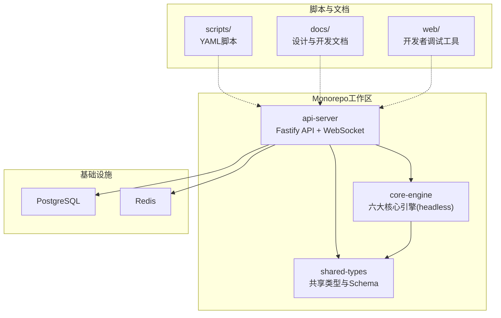
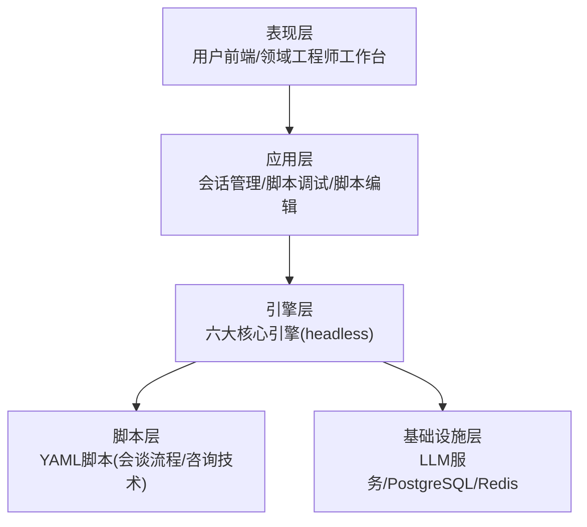
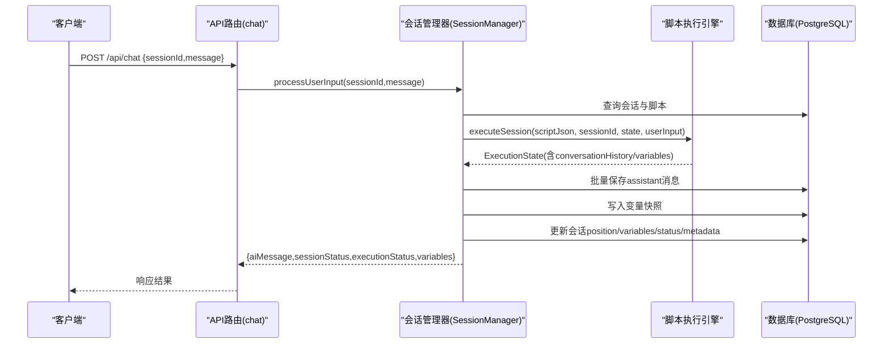
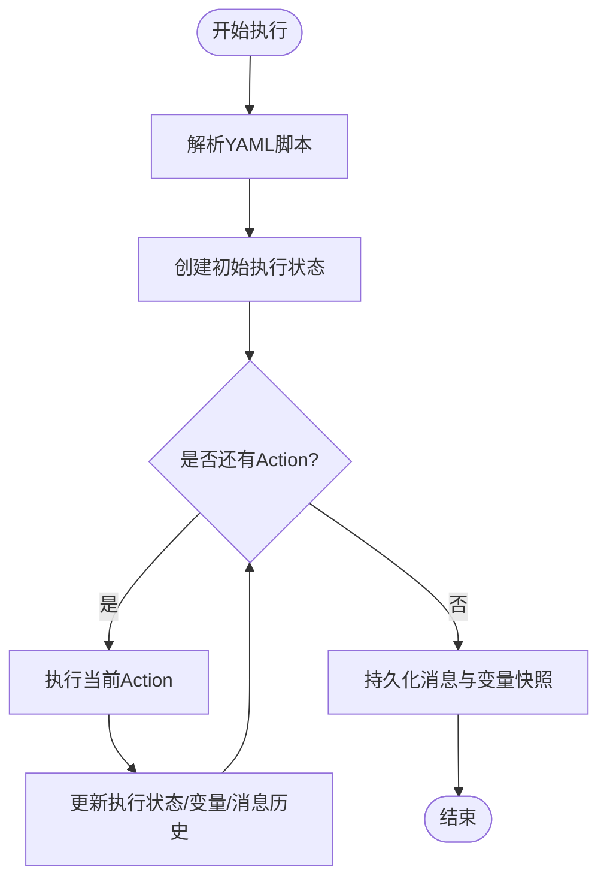
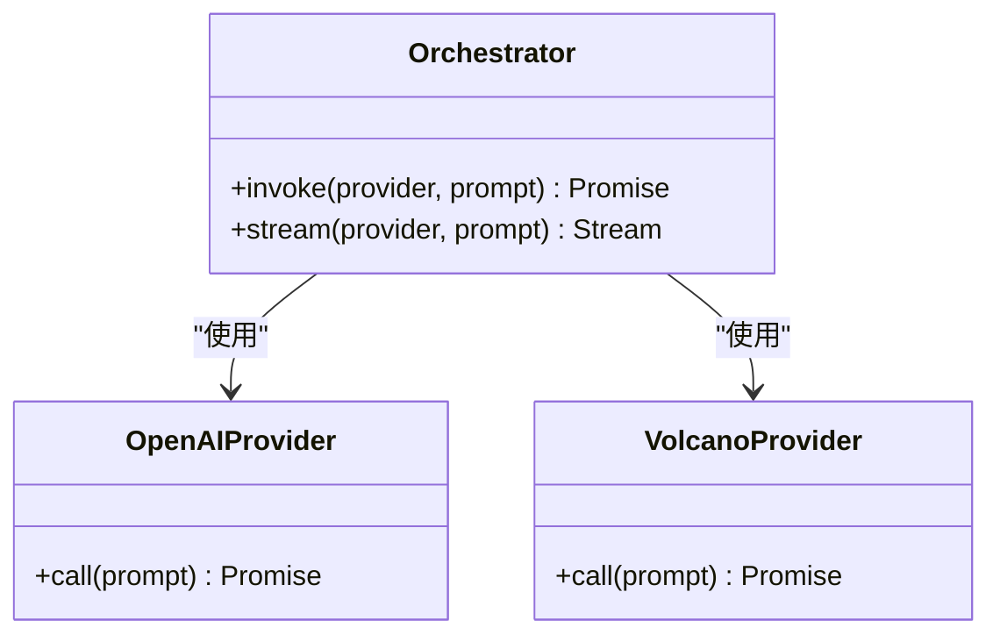
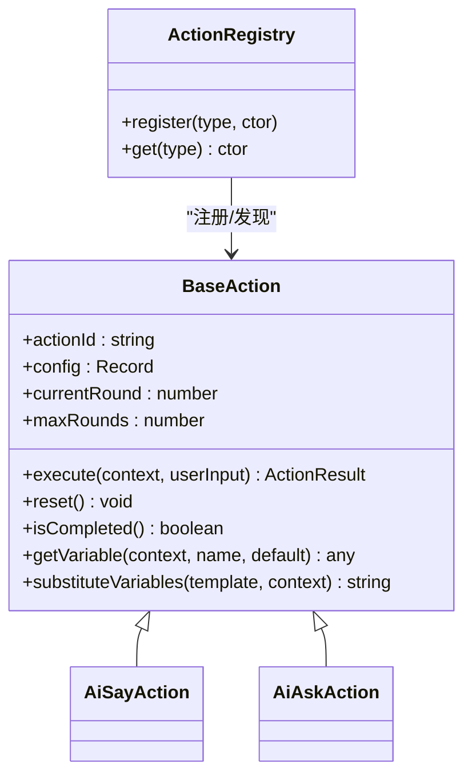
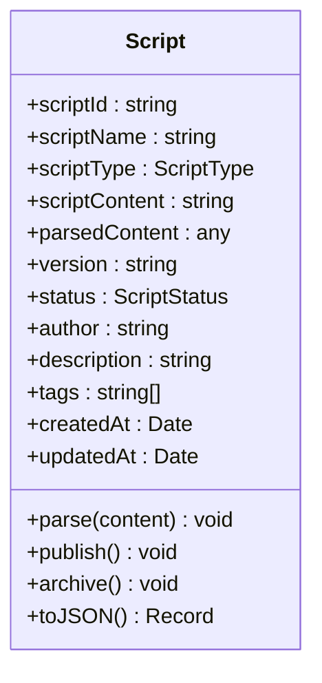
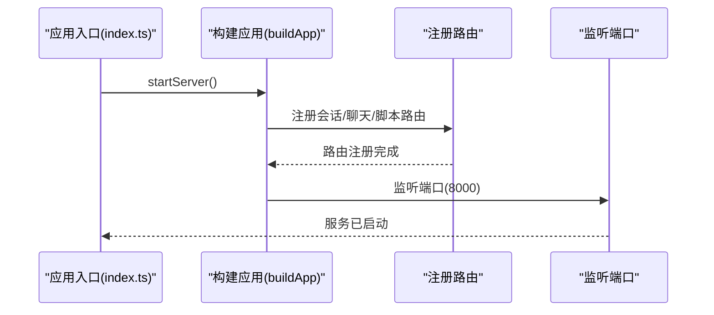
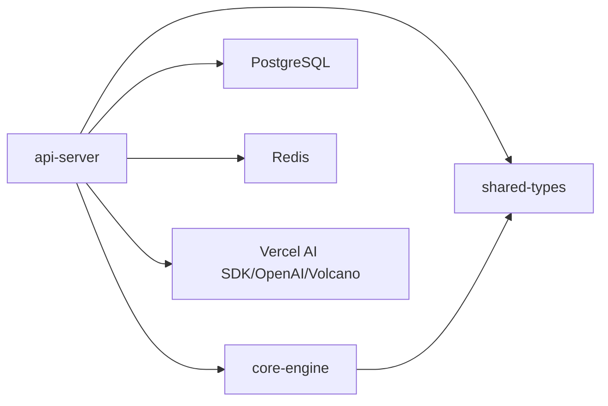

# 项目概述

<cite>
**本文引用的文件**
- [README.md](file://README.md)
- [package.json](file://package.json)
- [pnpm-workspace.yaml](file://pnpm-workspace.yaml)
- [DEV_START_GUIDE.md](file://DEV_START_GUIDE.md)
- [QUICK_START_GUIDE.md](file://QUICK_START_GUIDE.md)
- [packages/core-engine/src/index.ts](file://packages/core-engine/src/index.ts)
- [packages/core-engine/src/actions/base-action.ts](file://packages/core-engine/src/actions/base-action.ts)
- [packages/core-engine/src/domain/script.ts](file://packages/core-engine/src/domain/script.ts)
- [packages/core-engine/src/engines/script-execution/index.ts](file://packages/core-engine/src/engines/script-execution/index.ts)
- [packages/core-engine/src/engines/llm-orchestration/index.ts](file://packages/core-engine/src/engines/llm-orchestration/index.ts)
- [packages/shared-types/src/index.ts](file://packages/shared-types/src/index.ts)
- [packages/api-server/src/index.ts](file://packages/api-server/src/index.ts)
- [packages/api-server/src/app.ts](file://packages/api-server/src/app.ts)
- [packages/api-server/src/services/session-manager.ts](file://packages/api-server/src/services/session-manager.ts)
- [packages/api-server/src/routes/chat.ts](file://packages/api-server/src/routes/chat.ts)
</cite>

## 目录
1. [引言](#引言)
2. [项目结构](#项目结构)
3. [核心组件](#核心组件)
4. [架构总览](#架构总览)
5. [详细组件分析](#详细组件分析)
6. [依赖关系分析](#依赖关系分析)
7. [性能考量](#性能考量)
8. [故障排查指南](#故障排查指南)
9. [结论](#结论)
10. [附录](#附录)

## 引言
HeartRule AI咨询引擎是一个面向CBT（认知行为疗法）场景的“LLM + YAML脚本”混合智能咨询系统。其核心价值在于将专业咨询师的经验、技术、流程与数据沉淀为可执行、可维护的脚本化知识库，并通过LLM提供自然语言交互能力，实现“流程可控 + 智能增强”的平衡。

- 核心特性
  - 经验结构化沉淀：以YAML脚本承载会谈流程与咨询技术，形成可复用的知识资产
  - 灵活可控：LLM负责自然语言理解与生成，脚本保障专业流程与合规性
  - 领域可扩展：支持不同咨询领域的脚本定制与扩展
  - 质量可追溯：脚本化流程便于审计、优化与质量管理
  - 类型安全与高性能：TypeScript + Fastify，兼顾编译期安全与运行效率
  - 现代化架构：Monorepo组织 + 六大核心引擎，模块解耦、职责清晰

- 当前版本与状态
  - 版本：2.0.0（TypeScript）
  - 核心引擎完成度：约80%（脚本执行、LLM编排、变量提取已完成；记忆、话题调度、意识触发引擎逐步完善）
  - API服务：100%（11个核心端点）
  - 测试：15个测试全部通过
  - 前端：计划使用React + Pixi.js，当前处于规划阶段

- 应用场景
  - CBT心理咨询：会话引导、技术应用（如苏格拉底式提问）、变量提取与追踪
  - 可推广至其他心理治疗、培训演练、客服对话等领域

**章节来源**
- file://README.md#L10-L23
- file://README.md#L6-L6
- file://README.md#L364-L390

## 项目结构
项目采用Monorepo组织，根目录通过工作区配置统一管理各包，核心目录与职责如下：

- packages/
  - shared-types：共享TypeScript类型与Zod Schema，贯穿前后端与引擎层
  - core-engine：六大核心引擎（headless），提供脚本执行、LLM编排、变量提取、记忆、话题调度、意识触发等能力
  - api-server：基于Fastify的REST API + WebSocket，提供会话、聊天、脚本管理等接口
- scripts/：YAML脚本（会谈流程、咨询技术）
- docs/：设计文档与开发指南
- web/：开发者Web调试工具（测试对话、调试控制台、脚本编辑器入口）
- config/：开发环境配置
- docker-compose.dev.yml：本地开发环境编排（PostgreSQL + Redis）

**图表来源**
- [pnpm-workspace.yaml](file://pnpm-workspace.yaml#L1-L3)
- [README.md](file://README.md#L50-L57)

**章节来源**
- file://pnpm-workspace.yaml#L1-L3
- file://README.md#L97-L129

## 核心组件
- 六大核心引擎（headless）
  - 脚本执行引擎：解析YAML，管理Phase → Topic → Action流程，支持新旧版本执行器并行
  - LLM编排引擎：统一管理多个LLM提供者（OpenAI、火山引擎等），支持流式/非流式调用
  - 变量提取引擎：从对话中提取变量（direct、pattern、llm三种方法）
  - 记忆引擎：短期/中期/长期记忆管理（当前实现短期记忆）
  - 话题调度引擎：动态话题切换（计划驱动 + 意识驱动）
  - 意识触发引擎：监控对话情境，优先级干预
- 共享类型与Schema：统一Session、Message、Script、Variable等模型与API请求/响应类型
- API服务：会话管理、聊天交互、脚本管理等REST接口，集成Swagger文档与WebSocket

**章节来源**
- file://README.md#L256-L264
- file://packages/core-engine/src/index.ts#L13-L27
- file://packages/shared-types/src/index.ts#L7-L19

## 架构总览
系统采用五层分层架构，自上而下为表现层、应用层、引擎层、脚本层、基础设施层。引擎层由六大核心引擎组成，负责将YAML脚本与LLM能力整合，形成可执行的咨询流程。

**图表来源**
- [README.md](file://README.md#L28-L48)

**章节来源**
- file://README.md#L28-L48

## 详细组件分析

### 会话管理与聊天交互（API层）
- 会话管理服务集成脚本执行引擎，负责：
  - 初始化会话：加载脚本、解析YAML、执行脚本生成初始AI消息、持久化消息与变量快照
  - 处理用户输入：保存用户消息、恢复执行状态、调用脚本执行引擎、更新会话状态
- 路由与接口
  - POST /api/chat：非流式聊天
  - POST /api/chat/stream：SSE流式聊天（占位，当前模拟输出）
- 错误处理：统一构建详细错误信息，返回结构化错误对象

**图表来源**
- [packages/api-server/src/routes/chat.ts](file://packages/api-server/src/routes/chat.ts#L16-L79)
- [packages/api-server/src/services/session-manager.ts](file://packages/api-server/src/services/session-manager.ts#L258-L461)
- [packages/core-engine/src/engines/script-execution/index.ts](file://packages/core-engine/src/engines/script-execution/index.ts#L1-L11)

**章节来源**
- file://packages/api-server/src/routes/chat.ts#L1-L152
- file://packages/api-server/src/services/session-manager.ts#L1-L462

### 脚本执行引擎（核心引擎层）
- 职责：解析YAML脚本，按Phase → Topic → Action顺序推进执行，维护执行状态与变量
- 新旧版本并行：保留旧版执行器别名，新版本ScriptExecutor为主，默认导出
- 关键导出：yaml-parser、ScriptExecutor、Action注册表与基础Action类

**图表来源**
- [packages/core-engine/src/engines/script-execution/index.ts](file://packages/core-engine/src/engines/script-execution/index.ts#L1-L11)

**章节来源**
- file://packages/core-engine/src/engines/script-execution/index.ts#L1-L11

### LLM编排引擎（核心引擎层）
- 职责：统一管理多个LLM提供者（OpenAI、火山引擎等），支持流式/非流式调用
- 设计：基于Vercel AI SDK抽象，提供统一编排接口

**图表来源**
- [packages/core-engine/src/engines/llm-orchestration/index.ts](file://packages/core-engine/src/engines/llm-orchestration/index.ts#L1-L11)

**章节来源**
- file://packages/core-engine/src/engines/llm-orchestration/index.ts#L1-L11

### Action体系与扩展机制（核心引擎层）
- Action基类：定义ActionContext、ActionResult、执行生命周期与变量替换等通用能力
- Action注册表：集中注册与发现Action类型，便于扩展新Action
- 典型Action：AiSayAction、AiAskAction等（后续逐步实现）

**图表来源**
- [packages/core-engine/src/actions/base-action.ts](file://packages/core-engine/src/actions/base-action.ts#L37-L95)

**章节来源**
- file://packages/core-engine/src/actions/base-action.ts#L1-L96

### 脚本领域模型（共享类型层）
- Script领域模型：封装脚本标识、类型、内容、版本、状态、作者、描述、标签、时间戳等
- 支持发布/归档状态变更与JSON序列化

**图表来源**
- [packages/core-engine/src/domain/script.ts](file://packages/core-engine/src/domain/script.ts#L7-L94)

**章节来源**
- file://packages/core-engine/src/domain/script.ts#L1-L95

### API服务与应用入口（应用层）
- 应用入口：启动Fastify服务，注册CORS、Swagger、WebSocket、路由
- 核心路由：会话、聊天、脚本、项目、版本等
- 健康检查：/health返回服务状态

**图表来源**
- [packages/api-server/src/index.ts](file://packages/api-server/src/index.ts#L1-L10)
- [packages/api-server/src/app.ts](file://packages/api-server/src/app.ts#L21-L105)

**章节来源**
- file://packages/api-server/src/index.ts#L1-L10
- file://packages/api-server/src/app.ts#L1-L135

## 依赖关系分析
- 包依赖
  - api-server依赖core-engine与shared-types，提供会话与聊天能力
  - core-engine依赖shared-types，提供领域模型与类型
- 外部依赖
  - Fastify：高性能Web框架
  - Drizzle ORM：零运行时开销的数据库ORM
  - Vercel AI SDK + OpenAI Provider + 自定义火山Provider：统一LLM调用
  - PostgreSQL + Redis：持久化与缓存
- Monorepo与包管理
  - pnpm工作区统一管理，根脚本提供并发启动、构建、测试、格式化等任务

**图表来源**
- [README.md](file://README.md#L133-L164)
- [pnpm-workspace.yaml](file://pnpm-workspace.yaml#L1-L3)

**章节来源**
- file://README.md#L133-L164
- file://pnpm-workspace.yaml#L1-L3

## 性能考量
- 服务端性能
  - Fastify框架：性能优于Express，异步事件循环，适合高并发
  - Drizzle ORM：零运行时开销，SQL查询更高效
- LLM调用
  - 提供流式/非流式两种模式，根据场景选择
  - 多Provider抽象，便于切换与负载均衡
- 存储与缓存
  - PostgreSQL用于会话、消息、脚本、变量等结构化数据
  - Redis用于会话状态与缓存（短期记忆实现中）
- 类型安全
  - TypeScript编译期检查，减少运行时错误，提升稳定性

**章节来源**
- file://README.md#L21-L22
- file://README.md#L133-L164

## 故障排查指南
- 端口占用
  - 现象：EADDRINUSE
  - 处理：查找占用进程并终止
- Docker未启动
  - 现象：Docker连接错误
  - 处理：启动Docker Desktop，确认容器运行
- CORS错误
  - 现象：浏览器控制台CORS错误
  - 处理：确认API服务运行、前端地址正确
- 数据库连接失败
  - 现象：Database connection error
  - 处理：检查PostgreSQL容器状态、查看日志、重启服务

**章节来源**
- file://QUICK_START_GUIDE.md#L225-L283
- file://DEV_START_GUIDE.md#L67-L114

## 结论
HeartRule AI咨询引擎通过“LLM + YAML脚本”的混合架构，将专业咨询经验脚本化、流程化，结合六大核心引擎实现可执行、可维护、可扩展的智能咨询系统。项目采用现代Monorepo组织与TypeScript技术栈，具备良好的可维护性与扩展性。当前版本已完成核心引擎与API服务的主体功能，下一步将完善前端与高级引擎（记忆、话题调度、意识触发），并逐步引入长期记忆与游戏化UI，持续提升用户体验与专业价值。

## 附录
- 快速启动与开发指南
  - 一键启动：docker-compose + pnpm脚本
  - 并发启动：API服务与脚本编辑器前端
  - 健康检查与API文档：/health 与 /docs
- 测试与类型检查
  - 单元测试：15个测试全部通过
  - 类型检查：tsc --noEmit
- 技术栈选择理由
  - TypeScript：类型安全与现代化开发体验
  - Fastify：高性能Web框架
  - Drizzle ORM：零运行时开销的数据库ORM
  - Vercel AI SDK：统一LLM调用接口
  - pnpm：Monorepo包管理器

**章节来源**
- file://README.md#L63-L94
- file://README.md#L167-L181
- file://README.md#L133-L164
- file://package.json#L13-L32
- file://DEV_START_GUIDE.md#L1-L165
- file://QUICK_START_GUIDE.md#L1-L359