# 会话模型

<cite>
**本文档引用的文件**
- [packages/core-engine/src/domain/session.ts](file://packages/core-engine/src/domain/session.ts)
- [packages/shared-types/src/domain/session.ts](file://packages/shared-types/src/domain/session.ts)
- [packages/shared-types/src/enums.ts](file://packages/shared-types/src/enums.ts)
- [packages/api-server/src/services/session-manager.ts](file://packages/api-server/src/services/session-manager.ts)
- [packages/api-server/src/routes/sessions.ts](file://packages/api-server/src/routes/sessions.ts)
- [packages/api-server/src/db/schema.ts](file://packages/api-server/src/db/schema.ts)
- [packages/core-engine/src/domain/variable.ts](file://packages/core-engine/src/domain/variable.ts)
- [packages/api-server/test-session-flow.ts](file://packages/api-server/test-session-flow.ts)
- [scripts/sessions/cbt_depression_assessment.yaml](file://scripts/sessions/cbt_depression_assessment.yaml)
</cite>

## 目录
1. [简介](#简介)
2. [项目结构](#项目结构)
3. [核心组件](#核心组件)
4. [架构概览](#架构概览)
5. [详细组件分析](#详细组件分析)
6. [依赖关系分析](#依赖关系分析)
7. [性能考虑](#性能考虑)
8. [故障排除指南](#故障排除指南)
9. [结论](#结论)

## 简介

会话模型是 HeartRule 心理咨询AI系统的核心抽象，负责管理整个咨询过程中的状态、变量和元数据。该模型实现了完整的会话生命周期管理，支持多轮对话、状态持久化、变量跟踪和错误处理等功能。

会话模型采用分层架构设计，通过清晰的职责分离实现了高内聚、低耦合的系统结构。它不仅管理会话的基本状态信息，还提供了丰富的扩展点，支持不同类型的咨询场景和复杂的交互流程。

## 项目结构

会话模型在整个项目中的组织结构如下：

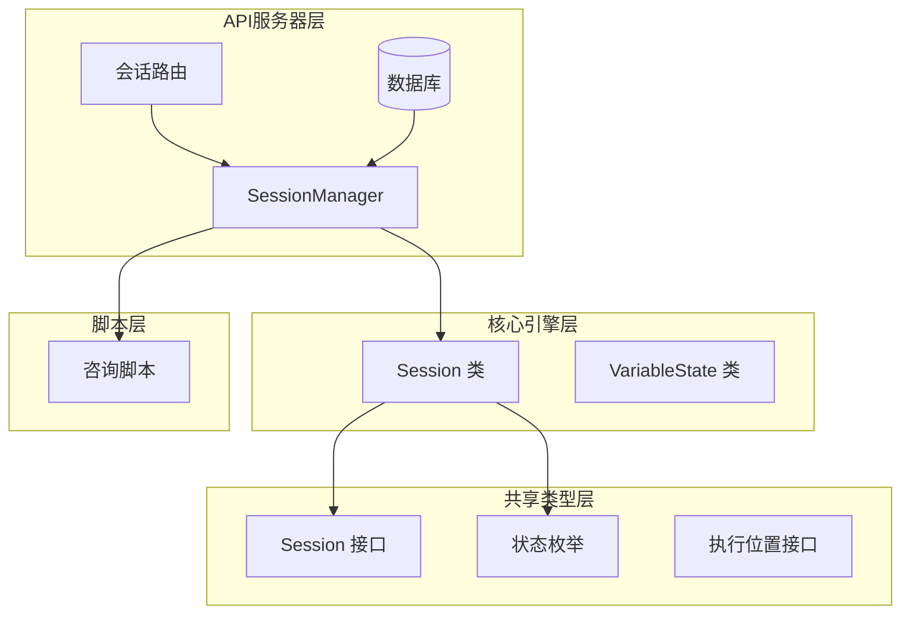

**图表来源**
- [packages/core-engine/src/domain/session.ts](file://packages/core-engine/src/domain/session.ts#L1-L137)
- [packages/shared-types/src/domain/session.ts](file://packages/shared-types/src/domain/session.ts#L1-L88)
- [packages/api-server/src/services/session-manager.ts](file://packages/api-server/src/services/session-manager.ts#L1-L462)

**章节来源**
- [packages/core-engine/src/domain/session.ts](file://packages/core-engine/src/domain/session.ts#L1-L137)
- [packages/shared-types/src/domain/session.ts](file://packages/shared-types/src/domain/session.ts#L1-L88)

## 核心组件

会话模型由多个核心组件构成，每个组件都有明确的职责和边界：

### 会话状态管理组件

| 组件名称 | 职责 | 关键特性 |
|---------|------|----------|
| Session 类 | 主要的会话实体模型 | 状态管理、生命周期控制、数据持久化 |
| SessionStatus 枚举 | 会话状态定义 | ACTIVE、PAUSED、COMPLETED、FAILED |
| ExecutionStatus 枚举 | 执行状态定义 | RUNNING、WAITING_INPUT、PAUSED、COMPLETED、ERROR |

### 执行位置跟踪组件

| 组件名称 | 职责 | 关键特性 |
|---------|------|----------|
| ExecutionPosition 接口 | 执行位置定义 | phaseIndex、topicIndex、actionIndex |
| 位置索引管理 | 三维度位置跟踪 | 支持精确的执行定位 |
| ID扩展字段 | 导航树支持 | phaseId、topicId、actionId |

### 变量管理组件

| 组件名称 | 职责 | 关键特性 |
|---------|------|----------|
| 变量映射 | 动态变量存储 | Map 结构支持任意类型 |
| 元数据存储 | 会话元信息 | 用于错误信息和配置 |
| 变量快照 | 历史追踪 | 支持变量变更审计 |

**章节来源**
- [packages/core-engine/src/domain/session.ts](file://packages/core-engine/src/domain/session.ts#L7-L44)
- [packages/shared-types/src/enums.ts](file://packages/shared-types/src/enums.ts#L6-L22)
- [packages/shared-types/src/domain/session.ts](file://packages/shared-types/src/domain/session.ts#L13-L22)

## 架构概览

会话模型采用分层架构设计，确保了良好的可维护性和扩展性：

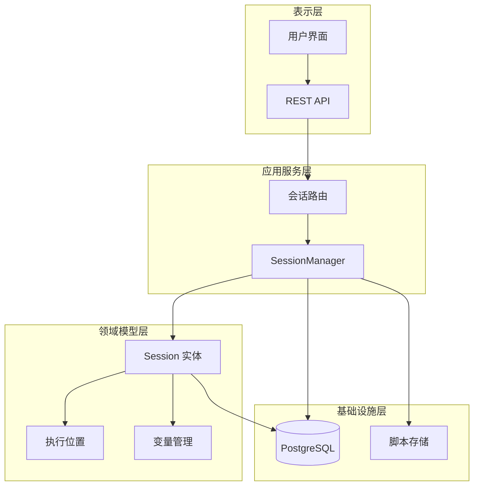

**图表来源**
- [packages/api-server/src/services/session-manager.ts](file://packages/api-server/src/services/session-manager.ts#L21-L26)
- [packages/api-server/src/routes/sessions.ts](file://packages/api-server/src/routes/sessions.ts#L13-L133)
- [packages/api-server/src/db/schema.ts](file://packages/api-server/src/db/schema.ts#L22-L40)

## 详细组件分析

### Session 类详细分析

Session 类是会话模型的核心实现，提供了完整的会话生命周期管理功能。

#### 类结构设计

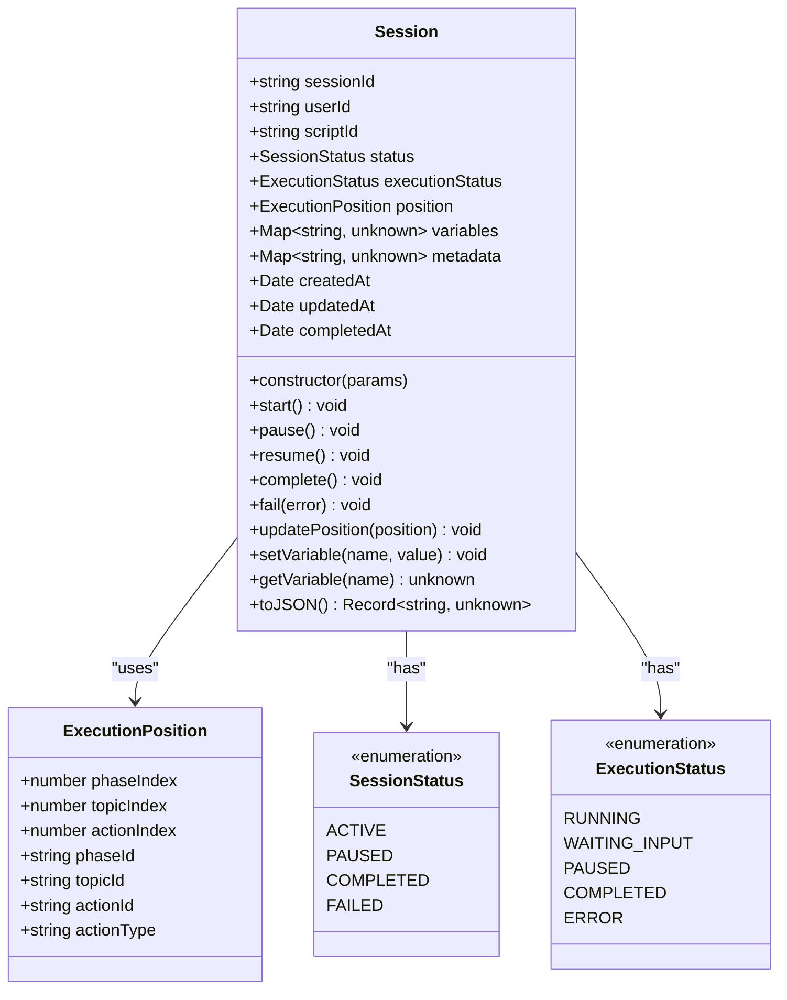

**图表来源**
- [packages/core-engine/src/domain/session.ts](file://packages/core-engine/src/domain/session.ts#L7-L137)
- [packages/shared-types/src/domain/session.ts](file://packages/shared-types/src/domain/session.ts#L13-L22)
- [packages/shared-types/src/enums.ts](file://packages/shared-types/src/enums.ts#L6-L22)

#### 会话状态管理

会话状态管理是 Session 类的核心功能之一，实现了完整的状态转换机制：

| 状态 | 描述 | 触发条件 | 影响范围 |
|------|------|----------|----------|
| ACTIVE | 活跃状态 | 启动会话或恢复会话 | 可正常执行动作 |
| PAUSED | 暂停状态 | 显式调用 pause 方法 | 暂停执行但保持数据 |
| COMPLETED | 完成状态 | 调用 complete 方法 | 执行结束，不可再修改 |
| FAILED | 失败状态 | 调用 fail 方法 | 记录错误信息，停止执行 |

#### 执行状态跟踪

执行状态提供了更细粒度的执行进度控制：

| 状态 | 描述 | 用途场景 |
|------|------|----------|
| RUNNING | 正在运行 | 正常执行会话 |
| WAITING_INPUT | 等待输入 | 需要用户回复 |
| PAUSED | 已暂停 | 显式暂停会话 |
| COMPLETED | 已完成 | 会话结束 |
| ERROR | 发生错误 | 执行异常 |

#### 执行位置跟踪

执行位置采用三维度索引系统，精确跟踪当前执行状态：

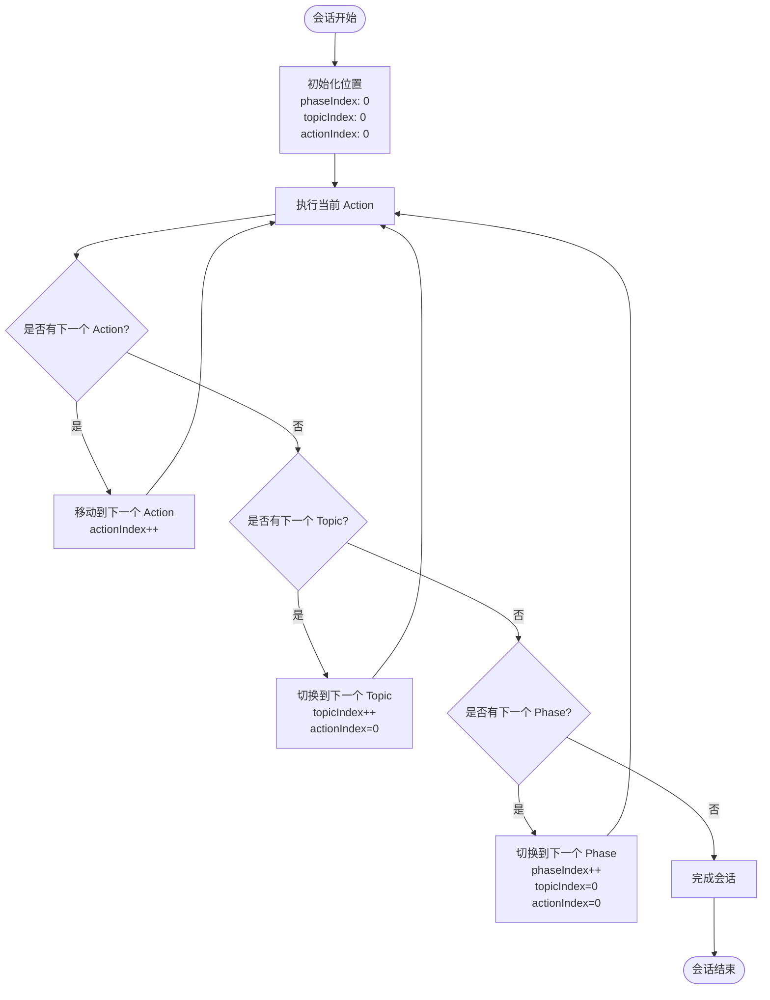

**图表来源**
- [packages/core-engine/src/domain/session.ts](file://packages/core-engine/src/domain/session.ts#L98-L101)
- [packages/shared-types/src/domain/session.ts](file://packages/shared-types/src/domain/session.ts#L13-L22)

#### 变量管理机制

会话提供了灵活的变量管理系统，支持动态变量存储和检索：

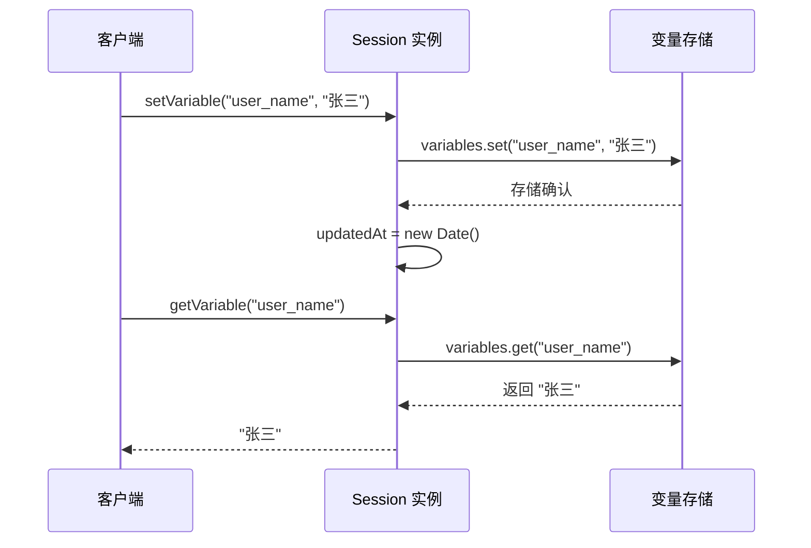

**图表来源**
- [packages/core-engine/src/domain/session.ts](file://packages/core-engine/src/domain/session.ts#L106-L116)

**章节来源**
- [packages/core-engine/src/domain/session.ts](file://packages/core-engine/src/domain/session.ts#L46-L137)

### SessionManager 服务分析

SessionManager 是会话管理的核心服务，负责协调会话生命周期和与外部系统的交互。

#### 服务架构

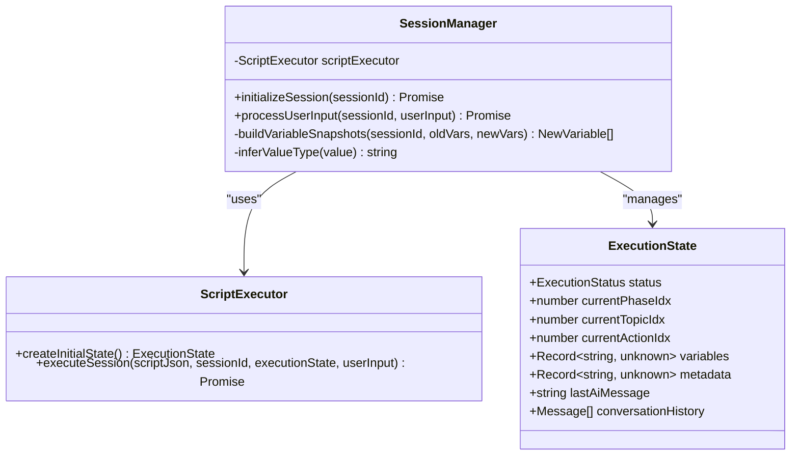

**图表来源**
- [packages/api-server/src/services/session-manager.ts](file://packages/api-server/src/services/session-manager.ts#L21-L26)
- [packages/api-server/src/services/session-manager.ts](file://packages/api-server/src/services/session-manager.ts#L124-L153)

#### 会话初始化流程

会话初始化是会话生命周期的第一个关键步骤：

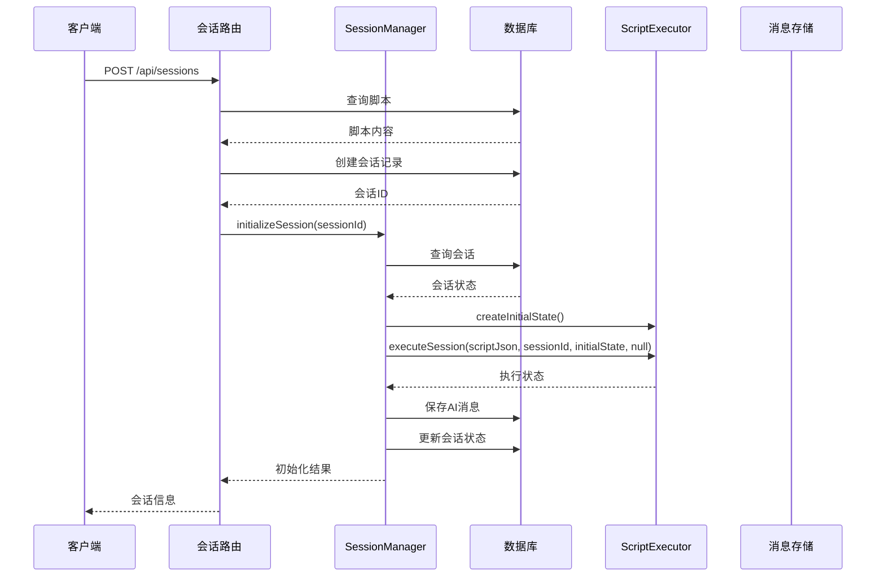

**图表来源**
- [packages/api-server/src/routes/sessions.ts](file://packages/api-server/src/routes/sessions.ts#L76-L125)
- [packages/api-server/src/services/session-manager.ts](file://packages/api-server/src/services/session-manager.ts#L73-L253)

#### 用户输入处理流程

用户输入处理是会话交互的核心流程：

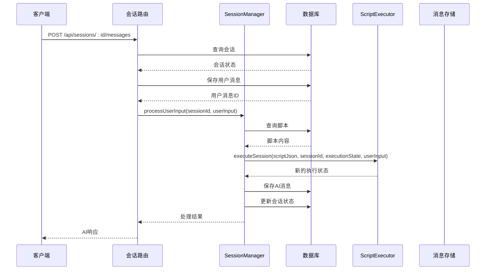

**图表来源**
- [packages/api-server/src/routes/sessions.ts](file://packages/api-server/src/routes/sessions.ts#L403-L471)
- [packages/api-server/src/services/session-manager.ts](file://packages/api-server/src/services/session-manager.ts#L258-L461)

**章节来源**
- [packages/api-server/src/services/session-manager.ts](file://packages/api-server/src/services/session-manager.ts#L1-L462)

### 数据持久化策略

会话模型采用了多层次的数据持久化策略，确保数据的一致性和可靠性：

#### 数据库模式设计

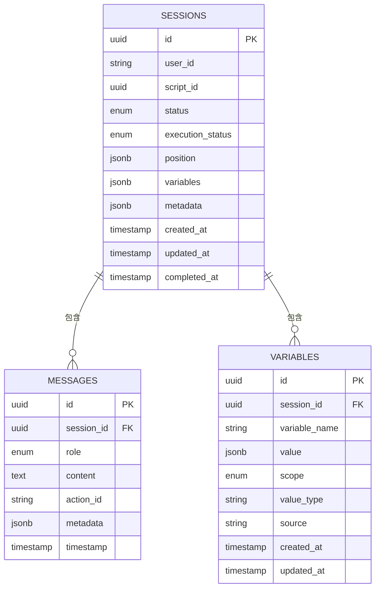

**图表来源**
- [packages/api-server/src/db/schema.ts](file://packages/api-server/src/db/schema.ts#L22-L40)
- [packages/api-server/src/db/schema.ts](file://packages/api-server/src/db/schema.ts#L45-L58)
- [packages/api-server/src/db/schema.ts](file://packages/api-server/src/db/schema.ts#L161-L176)

#### 变量快照机制

会话提供了智能的变量快照机制，只记录发生变化的变量：

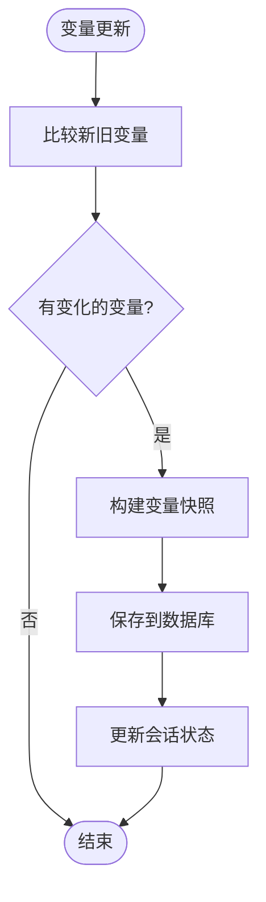

**图表来源**
- [packages/api-server/src/services/session-manager.ts](file://packages/api-server/src/services/session-manager.ts#L44-L68)
- [packages/api-server/src/services/session-manager.ts](file://packages/api-server/src/services/session-manager.ts#L195-L200)

**章节来源**
- [packages/api-server/src/db/schema.ts](file://packages/api-server/src/db/schema.ts#L1-L219)

## 依赖关系分析

会话模型的依赖关系体现了清晰的分层架构和职责分离：

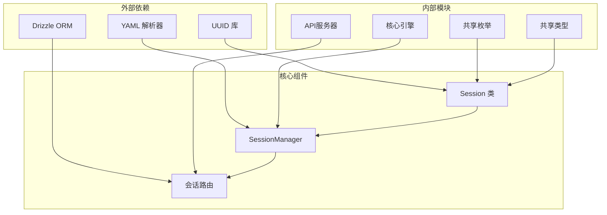

**图表来源**
- [packages/core-engine/src/domain/session.ts](file://packages/core-engine/src/domain/session.ts#L1-L3)
- [packages/api-server/src/services/session-manager.ts](file://packages/api-server/src/services/session-manager.ts#L11-L12)
- [packages/api-server/src/routes/sessions.ts](file://packages/api-server/src/routes/sessions.ts#L1-L8)

### 循环依赖检测

经过分析，会话模型没有发现循环依赖：
- Session 类不依赖 API 层
- SessionManager 不直接依赖路由层
- 数据库模式独立于业务逻辑
- 共享类型提供稳定的接口契约

### 外部依赖管理

会话模型对外部依赖的管理策略：
- 使用 UUID 库生成唯一标识符
- 使用 YAML 解析器处理脚本内容
- 使用 Drizzle ORM 进行数据库操作
- 通过共享类型确保类型安全

**章节来源**
- [packages/core-engine/src/domain/session.ts](file://packages/core-engine/src/domain/session.ts#L1-L3)
- [packages/api-server/src/services/session-manager.ts](file://packages/api-server/src/services/session-manager.ts#L11-L12)

## 性能考虑

会话模型在设计时充分考虑了性能优化：

### 内存使用优化

- 使用 Map 结构存储变量，提供 O(1) 的访问时间
- 采用增量更新策略，避免不必要的状态复制
- 变量快照机制只存储变化的数据

### 数据库性能优化

- 会话表使用 JSONB 存储复杂数据结构
- 为常用查询字段建立索引
- 批量操作减少数据库往返次数

### 缓存策略

- 执行状态在内存中缓存
- 脚本内容进行缓存以提高性能
- 变量快照定期清理过期数据

## 故障排除指南

### 常见问题及解决方案

#### 会话状态异常

**问题**: 会话状态无法正确转换
**解决方案**: 
1. 检查状态转换的前置条件
2. 验证会话是否处于正确的初始状态
3. 查看日志中的状态转换记录

#### 变量丢失问题

**问题**: 会话中变量在重启后丢失
**解决方案**:
1. 确认变量快照机制正常工作
2. 检查数据库连接状态
3. 验证变量存储的事务完整性

#### 执行位置错误

**问题**: 会话从错误的位置继续执行
**解决方案**:
1. 检查位置索引的更新逻辑
2. 验证执行状态的持久化
3. 确认脚本内容的完整性

**章节来源**
- [packages/api-server/src/services/session-manager.ts](file://packages/api-server/src/services/session-manager.ts#L235-L252)
- [packages/api-server/src/services/session-manager.ts](file://packages/api-server/src/services/session-manager.ts#L437-L460)

## 结论

会话模型作为 HeartRule 心理咨询AI系统的核心组件，展现了优秀的软件架构设计原则。通过清晰的分层结构、完善的生命周期管理、灵活的变量系统和可靠的持久化机制，该模型为复杂的咨询场景提供了坚实的技术基础。

### 设计优势

1. **模块化设计**: 清晰的职责分离使得系统易于维护和扩展
2. **状态管理**: 完整的状态转换机制确保了会话的可控性
3. **数据一致性**: 多层次的持久化策略保证了数据的可靠性
4. **性能优化**: 智能的缓存和批处理机制提升了系统性能

### 技术亮点

- 三维度执行位置跟踪提供了精确的会话控制
- 智能变量快照机制平衡了性能和数据完整性
- 分层架构设计支持了系统的可扩展性
- 完善的错误处理机制提升了系统的稳定性

会话模型为心理咨询AI系统的开发提供了可靠的基础框架，支持从简单的问答到复杂的多轮对话等各种应用场景。其设计理念和实现方式为类似系统的开发提供了宝贵的参考价值。