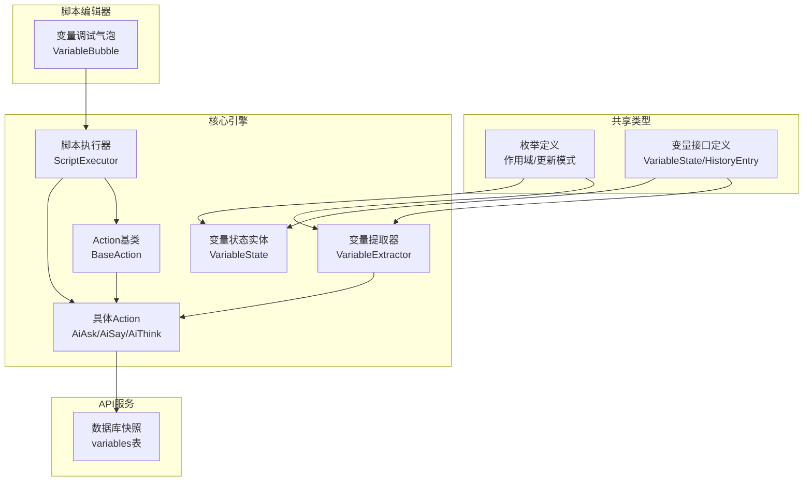
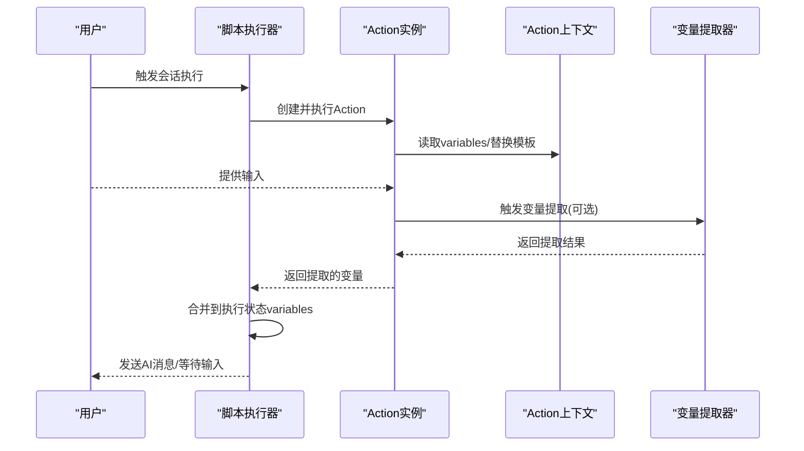
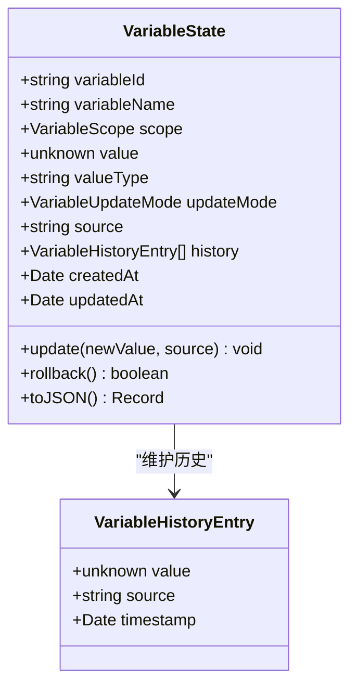
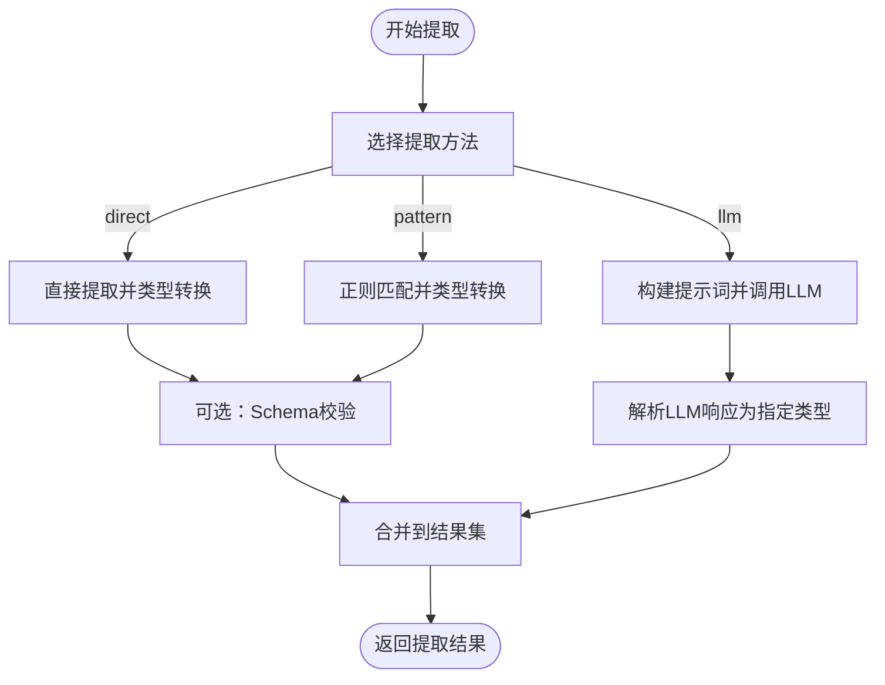
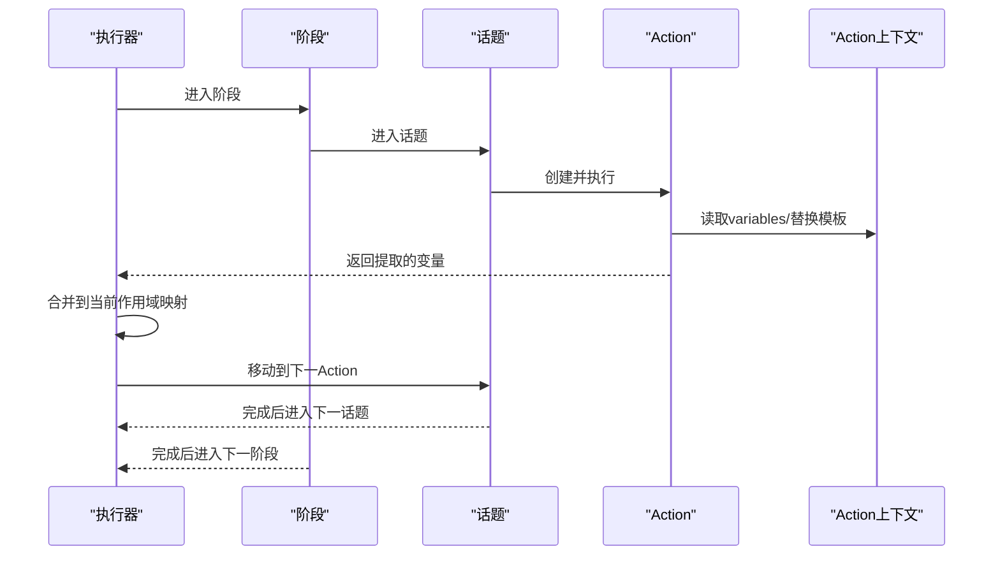
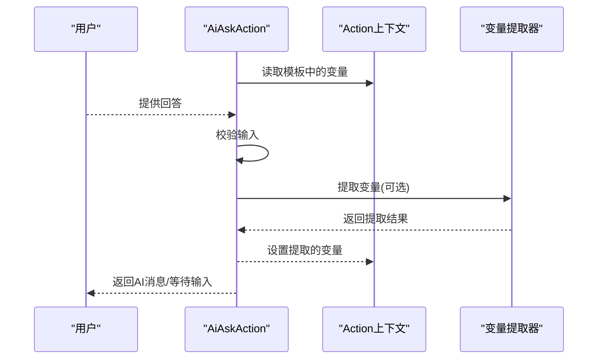
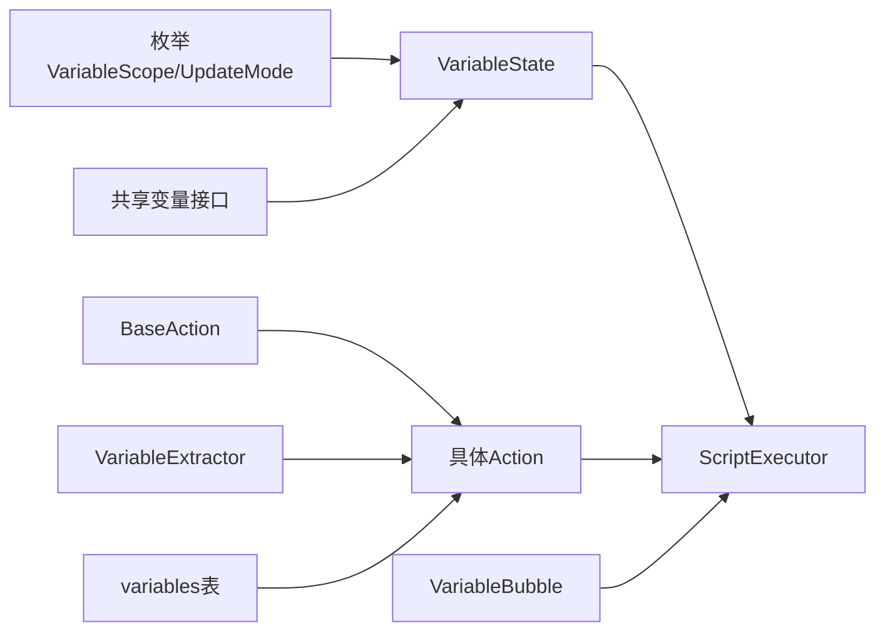

# 变量模型

<cite>
**本文档引用的文件**
- [packages/core-engine/src/domain/variable.ts](file://packages/core-engine/src/domain/variable.ts)
- [packages/shared-types/src/domain/variable.ts](file://packages/shared-types/src/domain/variable.ts)
- [packages/shared-types/src/enums.ts](file://packages/shared-types/src/enums.ts)
- [packages/core-engine/src/engines/script-execution/executor.ts](file://packages/core-engine/src/engines/script-execution/executor.ts)
- [packages/core-engine/src/engines/variable-extraction/extractor.ts](file://packages/core-engine/src/engines/variable-extraction/extractor.ts)
- [packages/core-engine/src/actions/base-action.ts](file://packages/core-engine/src/actions/base-action.ts)
- [packages/core-engine/src/actions/ai-ask-action.ts](file://packages/core-engine/src/actions/ai-ask-action.ts)
- [packages/core-engine/src/actions/ai-say-action.ts](file://packages/core-engine/src/actions/ai-say-action.ts)
- [packages/core-engine/src/actions/ai-think-action.ts](file://packages/core-engine/src/actions/ai-think-action.ts)
- [packages/core-engine/src/actions/action-registry.ts](file://packages/core-engine/src/actions/action-registry.ts)
- [packages/api-server/drizzle/meta/0001_snapshot.json](file://packages/api-server/drizzle/meta/0001_snapshot.json)
- [packages/script-editor/src/components/DebugBubbles/VariableBubble.tsx](file://packages/script-editor/src/components/DebugBubbles/VariableBubble.tsx)
- [scripts/sessions/cbt_depression_assessment.yaml](file://scripts/sessions/cbt_depression_assessment.yaml)
- [scripts/techniques/socratic_questioning.yaml](file://scripts/techniques/socratic_questioning.yaml)
</cite>

## 目录
1. [引言](#引言)
2. [项目结构](#项目结构)
3. [核心组件](#核心组件)
4. [架构总览](#架构总览)
5. [详细组件分析](#详细组件分析)
6. [依赖分析](#依赖分析)
7. [性能考虑](#性能考虑)
8. [故障排查指南](#故障排查指南)
9. [结论](#结论)
10. [附录](#附录)

## 引言
本文件系统化阐述变量模型的设计理念与实现细节，覆盖变量定义、类型系统、作用域管理、生命周期（声明、赋值、引用、销毁）、作用域规则与使用场景、数据类型支持与类型转换机制、命名规范与冲突处理、变量重置策略、监控与调试支持以及性能影响分析，并结合脚本示例展示在不同 Action 中的使用实践与最佳实践。

## 项目结构
变量模型横跨“共享类型”、“核心引擎”、“API服务”与“脚本编辑器”等多个包：
- 共享类型层定义变量状态接口与枚举（作用域、更新模式），确保前后端一致的契约。
- 核心引擎层实现变量状态实体、变量提取器、脚本执行器与 Action 基类，承载变量的读写、替换、提取与作用域传播。
- API 层数据库模式持久化变量，提供查询与索引能力。
- 脚本编辑器提供变量调试气泡，可视化展示不同作用域的变量集合。

图表来源
- [packages/shared-types/src/enums.ts](file://packages/shared-types/src/enums.ts#L52-L68)
- [packages/shared-types/src/domain/variable.ts](file://packages/shared-types/src/domain/variable.ts#L10-L58)
- [packages/core-engine/src/domain/variable.ts](file://packages/core-engine/src/domain/variable.ts#L15-L119)
- [packages/core-engine/src/engines/variable-extraction/extractor.ts](file://packages/core-engine/src/engines/variable-extraction/extractor.ts#L25-L317)
- [packages/core-engine/src/engines/script-execution/executor.ts](file://packages/core-engine/src/engines/script-execution/executor.ts#L34-L298)
- [packages/core-engine/src/actions/base-action.ts](file://packages/core-engine/src/actions/base-action.ts#L40-L99)
- [packages/api-server/drizzle/meta/0001_snapshot.json](file://packages/api-server/drizzle/meta/0001_snapshot.json#L775-L852)
- [packages/script-editor/src/components/DebugBubbles/VariableBubble.tsx](file://packages/script-editor/src/components/DebugBubbles/VariableBubble.tsx#L59-L190)

章节来源
- [packages/shared-types/src/enums.ts](file://packages/shared-types/src/enums.ts#L52-L68)
- [packages/shared-types/src/domain/variable.ts](file://packages/shared-types/src/domain/variable.ts#L10-L58)
- [packages/core-engine/src/domain/variable.ts](file://packages/core-engine/src/domain/variable.ts#L15-L119)
- [packages/core-engine/src/engines/variable-extraction/extractor.ts](file://packages/core-engine/src/engines/variable-extraction/extractor.ts#L25-L317)
- [packages/core-engine/src/engines/script-execution/executor.ts](file://packages/core-engine/src/engines/script-execution/executor.ts#L34-L298)
- [packages/core-engine/src/actions/base-action.ts](file://packages/core-engine/src/actions/base-action.ts#L40-L99)
- [packages/api-server/drizzle/meta/0001_snapshot.json](file://packages/api-server/drizzle/meta/0001_snapshot.json#L775-L852)
- [packages/script-editor/src/components/DebugBubbles/VariableBubble.tsx](file://packages/script-editor/src/components/DebugBubbles/VariableBubble.tsx#L59-L190)

## 核心组件
- 变量状态实体：封装变量标识、名称、作用域、值、值类型、更新模式、来源、历史、创建/更新时间等字段，并提供更新与回滚能力。
- 变量提取器：支持直接提取、正则提取、LLM智能提取三种方式，内置类型转换与Zod Schema校验。
- 脚本执行器：在执行会话脚本时，按阶段/话题/动作维度传播与合并变量，支持Action提取变量并写入执行状态。
- Action基类：提供变量获取与模板变量替换能力，统一Action的状态重置与完成判定。
- 枚举与Schema：定义作用域与更新模式的合法取值，并提供运行时校验。

章节来源
- [packages/core-engine/src/domain/variable.ts](file://packages/core-engine/src/domain/variable.ts#L15-L119)
- [packages/core-engine/src/engines/variable-extraction/extractor.ts](file://packages/core-engine/src/engines/variable-extraction/extractor.ts#L25-L317)
- [packages/core-engine/src/engines/script-execution/executor.ts](file://packages/core-engine/src/engines/script-execution/executor.ts#L34-L298)
- [packages/core-engine/src/actions/base-action.ts](file://packages/core-engine/src/actions/base-action.ts#L40-L99)
- [packages/shared-types/src/enums.ts](file://packages/shared-types/src/enums.ts#L52-L68)
- [packages/shared-types/src/domain/variable.ts](file://packages/shared-types/src/domain/variable.ts#L10-L58)

## 架构总览
变量模型贯穿“脚本解析—执行—Action—提取—持久化—调试”的全链路。执行器负责在各层级（会话、阶段、话题）间传递变量映射，Action通过上下文读取与替换变量，变量提取器负责从用户输入中抽取结构化数据并写回执行状态。

图表来源
- [packages/core-engine/src/engines/script-execution/executor.ts](file://packages/core-engine/src/engines/script-execution/executor.ts#L246-L258)
- [packages/core-engine/src/actions/base-action.ts](file://packages/core-engine/src/actions/base-action.ts#L79-L97)
- [packages/core-engine/src/engines/variable-extraction/extractor.ts](file://packages/core-engine/src/engines/variable-extraction/extractor.ts#L35-L77)

## 详细组件分析

### 变量状态实体（VariableState）
- 设计要点
  - 字段覆盖：标识、名称、作用域、值、值类型、更新模式、来源、历史、时间戳。
  - 更新策略：覆盖、追加（数组）、合并（对象），并记录历史以便回滚。
  - 序列化：提供JSON导出，便于持久化与调试。
- 生命周期
  - 声明：构造函数初始化字段与默认值。
  - 赋值：update根据更新模式修改值并记录历史。
  - 引用：通过上下文或Action方法读取。
  - 销毁：由执行器在作用域结束时清理执行状态中的变量映射。
- 复杂度
  - update操作为O(1)，历史回滚为O(1)。
  - 历史数组随更新增长，空间复杂度O(N)。

图表来源
- [packages/core-engine/src/domain/variable.ts](file://packages/core-engine/src/domain/variable.ts#L15-L119)
- [packages/shared-types/src/enums.ts](file://packages/shared-types/src/enums.ts#L52-L68)

章节来源
- [packages/core-engine/src/domain/variable.ts](file://packages/core-engine/src/domain/variable.ts#L15-L119)
- [packages/shared-types/src/enums.ts](file://packages/shared-types/src/enums.ts#L52-L68)

### 变量提取器（VariableExtractor）
- 支持的提取方法
  - 直接提取：从用户输入直接取值，按类型进行基础转换。
  - 正则提取：基于正则表达式捕获，再按类型转换。
  - LLM提取：构建提示词，调用LLM生成文本，再解析为指定类型。
- 类型系统与转换
  - 支持text/number/boolean/list/object五种类型，内置转换逻辑与JSON解析。
  - 可选Zod Schema校验，失败时记录告警并跳过该变量。
- 性能与并发
  - 非LLM路径可并行处理多个变量；LLM路径按配置批量处理，避免阻塞。

图表来源
- [packages/core-engine/src/engines/variable-extraction/extractor.ts](file://packages/core-engine/src/engines/variable-extraction/extractor.ts#L35-L77)
- [packages/core-engine/src/engines/variable-extraction/extractor.ts](file://packages/core-engine/src/engines/variable-extraction/extractor.ts#L128-L147)
- [packages/core-engine/src/engines/variable-extraction/extractor.ts](file://packages/core-engine/src/engines/variable-extraction/extractor.ts#L152-L176)
- [packages/core-engine/src/engines/variable-extraction/extractor.ts](file://packages/core-engine/src/engines/variable-extraction/extractor.ts#L268-L285)

章节来源
- [packages/core-engine/src/engines/variable-extraction/extractor.ts](file://packages/core-engine/src/engines/variable-extraction/extractor.ts#L25-L317)

### 脚本执行器与变量传播
- 作用域传播
  - 执行器在会话、阶段、话题三个层级分别维护变量映射，Action执行完成后将提取的变量写入当前层级的映射。
  - Action上下文携带只读副本，保证模板替换与读取的一致性。
- 生命周期管理
  - Action完成时，其提取的变量被合并到执行状态；若Action需要多轮交互，执行器在等待输入期间保持上下文不变。
  - 执行器负责清理已完成阶段/话题的上下文，避免变量泄漏。

图表来源
- [packages/core-engine/src/engines/script-execution/executor.ts](file://packages/core-engine/src/engines/script-execution/executor.ts#L169-L234)
- [packages/core-engine/src/engines/script-execution/executor.ts](file://packages/core-engine/src/engines/script-execution/executor.ts#L246-L258)
- [packages/core-engine/src/actions/base-action.ts](file://packages/core-engine/src/actions/base-action.ts#L79-L97)

章节来源
- [packages/core-engine/src/engines/script-execution/executor.ts](file://packages/core-engine/src/engines/script-execution/executor.ts#L34-L298)
- [packages/core-engine/src/actions/base-action.ts](file://packages/core-engine/src/actions/base-action.ts#L40-L99)

### Action中的变量使用
- AiAskAction：从用户输入中提取变量，支持必填、长度与正则校验，失败时允许重试。
- AiSayAction：模板中可直接引用变量，无需确认时立即完成并推进流程。
- AiThinkAction：MVP版本生成占位符变量，后续可接入LLM生成真实结论。

图表来源
- [packages/core-engine/src/actions/ai-ask-action.ts](file://packages/core-engine/src/actions/ai-ask-action.ts#L27-L167)
- [packages/core-engine/src/actions/ai-say-action.ts](file://packages/core-engine/src/actions/ai-say-action.ts#L19-L104)
- [packages/core-engine/src/actions/ai-think-action.ts](file://packages/core-engine/src/actions/ai-think-action.ts#L18-L56)
- [packages/core-engine/src/actions/base-action.ts](file://packages/core-engine/src/actions/base-action.ts#L79-L97)

章节来源
- [packages/core-engine/src/actions/ai-ask-action.ts](file://packages/core-engine/src/actions/ai-ask-action.ts#L19-L167)
- [packages/core-engine/src/actions/ai-say-action.ts](file://packages/core-engine/src/actions/ai-say-action.ts#L19-L104)
- [packages/core-engine/src/actions/ai-think-action.ts](file://packages/core-engine/src/actions/ai-think-action.ts#L18-L56)
- [packages/core-engine/src/actions/base-action.ts](file://packages/core-engine/src/actions/base-action.ts#L40-L99)

### 数据类型支持与类型转换
- 支持类型：text、number、boolean、list、object。
- 转换策略：
  - 直接提取：按类型进行字符串/数值/布尔/列表/对象转换。
  - 正则提取：先捕获再按类型转换。
  - LLM提取：解析LLM响应为对应类型，失败时回退。
- Schema校验：可选Zod Schema，失败时丢弃该变量并记录警告。

章节来源
- [packages/core-engine/src/engines/variable-extraction/extractor.ts](file://packages/core-engine/src/engines/variable-extraction/extractor.ts#L82-L123)
- [packages/core-engine/src/engines/variable-extraction/extractor.ts](file://packages/core-engine/src/engines/variable-extraction/extractor.ts#L128-L147)
- [packages/core-engine/src/engines/variable-extraction/extractor.ts](file://packages/core-engine/src/engines/variable-extraction/extractor.ts#L240-L285)
- [packages/shared-types/src/domain/variable.ts](file://packages/shared-types/src/domain/variable.ts#L47-L58)

### 作用域规则与使用场景
- 作用域枚举：global、session、phase、topic。
- 使用场景：
  - global：全局配置或只读常量，适合跨会话共享。
  - session：会话级变量，适合存储用户身份、会话元数据等。
  - phase/topic：阶段/话题级变量，适合临时状态与中间结果。
- 执行器传播：执行器在不同层级维护独立映射，变量仅在当前及更高作用域可见。

章节来源
- [packages/shared-types/src/enums.ts](file://packages/shared-types/src/enums.ts#L52-L59)
- [packages/core-engine/src/engines/script-execution/executor.ts](file://packages/core-engine/src/engines/script-execution/executor.ts#L169-L234)

### 命名规范、冲突解决与重置策略
- 命名规范
  - 建议使用小写字母与下划线组合，语义清晰且避免特殊字符。
  - 不同作用域内建议采用前缀区分（如session_user_name、phase_mood等）。
- 冲突解决
  - 同一作用域内后写覆盖；跨作用域遵循“就近作用域优先”原则。
  - 执行器在Action完成后合并变量，注意命名一致性以避免无意覆盖。
- 重置策略
  - Action基类提供reset方法，重置轮次计数，避免状态泄漏。
  - 执行器在阶段/话题切换时清理对应上下文，确保作用域隔离。

章节来源
- [packages/core-engine/src/actions/base-action.ts](file://packages/core-engine/src/actions/base-action.ts#L65-L74)
- [packages/core-engine/src/engines/script-execution/executor.ts](file://packages/core-engine/src/engines/script-execution/executor.ts#L169-L234)

### 监控、调试与性能影响
- 调试支持
  - 脚本编辑器提供变量调试气泡，按作用域分组展示变量键值，便于实时观察。
  - Action内部可打印调试日志，辅助定位变量替换与提取问题。
- 性能影响
  - 变量替换为O(N×M)（N为变量数量，M为模板长度），建议减少模板中变量嵌套深度。
  - LLM提取成本较高，应按需启用并限制批量规模。
  - 历史记录增长导致内存占用上升，建议在长会话中定期清理或限制历史深度。

章节来源
- [packages/script-editor/src/components/DebugBubbles/VariableBubble.tsx](file://packages/script-editor/src/components/DebugBubbles/VariableBubble.tsx#L59-L190)
- [packages/core-engine/src/actions/ai-say-action.ts](file://packages/core-engine/src/actions/ai-say-action.ts#L40-L49)
- [packages/core-engine/src/domain/variable.ts](file://packages/core-engine/src/domain/variable.ts#L54-L85)

### 实际案例与最佳实践
- CBT初次评估脚本
  - 使用AiAsk收集用户姓名、年龄、主诉、情绪状态等变量，并在后续AiThink中作为输入变量使用。
  - 模板中通过${变量名}引用已提取变量，提升个性化与连贯性。
- 苏格拉底式提问技术
  - 定义input_parameters与output_variables，明确输入输出，便于Action提取与生成。
  - 在多轮交互中逐步收集证据与替代想法，最终生成重构后的信念。

章节来源
- [scripts/sessions/cbt_depression_assessment.yaml](file://scripts/sessions/cbt_depression_assessment.yaml#L47-L166)
- [scripts/techniques/socratic_questioning.yaml](file://scripts/techniques/socratic_questioning.yaml#L14-L110)

## 依赖分析
- 组件耦合
  - VariableState依赖枚举（作用域、更新模式）与共享类型接口。
  - VariableExtractor依赖LLM编排器（可选）与Zod Schema。
  - ScriptExecutor依赖Action注册表与YAML解析器，向上游Action暴露只读上下文。
  - Action基类为所有Action提供统一的变量读取与模板替换能力。
- 外部依赖
  - 数据库：variables表持久化变量，包含session_id、variable_name、value、scope、value_type、source等字段。
  - 编辑器：变量调试气泡可视化展示不同作用域变量集合。

图表来源
- [packages/shared-types/src/enums.ts](file://packages/shared-types/src/enums.ts#L52-L68)
- [packages/shared-types/src/domain/variable.ts](file://packages/shared-types/src/domain/variable.ts#L10-L58)
- [packages/core-engine/src/domain/variable.ts](file://packages/core-engine/src/domain/variable.ts#L15-L119)
- [packages/core-engine/src/engines/script-execution/executor.ts](file://packages/core-engine/src/engines/script-execution/executor.ts#L34-L298)
- [packages/core-engine/src/actions/base-action.ts](file://packages/core-engine/src/actions/base-action.ts#L40-L99)
- [packages/core-engine/src/engines/variable-extraction/extractor.ts](file://packages/core-engine/src/engines/variable-extraction/extractor.ts#L25-L317)
- [packages/api-server/drizzle/meta/0001_snapshot.json](file://packages/api-server/drizzle/meta/0001_snapshot.json#L775-L852)
- [packages/script-editor/src/components/DebugBubbles/VariableBubble.tsx](file://packages/script-editor/src/components/DebugBubbles/VariableBubble.tsx#L59-L190)

章节来源
- [packages/shared-types/src/enums.ts](file://packages/shared-types/src/enums.ts#L52-L68)
- [packages/shared-types/src/domain/variable.ts](file://packages/shared-types/src/domain/variable.ts#L10-L58)
- [packages/core-engine/src/domain/variable.ts](file://packages/core-engine/src/domain/variable.ts#L15-L119)
- [packages/core-engine/src/engines/script-execution/executor.ts](file://packages/core-engine/src/engines/script-execution/executor.ts#L34-L298)
- [packages/core-engine/src/actions/base-action.ts](file://packages/core-engine/src/actions/base-action.ts#L40-L99)
- [packages/core-engine/src/engines/variable-extraction/extractor.ts](file://packages/core-engine/src/engines/variable-extraction/extractor.ts#L25-L317)
- [packages/api-server/drizzle/meta/0001_snapshot.json](file://packages/api-server/drizzle/meta/0001_snapshot.json#L775-L852)
- [packages/script-editor/src/components/DebugBubbles/VariableBubble.tsx](file://packages/script-editor/src/components/DebugBubbles/VariableBubble.tsx#L59-L190)

## 性能考虑
- 变量替换
  - 减少模板中变量数量与嵌套层级，避免重复替换。
  - 对于高频Action，可缓存已替换的模板片段。
- 提取器
  - 非LLM路径优先，LLM路径批量处理，控制并发与请求频率。
  - 合理设置max_rounds，避免无限重试导致的性能损耗。
- 历史记录
  - 控制历史深度，避免内存膨胀；对长会话可定期归档或清理。

## 故障排查指南
- 变量未生效
  - 检查Action是否正确提取并返回extractedVariables。
  - 确认执行器是否在当前作用域合并了变量。
- 类型错误
  - 检查VariableExtractor的类型转换逻辑与Schema校验是否通过。
  - 对于LLM提取，确认提示词与响应格式符合预期。
- 作用域问题
  - 确认变量在正确的阶段/话题中声明与使用。
  - 查看调试气泡中各作用域的变量集合，定位可见性问题。
- 性能问题
  - 关注模板替换与LLM提取的热点路径，必要时引入缓存与批处理。

章节来源
- [packages/core-engine/src/engines/script-execution/executor.ts](file://packages/core-engine/src/engines/script-execution/executor.ts#L210-L215)
- [packages/core-engine/src/engines/variable-extraction/extractor.ts](file://packages/core-engine/src/engines/variable-extraction/extractor.ts#L62-L70)
- [packages/script-editor/src/components/DebugBubbles/VariableBubble.tsx](file://packages/script-editor/src/components/DebugBubbles/VariableBubble.tsx#L59-L190)

## 结论
变量模型通过清晰的作用域划分、灵活的更新模式与完善的提取机制，支撑了脚本驱动的多轮对话系统。配合执行器的层级传播与Action的统一抽象，实现了从输入到输出的完整变量生命周期管理。建议在实践中遵循命名规范、合理使用作用域与更新模式，并借助调试工具与Schema校验保障稳定性与可维护性。

## 附录
- 数据库模式要点
  - 表：variables
  - 关键字段：session_id、variable_name、value(JSONB)、scope、value_type、source、created_at、updated_at
  - 索引：session_id、variable_name

章节来源
- [packages/api-server/drizzle/meta/0001_snapshot.json](file://packages/api-server/drizzle/meta/0001_snapshot.json#L775-L852)