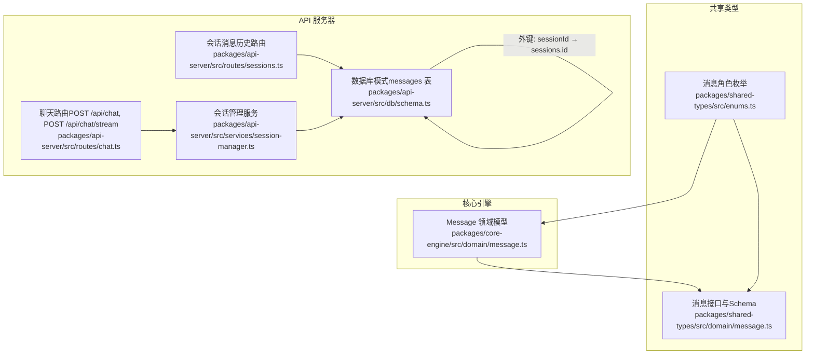
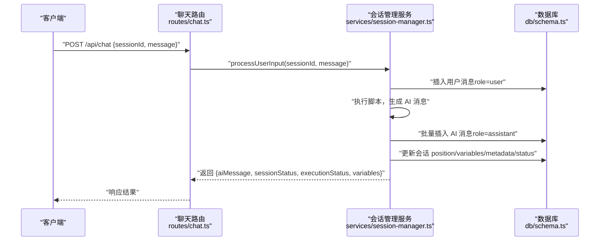
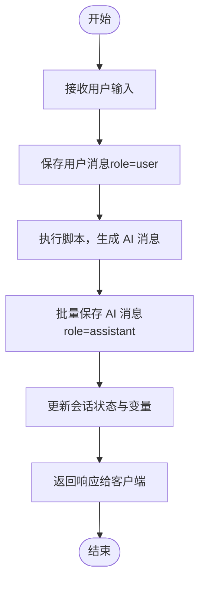

# 消息模型

<cite>
**本文档引用的文件**
- [packages/core-engine/src/domain/message.ts](file://packages/core-engine/src/domain/message.ts)
- [packages/shared-types/src/domain/message.ts](file://packages/shared-types/src/domain/message.ts)
- [packages/shared-types/src/enums.ts](file://packages/shared-types/src/enums.ts)
- [packages/api-server/src/db/schema.ts](file://packages/api-server/src/db/schema.ts)
- [packages/api-server/src/routes/chat.ts](file://packages/api-server/src/routes/chat.ts)
- [packages/api-server/src/routes/sessions.ts](file://packages/api-server/src/routes/sessions.ts)
- [packages/api-server/src/services/session-manager.ts](file://packages/api-server/src/services/session-manager.ts)
- [packages/api-server/test-init-message.ts](file://packages/api-server/test-init-message.ts)
- [packages/api-server/test-session-flow.ts](file://packages/api-server/test-session-flow.ts)
</cite>

## 目录
1. [简介](#简介)
2. [项目结构](#项目结构)
3. [核心组件](#核心组件)
4. [架构总览](#架构总览)
5. [详细组件分析](#详细组件分析)
6. [依赖关系分析](#依赖关系分析)
7. [性能考虑](#性能考虑)
8. [故障排查指南](#故障排查指南)
9. [结论](#结论)
10. [附录](#附录)

## 简介
本文件围绕“消息模型”进行系统性说明，覆盖消息格式规范、类型分类（USER、SYSTEM、ASSISTANT）、内容结构定义；消息生命周期（创建、发送、接收、存储、检索）；时间戳与排序机制；历史记录维护；格式验证与内容过滤策略；隐私保护措施；以及消息流处理、批量操作与性能优化最佳实践。目标是帮助开发者与产品人员准确理解消息在系统中的设计与运行方式。

## 项目结构
消息模型涉及三层：
- 领域层：核心引擎中的消息领域模型，负责消息对象的属性与序列化。
- 类型与校验层：共享类型包中的消息接口与Zod Schema，统一前后端对消息结构与字段的约束。
- 基础设施层：API 服务器中的数据库模式、路由与服务，负责消息的持久化、检索与业务编排。



图表来源
- [packages/core-engine/src/domain/message.ts](file://packages/core-engine/src/domain/message.ts#L1-L49)
- [packages/shared-types/src/domain/message.ts](file://packages/shared-types/src/domain/message.ts#L1-L52)
- [packages/shared-types/src/enums.ts](file://packages/shared-types/src/enums.ts#L24-L31)
- [packages/api-server/src/db/schema.ts](file://packages/api-server/src/db/schema.ts#L42-L58)
- [packages/api-server/src/routes/chat.ts](file://packages/api-server/src/routes/chat.ts#L1-L152)
- [packages/api-server/src/routes/sessions.ts](file://packages/api-server/src/routes/sessions.ts#L248-L293)
- [packages/api-server/src/services/session-manager.ts](file://packages/api-server/src/services/session-manager.ts#L1-L462)

章节来源
- [packages/core-engine/src/domain/message.ts](file://packages/core-engine/src/domain/message.ts#L1-L49)
- [packages/shared-types/src/domain/message.ts](file://packages/shared-types/src/domain/message.ts#L1-L52)
- [packages/shared-types/src/enums.ts](file://packages/shared-types/src/enums.ts#L24-L31)
- [packages/api-server/src/db/schema.ts](file://packages/api-server/src/db/schema.ts#L42-L58)
- [packages/api-server/src/routes/chat.ts](file://packages/api-server/src/routes/chat.ts#L1-L152)
- [packages/api-server/src/routes/sessions.ts](file://packages/api-server/src/routes/sessions.ts#L248-L293)
- [packages/api-server/src/services/session-manager.ts](file://packages/api-server/src/services/session-manager.ts#L1-L462)

## 核心组件
- 消息领域模型（Message）
  - 字段：messageId、sessionId、role、content、actionId、metadata、timestamp。
  - 行为：构造函数支持可选参数，默认生成 messageId、设置默认时间戳；toJSON 序列化时将 Map 转为普通对象，并将时间戳转为 ISO 字符串。
- 消息接口与 Schema（共享类型）
  - 定义消息接口与 CreateMessageInput 接口，配套 Zod Schema 用于运行时校验。
  - 角色使用 MessageRole 枚举，确保取值范围受控。
- 数据库模式（messages 表）
  - 字段：id、sessionId、role、content、actionId、metadata、timestamp。
  - 索引：session_id、timestamp；外键：sessionId → sessions(id)，级联删除。
- 路由与服务
  - /api/chat：非流式发送消息，调用会话管理服务处理用户输入并返回 AI 回复与会话状态。
  - /api/chat/stream：SSE 流式响应，保存用户消息后模拟流式输出。
  - /api/sessions/:id/messages：按时间升序返回某会话的所有消息。
  - SessionManager：保存用户消息、执行脚本、批量保存 AI 消息、更新会话状态与变量快照。

章节来源
- [packages/core-engine/src/domain/message.ts](file://packages/core-engine/src/domain/message.ts#L7-L48)
- [packages/shared-types/src/domain/message.ts](file://packages/shared-types/src/domain/message.ts#L8-L51)
- [packages/api-server/src/db/schema.ts](file://packages/api-server/src/db/schema.ts#L45-L57)
- [packages/api-server/src/routes/chat.ts](file://packages/api-server/src/routes/chat.ts#L16-L79)
- [packages/api-server/src/routes/sessions.ts](file://packages/api-server/src/routes/sessions.ts#L248-L293)
- [packages/api-server/src/services/session-manager.ts](file://packages/api-server/src/services/session-manager.ts#L258-L436)

## 架构总览
消息在系统中的流转路径如下：



图表来源
- [packages/api-server/src/routes/chat.ts](file://packages/api-server/src/routes/chat.ts#L44-L78)
- [packages/api-server/src/services/session-manager.ts](file://packages/api-server/src/services/session-manager.ts#L258-L436)
- [packages/api-server/src/db/schema.ts](file://packages/api-server/src/db/schema.ts#L45-L57)

## 详细组件分析

### 消息类型与业务含义
- 用户消息（USER）
  - 用途：来访者输入，作为脚本执行的触发条件。
  - 特点：content 为用户文本；通常在 /api/chat 中接收并保存。
- 系统消息（SYSTEM）
  - 用途：系统提示或引导语（如欢迎语、规则说明等）。
  - 特点：在当前代码中未直接暴露“system”消息的创建入口，但数据库与枚举支持该角色，便于后续扩展。
- 助手消息（ASSISTANT）
  - 用途：AI 回复，由脚本执行器生成并通过会话管理服务批量保存。
  - 特点：可能携带 actionId 与 metadata，便于追踪来源与上下文。

章节来源
- [packages/shared-types/src/enums.ts](file://packages/shared-types/src/enums.ts#L27-L31)
- [packages/api-server/src/db/schema.ts](file://packages/api-server/src/db/schema.ts#L48-L49)
- [packages/api-server/src/services/session-manager.ts](file://packages/api-server/src/services/session-manager.ts#L376-L388)

### 消息格式规范与结构定义
- 字段定义
  - messageId：消息唯一标识，UUID。
  - sessionId：所属会话标识，UUID。
  - role：消息角色（user/assistant/system）。
  - content：消息正文，字符串。
  - actionId：可选，关联到具体动作（如 AI 问、AI 说）。
  - metadata：可选，结构化元数据，前端以对象形式传输，后端以 JSONB 存储。
  - timestamp：消息时间戳，默认创建时赋值。
- 序列化
  - 领域模型 toJSON 将 Map(metadata) 转为普通对象，时间戳转为 ISO 字符串。
- 校验
  - 共享类型中提供 MessageSchema 与 CreateMessageInputSchema，使用 Zod 对字段类型、长度、格式进行约束。

章节来源
- [packages/core-engine/src/domain/message.ts](file://packages/core-engine/src/domain/message.ts#L16-L47)
- [packages/shared-types/src/domain/message.ts](file://packages/shared-types/src/domain/message.ts#L21-L51)

### 生命周期管理：创建、发送、接收、存储、检索
- 创建
  - 领域模型构造函数支持可选 messageId、metadata、timestamp，默认生成 UUID 并设置当前时间。
- 发送
  - 非流式：/api/chat 接收 {sessionId, message}，调用 SessionManager.processUserInput。
  - 流式：/api/chat/stream 接收相同请求，保存用户消息后模拟 SSE 输出。
- 接收
  - SessionManager 在执行脚本后收集 conversationHistory 中的 assistant 消息，批量保存至数据库。
- 存储
  - messages 表：id、sessionId、role、content、actionId、metadata、timestamp。
  - 索引：session_id、timestamp；外键：sessionId → sessions(id)。
- 检索
  - /api/sessions/:id/messages：按时间升序返回该会话所有消息，便于前端渲染历史。



图表来源
- [packages/api-server/src/routes/chat.ts](file://packages/api-server/src/routes/chat.ts#L44-L78)
- [packages/api-server/src/services/session-manager.ts](file://packages/api-server/src/services/session-manager.ts#L315-L322)
- [packages/api-server/src/services/session-manager.ts](file://packages/api-server/src/services/session-manager.ts#L376-L388)
- [packages/api-server/src/routes/sessions.ts](file://packages/api-server/src/routes/sessions.ts#L290-L293)

章节来源
- [packages/core-engine/src/domain/message.ts](file://packages/core-engine/src/domain/message.ts#L25-L31)
- [packages/api-server/src/db/schema.ts](file://packages/api-server/src/db/schema.ts#L45-L57)
- [packages/api-server/src/routes/chat.ts](file://packages/api-server/src/routes/chat.ts#L16-L79)
- [packages/api-server/src/routes/sessions.ts](file://packages/api-server/src/routes/sessions.ts#L248-L293)
- [packages/api-server/src/services/session-manager.ts](file://packages/api-server/src/services/session-manager.ts#L258-L436)

### 时间戳管理、排序机制与历史记录维护
- 时间戳
  - 领域模型默认创建时设置 timestamp；数据库默认 now()。
- 排序
  - /api/sessions/:id/messages 按 timestamp 升序返回，保证历史顺序一致。
- 历史记录
  - 通过 messages 表维护完整历史；结合会话表 position、variables、metadata 维护执行上下文。

章节来源
- [packages/core-engine/src/domain/message.ts](file://packages/core-engine/src/domain/message.ts#L31-L31)
- [packages/api-server/src/db/schema.ts](file://packages/api-server/src/db/schema.ts#L52-L52)
- [packages/api-server/src/routes/sessions.ts](file://packages/api-server/src/routes/sessions.ts#L290-L293)

### 格式验证规则、内容过滤策略与隐私保护
- 格式验证规则
  - Zod Schema 约束：messageId、sessionId 为 UUID；role 使用 MessageRole 枚举；content 为字符串；metadata 为对象；timestamp 为日期。
  - CreateMessageInputSchema 对应创建输入进行约束。
- 内容过滤策略
  - 当前代码未见通用内容过滤逻辑；可在路由层或服务层增加输入清洗与长度/正则校验（参考 AI Ask Action 的输入校验思路）。
- 隐私保护措施
  - 建议：对敏感字段（如 metadata）进行最小化采集与脱敏；对日志输出进行脱敏；数据库层面启用审计与访问控制。

章节来源
- [packages/shared-types/src/domain/message.ts](file://packages/shared-types/src/domain/message.ts#L21-L51)
- [packages/shared-types/src/enums.ts](file://packages/shared-types/src/enums.ts#L110-L110)

### 消息流处理、批量操作与性能优化最佳实践
- 消息流处理
  - SSE 流式响应：/api/chat/stream 设置 SSE 头，模拟分片输出；实际场景建议接入真实 LLM 流式输出。
- 批量操作
  - SessionManager 在初始化与每次用户输入后，批量保存 AI 消息，减少多次写入开销。
- 性能优化
  - 数据库索引：messages.session_id、messages.timestamp 已建立，有利于按会话查询与排序。
  - 建议：对高频查询添加复合索引；对 metadata 字段建立 GIN 索引以支持复杂查询；对长文本 content 建立必要全文索引（视需求）。
  - 缓存：对最近 N 条消息与会话状态进行缓存，降低数据库压力。
  - 分页：历史消息过多时采用分页或游标分页，避免一次性加载过多数据。

章节来源
- [packages/api-server/src/routes/chat.ts](file://packages/api-server/src/routes/chat.ts#L81-L150)
- [packages/api-server/src/services/session-manager.ts](file://packages/api-server/src/services/session-manager.ts#L163-L189)
- [packages/api-server/src/services/session-manager.ts](file://packages/api-server/src/services/session-manager.ts#L365-L391)
- [packages/api-server/src/db/schema.ts](file://packages/api-server/src/db/schema.ts#L54-L57)

## 依赖关系分析
- 消息领域模型依赖共享类型中的 MessageRole 枚举。
- 共享类型中的消息接口与 Schema 为前后端契约，确保数据一致性。
- API 服务器的路由与服务依赖数据库模式，形成完整的 CRUD 闭环。
- SessionManager 串联路由与数据库，承担消息持久化与会话状态维护职责。

```mermaid
classDiagram
class Message {
+string messageId
+string sessionId
+MessageRole role
+string content
+string? actionId
+Map~string, unknown~ metadata
+Date timestamp
+toJSON() Record
}
class MessageRole {
<<enum>>
+user
+assistant
+system
}
class MessagesTable {
+uuid id
+uuid sessionId
+message_role role
+text content
+varchar? actionId
+jsonb metadata
+timestamp timestamp
}
Message --> MessageRole : "使用"
MessagesTable : "外键 : sessionId → sessions(id)"
```

图表来源
- [packages/core-engine/src/domain/message.ts](file://packages/core-engine/src/domain/message.ts#L7-L47)
- [packages/shared-types/src/enums.ts](file://packages/shared-types/src/enums.ts#L27-L31)
- [packages/api-server/src/db/schema.ts](file://packages/api-server/src/db/schema.ts#L45-L57)

章节来源
- [packages/core-engine/src/domain/message.ts](file://packages/core-engine/src/domain/message.ts#L1-L49)
- [packages/shared-types/src/enums.ts](file://packages/shared-types/src/enums.ts#L24-L31)
- [packages/api-server/src/db/schema.ts](file://packages/api-server/src/db/schema.ts#L42-L58)

## 性能考虑
- 查询性能
  - messages.session_id 与 messages.timestamp 索引有助于按会话检索与排序。
- 写入性能
  - 批量插入 AI 消息减少事务次数；合理控制每批条数。
- 存储与归档
  - 对历史消息进行冷热分离与定期归档，降低热数据表膨胀。
- 日志与可观测性
  - 对关键路径（消息保存、脚本执行）增加结构化日志与指标埋点，便于定位性能瓶颈。

## 故障排查指南
- 会话不存在
  - /api/chat 在查询会话不存在时返回 404，需确认 sessionId 是否正确。
- 执行异常
  - SessionManager 在执行脚本异常时构建详细错误信息并返回，检查 error 字段定位问题。
- 初始化消息验证
  - 可通过测试脚本验证初始化消息是否符合预期（例如是否先询问姓名而非年龄）。
- 会话流程验证
  - 使用测试脚本模拟多轮对话，验证 Action 状态恢复与位置推进是否正确。

章节来源
- [packages/api-server/src/routes/chat.ts](file://packages/api-server/src/routes/chat.ts#L50-L60)
- [packages/api-server/src/services/session-manager.ts](file://packages/api-server/src/services/session-manager.ts#L235-L252)
- [packages/api-server/test-init-message.ts](file://packages/api-server/test-init-message.ts#L47-L54)
- [packages/api-server/test-session-flow.ts](file://packages/api-server/test-session-flow.ts#L110-L131)

## 结论
消息模型在本项目中以清晰的分层设计实现：领域模型定义消息结构与序列化，共享类型提供跨层契约与校验，API 层负责持久化与业务编排。通过角色分类、时间戳与索引、批量写入与流式输出等机制，系统实现了稳定的历史记录维护与高效的消息流转。建议在现有基础上进一步完善内容过滤与隐私保护策略，并持续优化数据库索引与缓存策略以提升性能。

## 附录
- 关键路径参考
  - 非流式发送：/api/chat → SessionManager.processUserInput → 批量保存 AI 消息 → 返回响应
  - 流式发送：/api/chat/stream → 保存用户消息 → SSE 模拟输出
  - 历史检索：/api/sessions/:id/messages → 按时间升序返回