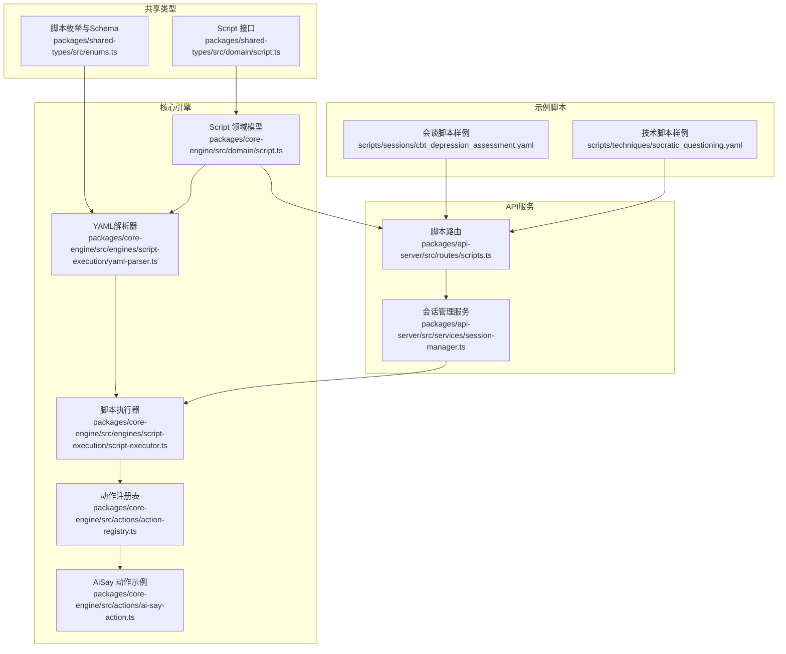
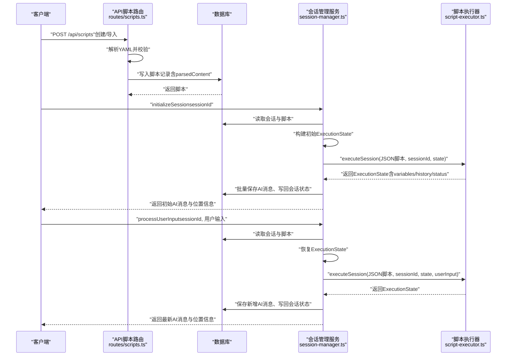
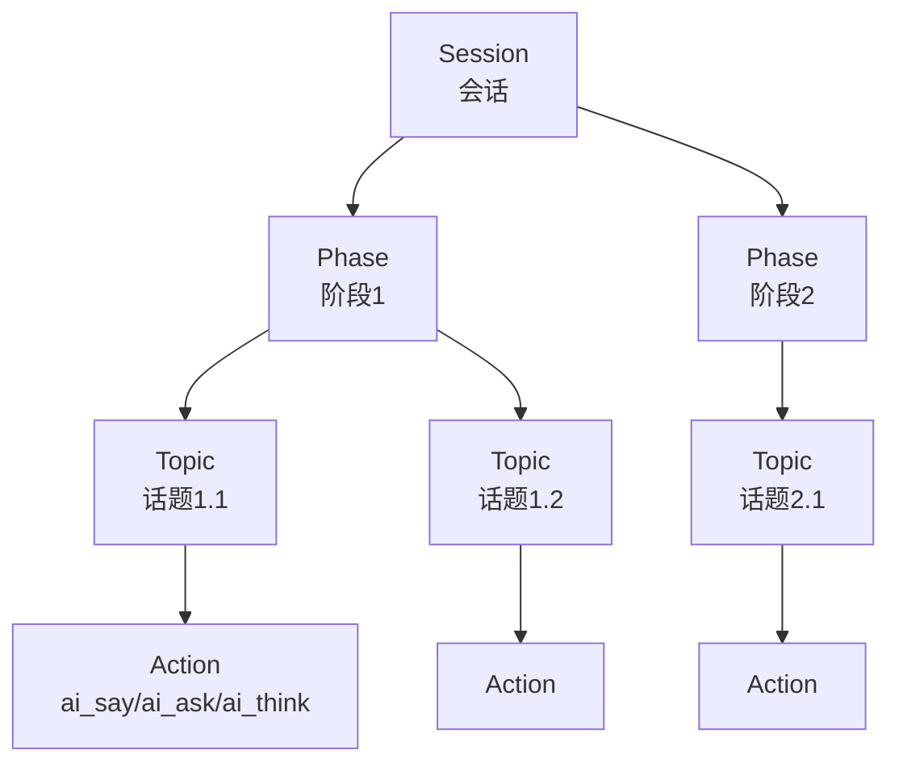
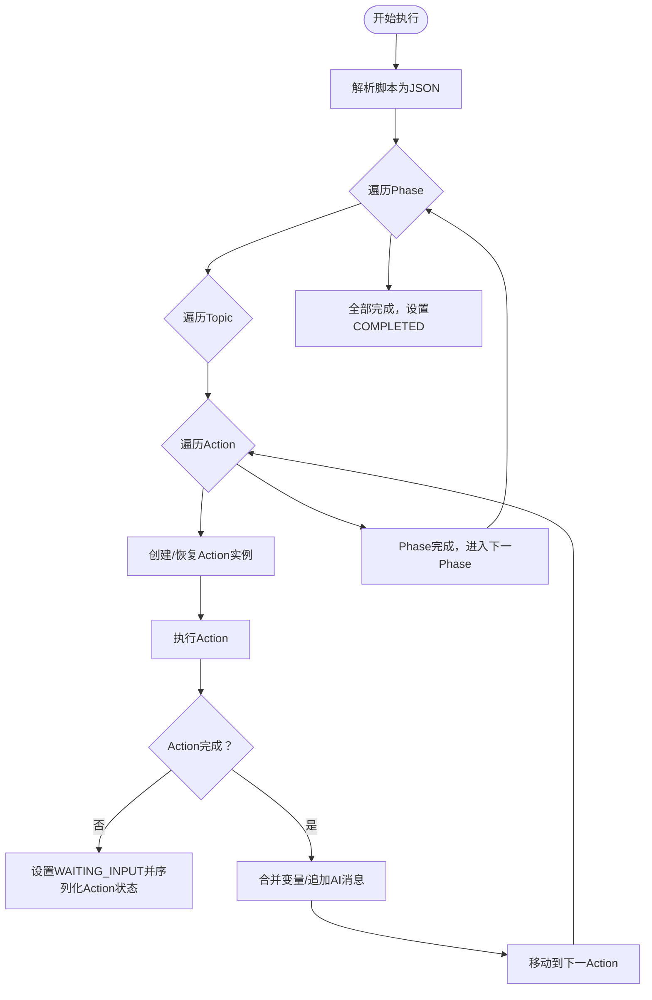
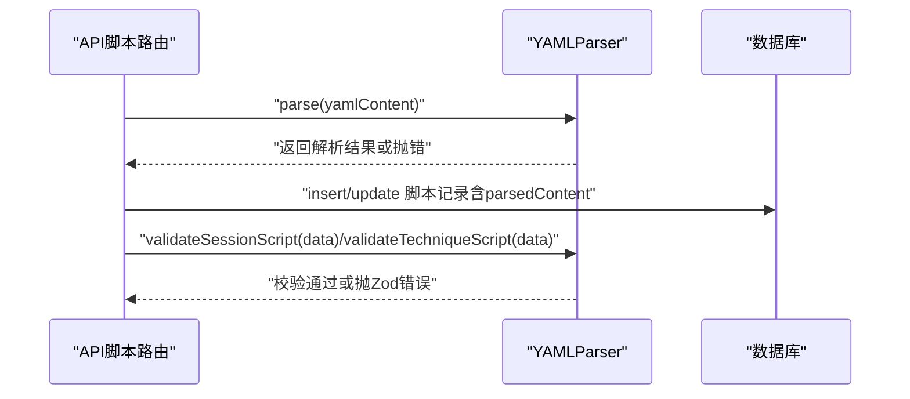
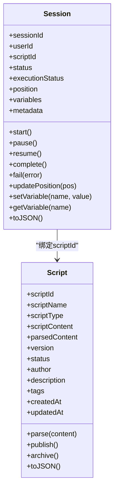
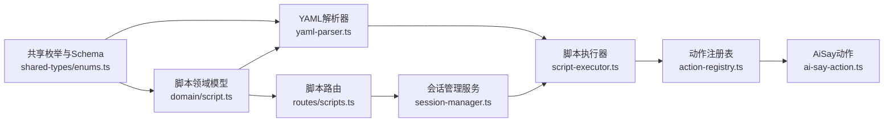

# 脚本模型

<cite>
**本文引用的文件**
- [packages/core-engine/src/domain/script.ts](file://packages/core-engine/src/domain/script.ts)
- [packages/shared-types/src/domain/script.ts](file://packages/shared-types/src/domain/script.ts)
- [packages/shared-types/src/enums.ts](file://packages/shared-types/src/enums.ts)
- [packages/core-engine/src/engines/script-execution/yaml-parser.ts](file://packages/core-engine/src/engines/script-execution/yaml-parser.ts)
- [packages/core-engine/src/engines/script-execution/script-executor.ts](file://packages/core-engine/src/engines/script-execution/script-executor.ts)
- [packages/core-engine/src/actions/action-registry.ts](file://packages/core-engine/src/actions/action-registry.ts)
- [packages/core-engine/src/actions/ai-say-action.ts](file://packages/core-engine/src/actions/ai-say-action.ts)
- [packages/api-server/src/routes/scripts.ts](file://packages/api-server/src/routes/scripts.ts)
- [packages/api-server/src/services/session-manager.ts](file://packages/api-server/src/services/session-manager.ts)
- [packages/core-engine/src/domain/session.ts](file://packages/core-engine/src/domain/session.ts)
- [scripts/sessions/cbt_depression_assessment.yaml](file://scripts/sessions/cbt_depression_assessment.yaml)
- [scripts/techniques/socratic_questioning.yaml](file://scripts/techniques/socratic_questioning.yaml)
- [packages/api-server/temp-script.yaml](file://packages/api-server/temp-script.yaml)
- [packages/api-server/test-new-config.yaml](file://packages/api-server/test-new-config.yaml)
</cite>

## 目录
1. [简介](#简介)
2. [项目结构](#项目结构)
3. [核心组件](#核心组件)
4. [架构总览](#架构总览)
5. [详细组件分析](#详细组件分析)
6. [依赖分析](#依赖分析)
7. [性能考虑](#性能考虑)
8. [故障排查指南](#故障排查指南)
9. [结论](#结论)
10. [附录](#附录)

## 简介
本文件系统化阐述“脚本模型”的设计与实现，围绕以下主题展开：
- 脚本结构定义：phase（阶段）、topic（话题）、action（动作）三层嵌套结构与语义边界
- 版本控制与状态管理：脚本版本号、状态（草稿/发布/归档）、时间戳
- 执行流程管理：脚本解析、校验、执行器驱动的会话执行、状态同步与持久化
- 加载与验证：YAML解析与Zod Schema校验、API层导入与校验接口
- 与会话的绑定：Session模型与Script的关联、执行状态在会话中的映射
- 运维与最佳实践：导入导出、备份恢复、编写规范与常见错误处理

## 项目结构
脚本模型横跨共享类型、核心引擎、API服务与示例脚本四部分：
- 共享类型：定义脚本接口、脚本类型/状态枚举与Zod校验
- 核心引擎：脚本领域模型、YAML解析器、脚本执行器、动作注册与具体动作
- API服务：脚本路由（创建/查询/导入/校验）、会话管理服务（会话与脚本绑定、执行状态同步）
- 示例脚本：会谈脚本与技术脚本样例，展示phase/topic/action结构

图表来源
- [packages/shared-types/src/domain/script.ts](file://packages/shared-types/src/domain/script.ts#L1-L64)
- [packages/shared-types/src/enums.ts](file://packages/shared-types/src/enums.ts#L35-L49)
- [packages/core-engine/src/domain/script.ts](file://packages/core-engine/src/domain/script.ts#L1-L95)
- [packages/core-engine/src/engines/script-execution/yaml-parser.ts](file://packages/core-engine/src/engines/script-execution/yaml-parser.ts#L1-L96)
- [packages/core-engine/src/engines/script-execution/script-execution/script-executor.ts](file://packages/core-engine/src/engines/script-execution/script-execution/script-executor.ts#L1-L511)
- [packages/core-engine/src/actions/action-registry.ts](file://packages/core-engine/src/actions/action-registry.ts#L1-L46)
- [packages/core-engine/src/actions/ai-say-action.ts](file://packages/core-engine/src/actions/ai-say-action.ts#L1-L105)
- [packages/api-server/src/routes/scripts.ts](file://packages/api-server/src/routes/scripts.ts#L1-L325)
- [packages/api-server/src/services/session-manager.ts](file://packages/api-server/src/services/session-manager.ts#L1-L462)
- [scripts/sessions/cbt_depression_assessment.yaml](file://scripts/sessions/cbt_depression_assessment.yaml#L1-L166)
- [scripts/techniques/socratic_questioning.yaml](file://scripts/techniques/socratic_questioning.yaml#L1-L110)

章节来源
- [packages/core-engine/src/domain/script.ts](file://packages/core-engine/src/domain/script.ts#L1-L95)
- [packages/shared-types/src/domain/script.ts](file://packages/shared-types/src/domain/script.ts#L1-L64)
- [packages/shared-types/src/enums.ts](file://packages/shared-types/src/enums.ts#L35-L49)
- [packages/core-engine/src/engines/script-execution/yaml-parser.ts](file://packages/core-engine/src/engines/script-execution/yaml-parser.ts#L1-L96)
- [packages/core-engine/src/engines/script-execution/script-executor.ts](file://packages/core-engine/src/engines/script-execution/script-executor.ts#L1-L511)
- [packages/api-server/src/routes/scripts.ts](file://packages/api-server/src/routes/scripts.ts#L1-L325)
- [packages/api-server/src/services/session-manager.ts](file://packages/api-server/src/services/session-manager.ts#L1-L462)
- [scripts/sessions/cbt_depression_assessment.yaml](file://scripts/sessions/cbt_depression_assessment.yaml#L1-L166)
- [scripts/techniques/socratic_questioning.yaml](file://scripts/techniques/socratic_questioning.yaml#L1-L110)

## 核心组件
- 脚本领域模型：封装脚本标识、名称、类型、内容、解析结果、版本、状态、作者、标签、时间戳等字段，并提供解析、发布、归档与序列化能力
- YAML解析器：负责YAML字符串解析与序列化，并提供两类脚本Schema校验（会谈脚本与技术脚本）
- 脚本执行器：按phase/topic/action顺序执行，维护执行状态（运行/等待输入/暂停/完成/错误），支持Action内部状态序列化/反序列化
- 动作注册与动作：通过注册表创建具体动作实例；AiSay等动作示例展示了消息发送、确认等待、轮次控制等行为
- API脚本路由：提供脚本创建、查询、导入、校验接口；导入时解析YAML并入库
- 会话管理服务：将脚本与会话绑定，初始化与处理用户输入，同步执行状态与变量到数据库
- 示例脚本：展示phase/topic/action的完整结构与典型配置

章节来源
- [packages/core-engine/src/domain/script.ts](file://packages/core-engine/src/domain/script.ts#L7-L94)
- [packages/core-engine/src/engines/script-execution/yaml-parser.ts](file://packages/core-engine/src/engines/script-execution/yaml-parser.ts#L8-L95)
- [packages/core-engine/src/engines/script-execution/script-executor.ts](file://packages/core-engine/src/engines/script-execution/script-executor.ts#L59-L510)
- [packages/core-engine/src/actions/action-registry.ts](file://packages/core-engine/src/actions/action-registry.ts#L17-L45)
- [packages/core-engine/src/actions/ai-say-action.ts](file://packages/core-engine/src/actions/ai-say-action.ts#L16-L104)
- [packages/api-server/src/routes/scripts.ts](file://packages/api-server/src/routes/scripts.ts#L14-L324)
- [packages/api-server/src/services/session-manager.ts](file://packages/api-server/src/services/session-manager.ts#L21-L461)
- [scripts/sessions/cbt_depression_assessment.yaml](file://scripts/sessions/cbt_depression_assessment.yaml#L13-L166)
- [scripts/techniques/socratic_questioning.yaml](file://scripts/techniques/socratic_questioning.yaml#L31-L110)

## 架构总览
脚本模型的端到端流程如下：
- 脚本创建/导入：API接收YAML，解析为JSON并入库，同时保留parsedContent
- 会话启动：根据会话绑定的scriptId获取脚本，转换为JSON后交由执行器
- 执行过程：按phase→topic→action顺序推进，支持等待用户输入、Action内部状态持久化、变量抽取与历史记录
- 状态同步：执行器输出的ExecutionState回写至会话表，确保断点续跑与错误恢复

图表来源
- [packages/api-server/src/routes/scripts.ts](file://packages/api-server/src/routes/scripts.ts#L14-L324)
- [packages/api-server/src/services/session-manager.ts](file://packages/api-server/src/services/session-manager.ts#L73-L461)
- [packages/core-engine/src/engines/script-execution/script-executor.ts](file://packages/core-engine/src/engines/script-execution/script-executor.ts#L63-L208)

## 详细组件分析

### 脚本结构定义与层级关系
- 结构层次：Session → Phase → Topic → Action
- 语义边界：
  - Session：一次完整的咨询对话实例，绑定scriptId
  - Phase：阶段性目标与流程划分
  - Topic：围绕特定议题的子流程
  - Action：最小可执行单元（如AI说话、提问、思考）
- 示例脚本展示了三者嵌套与典型配置项（如action_id、action_type、config）

图表来源
- [scripts/sessions/cbt_depression_assessment.yaml](file://scripts/sessions/cbt_depression_assessment.yaml#L17-L126)
- [scripts/techniques/socratic_questioning.yaml](file://scripts/techniques/socratic_questioning.yaml#L31-L110)

章节来源
- [scripts/sessions/cbt_depression_assessment.yaml](file://scripts/sessions/cbt_depression_assessment.yaml#L12-L166)
- [scripts/techniques/socratic_questioning.yaml](file://scripts/techniques/socratic_questioning.yaml#L10-L110)

### 版本控制与状态管理
- 版本：脚本模型包含version字段，默认初始化为“1.0.0”
- 状态：脚本状态枚举包含DRAFT/PUBLISHED/ARCHIVED，提供publish/archive方法
- 时间戳：createdAt/updatedAt自动维护
- API层：创建脚本时写入version与status，并保存parsedContent

章节来源
- [packages/core-engine/src/domain/script.ts](file://packages/core-engine/src/domain/script.ts#L13-L47)
- [packages/shared-types/src/enums.ts](file://packages/shared-types/src/enums.ts#L45-L49)
- [packages/api-server/src/routes/scripts.ts](file://packages/api-server/src/routes/scripts.ts#L57-L70)

### 执行流程管理
- 执行器职责：按序遍历phase/topic/action，维护ExecutionState（状态、索引、变量、历史、元数据）
- 等待输入：当Action返回未完成且需要用户确认时，设置WAITING_INPUT并序列化Action内部状态
- 断点续跑：从会话metadata恢复Action状态，继续执行
- 变量与历史：Action执行成功后合并extractedVariables，追加AI消息到conversationHistory

图表来源
- [packages/core-engine/src/engines/script-execution/script-executor.ts](file://packages/core-engine/src/engines/script-execution/script-executor.ts#L63-L208)
- [packages/core-engine/src/engines/script-execution/script-executor.ts](file://packages/core-engine/src/engines/script-execution/script-executor.ts#L213-L389)
- [packages/core-engine/src/engines/script-execution/script-executor.ts](file://packages/core-engine/src/engines/script-execution/script-executor.ts#L394-L448)

章节来源
- [packages/core-engine/src/engines/script-execution/script-executor.ts](file://packages/core-engine/src/engines/script-execution/script-executor.ts#L59-L510)

### 加载、解析与验证流程
- 加载：API路由接收YAML字符串，尝试解析为JSON并入库；若解析失败则记录null并继续
- 解析：YAMLParser使用js-yaml进行load/dump，并提供validateSessionScript/validateTechniqueScript
- 校验：YAMLParser使用Zod Schema对脚本结构进行严格校验，捕获ZodError并转换为可读错误

图表来源
- [packages/api-server/src/routes/scripts.ts](file://packages/api-server/src/routes/scripts.ts#L48-L70)
- [packages/api-server/src/routes/scripts.ts](file://packages/api-server/src/routes/scripts.ts#L203-L277)
- [packages/core-engine/src/engines/script-execution/yaml-parser.ts](file://packages/core-engine/src/engines/script-execution/yaml-parser.ts#L12-L18)
- [packages/core-engine/src/engines/script-execution/yaml-parser.ts](file://packages/core-engine/src/engines/script-execution/yaml-parser.ts#L34-L67)
- [packages/core-engine/src/engines/script-execution/yaml-parser.ts](file://packages/core-engine/src/engines/script-execution/yaml-parser.ts#L72-L94)

章节来源
- [packages/api-server/src/routes/scripts.ts](file://packages/api-server/src/routes/scripts.ts#L48-L70)
- [packages/core-engine/src/engines/script-execution/yaml-parser.ts](file://packages/core-engine/src/engines/script-execution/yaml-parser.ts#L34-L94)

### 与会话的绑定与状态同步
- 绑定关系：Session持有scriptId，初始化时读取脚本并执行；执行结果回写会话position、variables、executionStatus、metadata
- 状态同步：会话管理服务在每次执行前后，将ExecutionState写回数据库；变量变更生成快照并入库
- 位置信息：执行器维护currentPhaseId/currentTopicId/currentActionId/currentActionType，便于前端定位

图表来源
- [packages/core-engine/src/domain/session.ts](file://packages/core-engine/src/domain/session.ts#L7-L137)
- [packages/core-engine/src/domain/script.ts](file://packages/core-engine/src/domain/script.ts#L7-L94)

章节来源
- [packages/core-engine/src/domain/session.ts](file://packages/core-engine/src/domain/session.ts#L7-L137)
- [packages/api-server/src/services/session-manager.ts](file://packages/api-server/src/services/session-manager.ts#L73-L253)
- [packages/api-server/src/services/session-manager.ts](file://packages/api-server/src/services/session-manager.ts#L258-L461)

### 动作注册与扩展
- 注册表：ACTION_REGISTRY维护actionType到类的映射，支持动态扩展新动作类型
- 创建动作：createAction根据action_type构造实例，未知类型抛错
- 示例动作：AiSayAction展示消息发送、确认等待、轮次控制与元数据返回

章节来源
- [packages/core-engine/src/actions/action-registry.ts](file://packages/core-engine/src/actions/action-registry.ts#L17-L45)
- [packages/core-engine/src/actions/ai-say-action.ts](file://packages/core-engine/src/actions/ai-say-action.ts#L19-L104)

## 依赖分析
- 脚本模型依赖共享类型中的枚举与Schema，确保跨包一致性
- 执行器依赖动作注册表与具体动作实现
- API服务依赖执行器与数据库，负责脚本生命周期与会话执行编排
- 示例脚本作为外部输入，驱动API导入与执行器验证

图表来源
- [packages/shared-types/src/enums.ts](file://packages/shared-types/src/enums.ts#L35-L49)
- [packages/core-engine/src/domain/script.ts](file://packages/core-engine/src/domain/script.ts#L1-L95)
- [packages/core-engine/src/engines/script-execution/yaml-parser.ts](file://packages/core-engine/src/engines/script-execution/yaml-parser.ts#L1-L96)
- [packages/core-engine/src/engines/script-execution/script-executor.ts](file://packages/core-engine/src/engines/script-execution/script-executor.ts#L1-L511)
- [packages/core-engine/src/actions/action-registry.ts](file://packages/core-engine/src/actions/action-registry.ts#L1-L46)
- [packages/core-engine/src/actions/ai-say-action.ts](file://packages/core-engine/src/actions/ai-say-action.ts#L1-L105)
- [packages/api-server/src/routes/scripts.ts](file://packages/api-server/src/routes/scripts.ts#L1-L325)
- [packages/api-server/src/services/session-manager.ts](file://packages/api-server/src/services/session-manager.ts#L1-L462)

章节来源
- [packages/shared-types/src/enums.ts](file://packages/shared-types/src/enums.ts#L35-L49)
- [packages/core-engine/src/domain/script.ts](file://packages/core-engine/src/domain/script.ts#L1-L95)
- [packages/core-engine/src/engines/script-execution/script-executor.ts](file://packages/core-engine/src/engines/script-execution/script-executor.ts#L1-L511)
- [packages/api-server/src/routes/scripts.ts](file://packages/api-server/src/routes/scripts.ts#L1-L325)
- [packages/api-server/src/services/session-manager.ts](file://packages/api-server/src/services/session-manager.ts#L1-L462)

## 性能考虑
- YAML解析与Schema校验：建议在导入时一次性完成，避免重复解析
- 执行器状态序列化：仅在Action未完成且需要等待输入时序列化，减少IO开销
- 变量快照：仅在值发生变化时写入，降低数据库压力
- 并发与批处理：批量保存AI消息与变量快照，减少事务次数

## 故障排查指南
- YAML解析失败：检查YAML语法与缩进；查看API导入日志与错误响应
- Schema校验失败：对照validateSessionScript/validateTechniqueScript的结构要求修正
- 执行器错误：关注ExecutionStatus.ERROR与metadata.error；结合Action日志定位问题
- 会话状态异常：核对position、variables、executionStatus是否与期望一致；必要时重置或回滚

章节来源
- [packages/core-engine/src/engines/script-execution/yaml-parser.ts](file://packages/core-engine/src/engines/script-execution/yaml-parser.ts#L59-L66)
- [packages/core-engine/src/engines/script-execution/script-executor.ts](file://packages/core-engine/src/engines/script-execution/script-executor.ts#L203-L207)
- [packages/api-server/src/services/session-manager.ts](file://packages/api-server/src/services/session-manager.ts#L235-L252)

## 结论
脚本模型以清晰的三层结构（phase/topic/action）与严格的Schema校验为基础，结合可扩展的动作体系与稳健的执行器状态管理，实现了从脚本导入、解析、校验到会话执行与状态同步的全链路闭环。通过会话与脚本的强绑定，系统能够在复杂交互中保持一致性与可恢复性。

## 附录

### 编写规范与最佳实践
- 结构规范
  - 严格遵循phase/topic/action层级命名与唯一标识（phase_id/topic_id/action_id）
  - 使用明确的goal与template字段，便于维护与审计
- 动作配置
  - 对需要用户确认的动作（如ai_say）合理设置require_acknowledgment与max_rounds
  - 对ai_ask动作，明确target_variable与extraction_prompt，确保变量抽取准确
- 版本与状态
  - 新增或修改脚本时更新version；发布前确保状态为PUBLISHED
  - 使用归档状态隔离不再使用的脚本
- 变量管理
  - 明确变量作用域与更新模式，避免覆盖关键状态
  - 通过变量快照追踪变更，便于回溯

### 常见错误与处理
- YAML语法错误：修正缩进与键名拼写；使用validate接口先行校验
- Schema不匹配：核对action_type与config结构；参考示例脚本
- 执行中断：利用WAITING_INPUT机制与Action状态序列化恢复；检查用户输入是否符合预期
- 数据不一致：核对会话position与执行器索引，必要时手动修复

### 导入导出与运维
- 导入
  - 使用API导入接口提交yamlContent与scriptName；系统自动解析并入库
  - 若脚本已存在则更新内容与parsedContent
- 导出
  - 通过查询接口获取脚本内容与元数据，导出为YAML或JSON
- 备份与恢复
  - 定期备份数据库；恢复时先导入脚本，再恢复会话状态
  - 使用parsedContent与ExecutionState元数据辅助快速恢复

章节来源
- [packages/api-server/src/routes/scripts.ts](file://packages/api-server/src/routes/scripts.ts#L172-L277)
- [packages/api-server/src/routes/scripts.ts](file://packages/api-server/src/routes/scripts.ts#L87-L125)
- [packages/api-server/src/services/session-manager.ts](file://packages/api-server/src/services/session-manager.ts#L73-L253)
- [packages/api-server/src/services/session-manager.ts](file://packages/api-server/src/services/session-manager.ts#L258-L461)