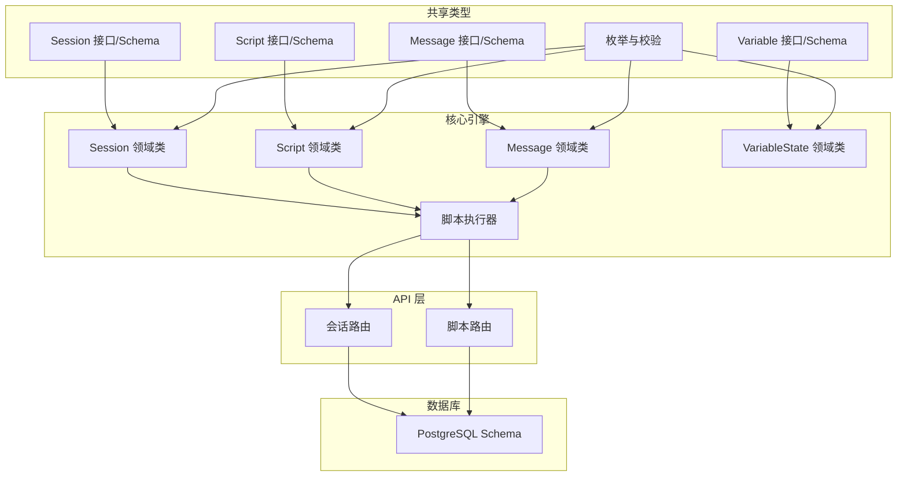
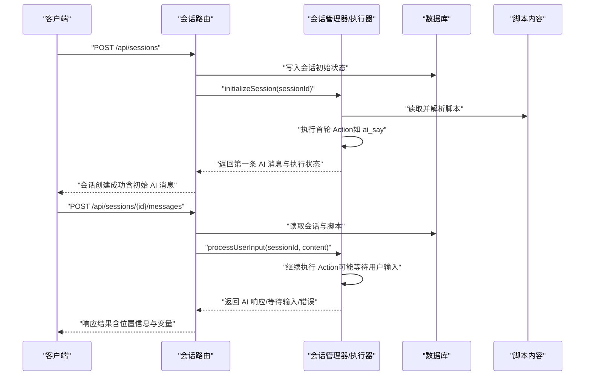
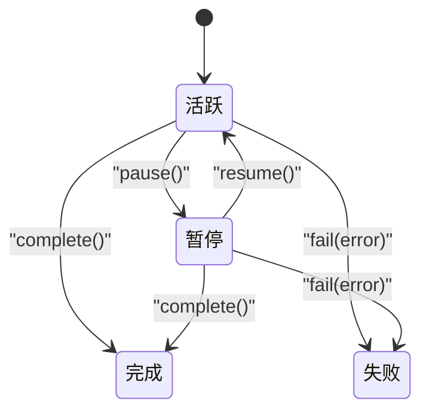
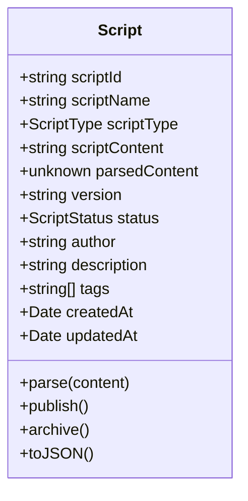
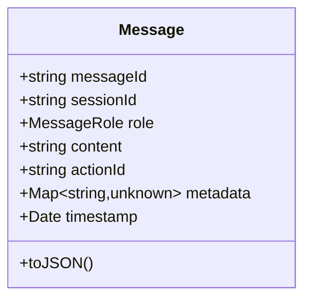
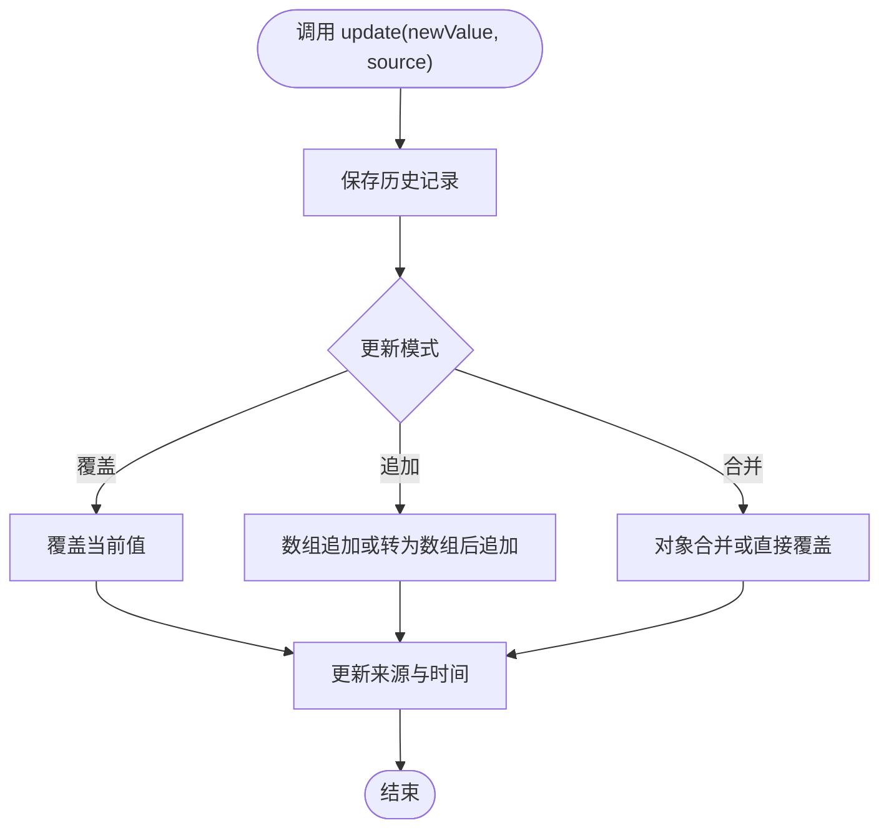
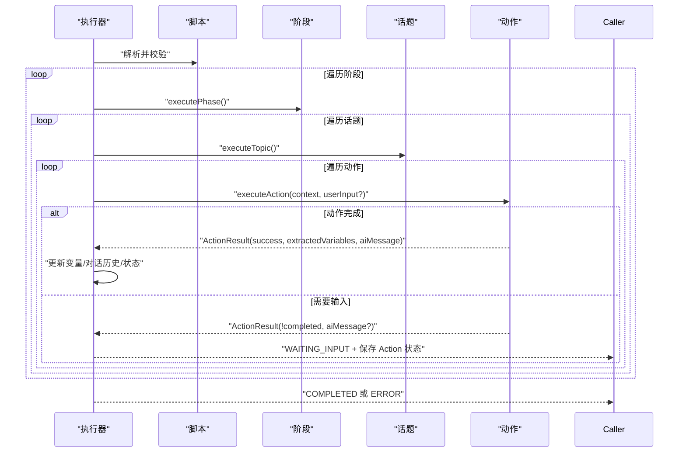
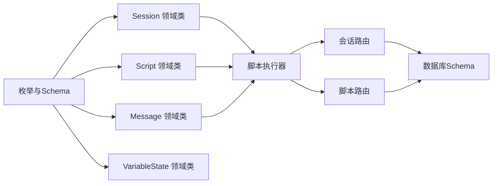

# 领域模型

<cite>
**本文引用的文件**
- [packages/core-engine/src/domain/session.ts](file://packages/core-engine/src/domain/session.ts)
- [packages/core-engine/src/domain/script.ts](file://packages/core-engine/src/domain/script.ts)
- [packages/core-engine/src/domain/message.ts](file://packages/core-engine/src/domain/message.ts)
- [packages/core-engine/src/domain/variable.ts](file://packages/core-engine/src/domain/variable.ts)
- [packages/shared-types/src/domain/session.ts](file://packages/shared-types/src/domain/session.ts)
- [packages/shared-types/src/domain/script.ts](file://packages/shared-types/src/domain/script.ts)
- [packages/shared-types/src/domain/message.ts](file://packages/shared-types/src/domain/message.ts)
- [packages/shared-types/src/domain/variable.ts](file://packages/shared-types/src/domain/variable.ts)
- [packages/shared-types/src/enums.ts](file://packages/shared-types/src/enums.ts)
- [packages/core-engine/src/engines/script-execution/executor.ts](file://packages/core-engine/src/engines/script-execution/executor.ts)
- [packages/core-engine/src/engines/script-execution/script-executor.ts](file://packages/core-engine/src/engines/script-execution/script-executor.ts)
- [packages/api-server/src/route/sessions.ts](file://packages/api-server/src/routes/sessions.ts)
- [packages/api-server/src/route/scripts.ts](file://packages/api-server/src/routes/scripts.ts)
- [packages/api-server/src/db/schema.ts](file://packages/api-server/src/db/schema.ts)
- [scripts/sessions/cbt_depression_assessment.yaml](file://scripts/sessions/cbt_depression_assessment.yaml)
</cite>

## 目录
1. [引言](#引言)
2. [项目结构](#项目结构)
3. [核心组件](#核心组件)
4. [架构总览](#架构总览)
5. [详细组件分析](#详细组件分析)
6. [依赖分析](#依赖分析)
7. [性能考虑](#性能考虑)
8. [故障排查指南](#故障排查指南)
9. [结论](#结论)
10. [附录](#附录)

## 引言
本文件系统化梳理 HeartRule AI 咨询引擎的领域模型，围绕三大核心实体 Session（会话）、Script（脚本）、Message（消息）展开，阐明其设计理念、业务含义、生命周期与状态流转、变量管理机制，以及三者之间的关系与约束。同时结合执行引擎与 API 层实现，说明数据模型如何支撑完整的咨询流程，并给出扩展与自定义字段的实践建议。

## 项目结构
- 领域模型位于核心引擎包中，采用按领域分层组织：domain 目录下分别定义 Session、Script、Message、Variable 等领域模型类与接口。
- 共享类型（shared-types）提供跨包的接口定义与 Zod 校验，确保前后端一致的数据契约。
- 执行引擎负责解析脚本、驱动 Action 流程、维护执行状态与变量。
- API 层通过路由暴露会话与脚本的 CRUD 与交互能力，持久化由数据库 Schema 定义。

图表来源
- [packages/shared-types/src/domain/session.ts](file://packages/shared-types/src/domain/session.ts#L37-L69)
- [packages/shared-types/src/domain/script.ts](file://packages/shared-types/src/domain/script.ts#L5-L39)
- [packages/shared-types/src/domain/message.ts](file://packages/shared-types/src/domain/message.ts#L5-L29)
- [packages/shared-types/src/domain/variable.ts](file://packages/shared-types/src/domain/variable.ts#L10-L58)
- [packages/shared-types/src/enums.ts](file://packages/shared-types/src/enums.ts#L3-L118)
- [packages/core-engine/src/domain/session.ts](file://packages/core-engine/src/domain/session.ts#L7-L136)
- [packages/core-engine/src/domain/script.ts](file://packages/core-engine/src/domain/script.ts#L7-L94)
- [packages/core-engine/src/domain/message.ts](file://packages/core-engine/src/domain/message.ts#L7-L48)
- [packages/core-engine/src/domain/variable.ts](file://packages/core-engine/src/domain/variable.ts#L15-L119)
- [packages/core-engine/src/engines/script-execution/executor.ts](file://packages/core-engine/src/engines/script-execution/executor.ts#L34-L297)
- [packages/api-server/src/routes/sessions.ts](file://packages/api-server/src/routes/sessions.ts#L13-L547)
- [packages/api-server/src/routes/scripts.ts](file://packages/api-server/src/routes/scripts.ts#L12-L324)
- [packages/api-server/src/db/schema.ts](file://packages/api-server/src/db/schema.ts#L22-L81)

章节来源
- [packages/core-engine/src/domain/session.ts](file://packages/core-engine/src/domain/session.ts#L1-L137)
- [packages/core-engine/src/domain/script.ts](file://packages/core-engine/src/domain/script.ts#L1-L95)
- [packages/core-engine/src/domain/message.ts](file://packages/core-engine/src/domain/message.ts#L1-L49)
- [packages/core-engine/src/domain/variable.ts](file://packages/core-engine/src/domain/variable.ts#L1-L120)
- [packages/shared-types/src/domain/session.ts](file://packages/shared-types/src/domain/session.ts#L1-L88)
- [packages/shared-types/src/domain/script.ts](file://packages/shared-types/src/domain/script.ts#L1-L64)
- [packages/shared-types/src/domain/message.ts](file://packages/shared-types/src/domain/message.ts#L1-L52)
- [packages/shared-types/src/domain/variable.ts](file://packages/shared-types/src/domain/variable.ts#L1-L59)
- [packages/shared-types/src/enums.ts](file://packages/shared-types/src/enums.ts#L1-L118)
- [packages/api-server/src/db/schema.ts](file://packages/api-server/src/db/schema.ts#L1-L219)

## 核心组件
- Session（会话）
  - 负责会话生命周期管理、状态跟踪（会话状态与执行状态）、执行位置追踪（阶段/话题/动作索引及可选 ID 字段）、变量与元数据管理。
  - 支持启动、暂停、恢复、完成、失败等操作，并在每次变更时更新时间戳。
- Script（脚本）
  - 描述咨询流程的 YAML/JSON 结构，包含名称、类型、内容、版本、状态、作者、标签、描述等。
  - 提供解析、发布、归档等状态管理方法。
- Message（消息）
  - 记录单条对话内容，包含角色（用户/助理/系统）、内容、关联动作 ID、时间戳与元数据。
- Variable（变量）
  - 表达变量的当前值、类型、作用域、更新模式（覆盖/追加/合并）、来源与历史记录，支持回滚。

章节来源
- [packages/core-engine/src/domain/session.ts](file://packages/core-engine/src/domain/session.ts#L7-L136)
- [packages/core-engine/src/domain/script.ts](file://packages/core-engine/src/domain/script.ts#L7-L94)
- [packages/core-engine/src/domain/message.ts](file://packages/core-engine/src/domain/message.ts#L7-L48)
- [packages/core-engine/src/domain/variable.ts](file://packages/core-engine/src/domain/variable.ts#L15-L119)
- [packages/shared-types/src/domain/session.ts](file://packages/shared-types/src/domain/session.ts#L37-L69)
- [packages/shared-types/src/domain/script.ts](file://packages/shared-types/src/domain/script.ts#L5-L39)
- [packages/shared-types/src/domain/message.ts](file://packages/shared-types/src/domain/message.ts#L5-L29)
- [packages/shared-types/src/domain/variable.ts](file://packages/shared-types/src/domain/variable.ts#L10-L58)

## 架构总览
会话从创建开始，绑定脚本后进入执行循环：执行器解析脚本结构，按阶段/话题/动作顺序驱动 Action 执行，期间维护执行状态、变量集合与对话历史，并在需要用户输入时返回“等待输入”状态。API 层负责会话与脚本的创建、查询与消息交互，数据库持久化会话、消息与脚本。

图表来源
- [packages/api-server/src/routes/sessions.ts](file://packages/api-server/src/routes/sessions.ts#L14-L133)
- [packages/api-server/src/routes/sessions.ts](file://packages/api-server/src/routes/sessions.ts#L403-L471)
- [packages/core-engine/src/engines/script-execution/executor.ts](file://packages/core-engine/src/engines/script-execution/executor.ts#L46-L127)

章节来源
- [packages/api-server/src/routes/sessions.ts](file://packages/api-server/src/routes/sessions.ts#L1-L548)
- [packages/core-engine/src/engines/script-execution/executor.ts](file://packages/core-engine/src/engines/script-execution/executor.ts#L1-L298)

## 详细组件分析

### Session（会话）领域模型
- 设计要点
  - 会话状态与执行状态分离：前者反映用户可见的会话进展，后者反映执行引擎内部状态（如等待输入、错误）。
  - 执行位置扩展：支持 phaseId/topicId/actionId/actionType，便于前端导航树定位。
  - 变量与元数据：Map 结构便于动态扩展，支持运行时注入与持久化。
- 生命周期与状态流转
  - 启动 -> 运行中 -> 执行中（可能暂停/等待输入）-> 完成或失败。
  - 暂停/恢复仅在会话状态为暂停时允许恢复。
- 关键行为
  - 启动/暂停/恢复/完成/失败均更新 updatedAt；失败时将错误写入 metadata。
  - updatePosition/updateVariable/getVariable 提供位置与变量的读写。
  - toJSON 输出标准化 JSON，便于 API 传输与持久化。

图表来源
- [packages/core-engine/src/domain/session.ts](file://packages/core-engine/src/domain/session.ts#L49-L93)
- [packages/shared-types/src/enums.ts](file://packages/shared-types/src/enums.ts#L6-L22)

章节来源
- [packages/core-engine/src/domain/session.ts](file://packages/core-engine/src/domain/session.ts#L1-L137)
- [packages/shared-types/src/domain/session.ts](file://packages/shared-types/src/domain/session.ts#L10-L69)
- [packages/shared-types/src/enums.ts](file://packages/shared-types/src/enums.ts#L1-L118)

### Script（脚本）领域模型
- 设计要点
  - 脚本类型区分会话型、技巧型、觉察型；状态支持草稿/发布/归档。
  - 版本字段用于演进管理；解析后的内容可缓存以减少重复解析。
- 关键行为
  - parse：缓存解析后的结构。
  - publish/archive：状态转换。
  - toJSON：序列化脚本元数据与内容。

图表来源
- [packages/core-engine/src/domain/script.ts](file://packages/core-engine/src/domain/script.ts#L7-L94)
- [packages/shared-types/src/domain/script.ts](file://packages/shared-types/src/domain/script.ts#L5-L39)
- [packages/shared-types/src/enums.ts](file://packages/shared-types/src/enums.ts#L34-L49)

章节来源
- [packages/core-engine/src/domain/script.ts](file://packages/core-engine/src/domain/script.ts#L1-L95)
- [packages/shared-types/src/domain/script.ts](file://packages/shared-types/src/domain/script.ts#L1-L64)
- [packages/shared-types/src/enums.ts](file://packages/shared-types/src/enums.ts#L1-L118)

### Message（消息）领域模型
- 设计要点
  - 角色区分用户、助理与系统；支持 actionId 关联到具体动作；metadata 用于承载额外上下文。
  - 时间戳精确到毫秒，保证消息顺序与审计。
- 关键行为
  - toJSON：序列化消息结构，便于 API 返回与前端渲染。

图表来源
- [packages/core-engine/src/domain/message.ts](file://packages/core-engine/src/domain/message.ts#L7-L48)
- [packages/shared-types/src/domain/message.ts](file://packages/shared-types/src/domain/message.ts#L5-L29)
- [packages/shared-types/src/enums.ts](file://packages/shared-types/src/enums.ts#L24-L31)

章节来源
- [packages/core-engine/src/domain/message.ts](file://packages/core-engine/src/domain/message.ts#L1-L49)
- [packages/shared-types/src/domain/message.ts](file://packages/shared-types/src/domain/message.ts#L1-L52)
- [packages/shared-types/src/enums.ts](file://packages/shared-types/src/enums.ts#L1-L118)

### Variable（变量）领域模型
- 设计要点
  - 支持三种更新模式：覆盖、追加（数组）、合并（对象），满足不同业务场景。
  - 历史记录保存每次变更的值、来源与时间戳，支持回滚。
  - 作用域枚举支持全局/会话/阶段/话题，便于变量生命周期管理。
- 关键行为
  - update：根据模式更新值并保存历史，更新来源与时间。
  - rollback：弹出历史并回退到上一值。
  - toJSON：序列化变量状态与历史。

图表来源
- [packages/core-engine/src/domain/variable.ts](file://packages/core-engine/src/domain/variable.ts#L54-L85)
- [packages/shared-types/src/enums.ts](file://packages/shared-types/src/enums.ts#L52-L68)

章节来源
- [packages/core-engine/src/domain/variable.ts](file://packages/core-engine/src/domain/variable.ts#L1-L120)
- [packages/shared-types/src/domain/variable.ts](file://packages/shared-types/src/domain/variable.ts#L1-L59)
- [packages/shared-types/src/enums.ts](file://packages/shared-types/src/enums.ts#L1-L118)

### 执行流程与脚本结构
- 执行器职责
  - 解析脚本内容，校验会话脚本结构，按阶段/话题/动作顺序执行 Action。
  - 维护执行状态（运行/等待输入/暂停/完成/错误）、变量集合、对话历史与元数据。
  - 对需要用户输入的动作，返回 WAITING_INPUT 并保留 Action 内部状态以便后续继续。
- 脚本结构
  - 示例脚本展示会话结构：Session → Phase → Topic → Action，每个节点具备唯一 ID 与目标/配置。
  - Action 类型包括 ai_say、ai_ask、ai_think 等，支持轮数限制与变量抽取。

图表来源
- [packages/core-engine/src/engines/script-execution/executor.ts](file://packages/core-engine/src/engines/script-execution/executor.ts#L46-L234)
- [scripts/sessions/cbt_depression_assessment.yaml](file://scripts/sessions/cbt_depression_assessment.yaml#L1-L166)

章节来源
- [packages/core-engine/src/engines/script-execution/executor.ts](file://packages/core-engine/src/engines/script-execution/executor.ts#L1-L298)
- [scripts/sessions/cbt_depression_assessment.yaml](file://scripts/sessions/cbt_depression_assessment.yaml#L1-L166)

## 依赖分析
- 枚举与接口
  - 共享类型中的枚举与 Schema 为领域模型提供统一的类型约束与校验。
- 执行引擎与领域模型
  - 执行器依赖领域模型进行状态维护与变量管理；Action 执行结果回填变量与消息。
- API 层与数据库
  - 路由负责读取/写入会话与脚本，数据库 Schema 映射到 JSONB 字段以存储复杂结构（如 position、variables、metadata、parsedContent）。

图表来源
- [packages/shared-types/src/enums.ts](file://packages/shared-types/src/enums.ts#L1-L118)
- [packages/core-engine/src/domain/session.ts](file://packages/core-engine/src/domain/session.ts#L1-L137)
- [packages/core-engine/src/domain/script.ts](file://packages/core-engine/src/domain/script.ts#L1-L95)
- [packages/core-engine/src/domain/message.ts](file://packages/core-engine/src/domain/message.ts#L1-L49)
- [packages/core-engine/src/domain/variable.ts](file://packages/core-engine/src/domain/variable.ts#L1-L120)
- [packages/core-engine/src/engines/script-execution/executor.ts](file://packages/core-engine/src/engines/script-execution/executor.ts#L1-L298)
- [packages/api-server/src/routes/sessions.ts](file://packages/api-server/src/routes/sessions.ts#L1-L548)
- [packages/api-server/src/routes/scripts.ts](file://packages/api-server/src/routes/scripts.ts#L1-L324)
- [packages/api-server/src/db/schema.ts](file://packages/api-server/src/db/schema.ts#L1-L219)

章节来源
- [packages/shared-types/src/enums.ts](file://packages/shared-types/src/enums.ts#L1-L118)
- [packages/api-server/src/db/schema.ts](file://packages/api-server/src/db/schema.ts#L1-L219)

## 性能考虑
- 脚本解析缓存：脚本解析结果缓存在领域模型中，避免重复解析 YAML/JSON。
- 变量与元数据：Map 结构便于增量更新；建议在批量写入时合并更新以减少对象重建。
- 执行状态持久化：执行器在 WAITING_INPUT 时保存 Action 内部状态，避免重启丢失进度。
- 数据库索引：会话与消息表的关键字段已建立索引，有助于查询性能。

## 故障排查指南
- 会话状态异常
  - 若会话处于暂停状态无法恢复，检查状态机逻辑与恢复入口。
  - 失败状态需查看 metadata 中的错误信息。
- 执行状态卡住
  - 确认 Action 是否返回 completed=false 且设置了 WAITING_INPUT。
  - 检查 Action 内部状态序列化/反序列化是否正确。
- 脚本解析失败
  - 校验脚本内容格式与必需字段；必要时重新解析并更新 parsedContent。
- API 返回错误
  - 查看路由层错误处理与日志输出，确认脚本/会话是否存在、参数是否合法。

章节来源
- [packages/core-engine/src/domain/session.ts](file://packages/core-engine/src/domain/session.ts#L88-L93)
- [packages/core-engine/src/engines/script-execution/executor.ts](file://packages/core-engine/src/engines/script-execution/executor.ts#L122-L126)
- [packages/api-server/src/routes/sessions.ts](file://packages/api-server/src/routes/sessions.ts#L64-L74)
- [packages/api-server/src/routes/scripts.ts](file://packages/api-server/src/routes/scripts.ts#L48-L55)

## 结论
HeartRule 的领域模型以 Session、Script、Message 为核心，配合 Variable 的灵活更新与历史回滚能力，形成完整的咨询流程数据骨架。执行引擎将脚本结构转化为可编排的动作流，API 层提供稳定的交互入口，数据库 Schema 支撑复杂结构的持久化。该设计既保证了业务语义清晰，又具备良好的扩展性与可维护性。

## 附录

### 数据模型与业务规则对照
- 会话
  - 必填：userId、scriptId、初始 position（默认 0,0,0）。
  - 状态约束：会话状态与执行状态需保持一致或合理映射。
  - 变量与元数据：Map 结构，支持任意键值对。
- 脚本
  - 必填：scriptName、scriptType、scriptContent、author。
  - 状态约束：草稿可发布，已发布不可再改为草稿（需版本升级）。
- 消息
  - 必填：sessionId、role、content。
  - 关联：可选 actionId 与 metadata。
- 变量
  - 必填：variableName、scope、value、valueType、source。
  - 更新模式：覆盖/追加/合并，合并仅对对象生效。

章节来源
- [packages/shared-types/src/domain/session.ts](file://packages/shared-types/src/domain/session.ts#L37-L69)
- [packages/shared-types/src/domain/script.ts](file://packages/shared-types/src/domain/script.ts#L5-L39)
- [packages/shared-types/src/domain/message.ts](file://packages/shared-types/src/domain/message.ts#L5-L29)
- [packages/shared-types/src/domain/variable.ts](file://packages/shared-types/src/domain/variable.ts#L10-L58)
- [packages/shared-types/src/enums.ts](file://packages/shared-types/src/enums.ts#L1-L118)

### 执行流程关键路径参考
- 会话初始化与首条消息：[packages/api-server/src/routes/sessions.ts](file://packages/api-server/src/routes/sessions.ts#L94-L124)
- 用户输入处理与继续执行：[packages/api-server/src/routes/sessions.ts](file://packages/api-server/src/routes/sessions.ts#L428-L454)
- 脚本解析与校验：[packages/core-engine/src/engines/script-execution/executor.ts](file://packages/core-engine/src/engines/script-execution/executor.ts#L53-L58)
- 示例脚本结构：[scripts/sessions/cbt_depression_assessment.yaml](file://scripts/sessions/cbt_depression_assessment.yaml#L1-L166)

### 扩展与自定义字段建议
- 新增会话元数据字段
  - 在领域模型的 metadata Map 中新增键值，或在数据库 schema 的 JSONB 字段中扩展。
  - 确保 API 层在序列化/反序列化时包含新字段。
- 新增脚本字段
  - 在 Script 领域类与数据库 schema 中增加字段，并在脚本导入/解析流程中处理。
- 新增消息元数据
  - 在 Message 领域类与数据库 schema 中扩展 metadata；在执行器与 API 层同步序列化。
- 新增变量历史字段
  - 在 VariableState 领域类与数据库 schema 中扩展历史项；注意回滚逻辑兼容。
- 新增 Action 类型
  - 在执行器注册表中注册新类型，确保 createAction 能正确构造实例并支持状态序列化。

章节来源
- [packages/core-engine/src/domain/session.ts](file://packages/core-engine/src/domain/session.ts#L121-L135)
- [packages/core-engine/src/domain/script.ts](file://packages/core-engine/src/domain/script.ts#L78-L93)
- [packages/core-engine/src/domain/message.ts](file://packages/core-engine/src/domain/message.ts#L37-L47)
- [packages/core-engine/src/domain/variable.ts](file://packages/core-engine/src/domain/variable.ts#L105-L118)
- [packages/api-server/src/db/schema.ts](file://packages/api-server/src/db/schema.ts#L22-L81)
- [packages/api-server/src/routes/sessions.ts](file://packages/api-server/src/routes/sessions.ts#L1-L548)
- [packages/api-server/src/routes/scripts.ts](file://packages/api-server/src/routes/scripts.ts#L1-L324)