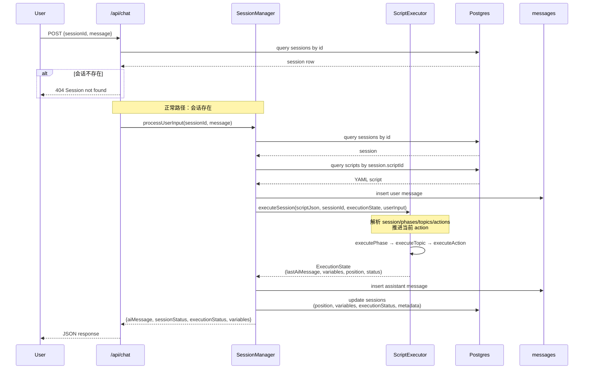
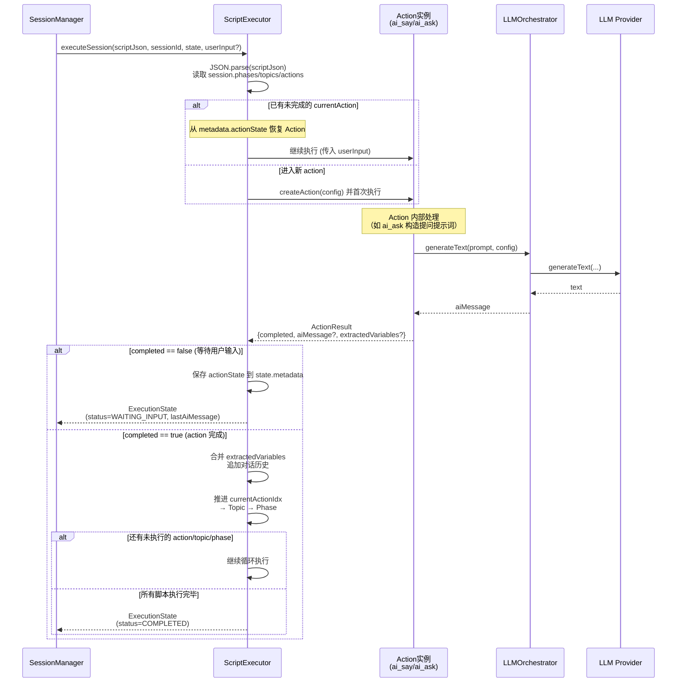
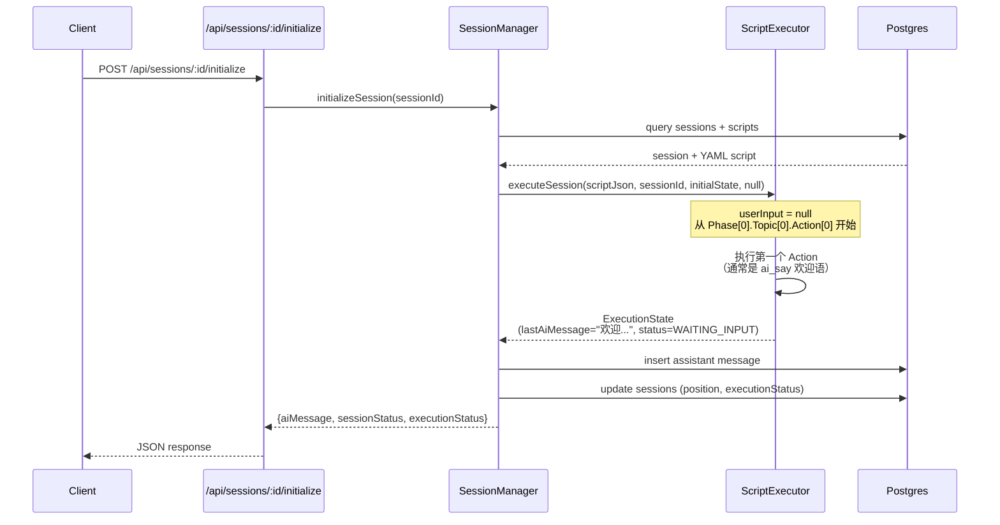
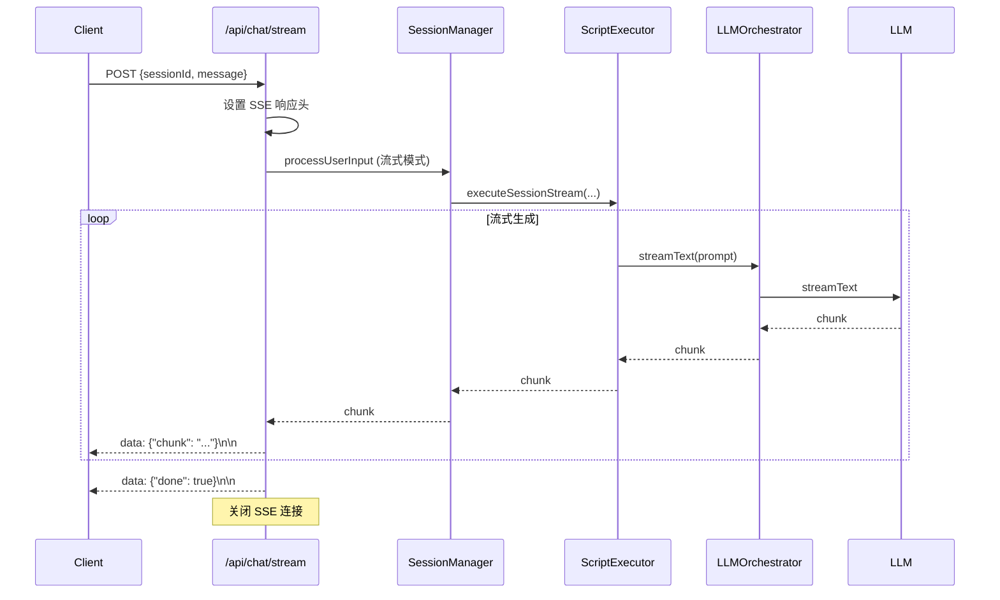

# 核心流程时序图

本文档包含 HeartRule AI 咨询引擎（TypeScript 版本）的关键时序图，用于帮助开发者和 AI 快速理解系统的核心执行流程。

---

## 1. HTTP 聊天接口完整调用链路

**场景描述**：用户通过前端发送一条消息到 `/api/chat` 接口，后端如何通过 SessionManager、ScriptExecutor 推进会谈脚本，并返回 AI 回复。

**涉及模块**：

- `packages/api-server/src/routes/chat.ts` - HTTP 路由层
- `packages/api-server/src/services/session-manager.ts` - 会话管理服务
- `packages/core-engine/src/engines/script-execution/script-executor.ts` - 脚本执行引擎
- PostgreSQL 数据库（sessions、messages、scripts 表）

**关键要点**：

- SessionManager 从数据库恢复会话状态（position、variables、metadata）
- ScriptExecutor 根据 YAML 脚本内容推进执行位置
- 执行结果（AI 消息、变量、位置）会持久化回数据库
- 支持多轮对话：通过 `executionState.metadata.actionState` 保存 Action 内部状态



---

## 2. ScriptExecutor 内部脚本驱动执行流程

**场景描述**：不关心 HTTP 和数据库层面，只看脚本执行引擎如何从 YAML 脚本驱动会话推进，并与 LLM 交互。

**涉及模块**：

- `packages/core-engine/src/engines/script-execution/script-executor.ts` - 脚本执行器
- `packages/core-engine/src/actions/*-action.ts` - Action 实现（ai_say、ai_ask、ai_think）
- `packages/core-engine/src/engines/llm-orchestration/orchestrator.ts` - LLM 编排引擎
- LLM Provider（OpenAI / Volcano）

**关键要点**：

- YAML 脚本结构：`session → phases → topics → actions`
- ExecutionState 保存三级索引：`currentPhaseIdx / currentTopicIdx / currentActionIdx`
- Action 可以是**多轮执行**的（如 ai_ask 需要等待用户回答）
  - 未完成时：保存 `actionState` 到 `metadata`，返回 `WAITING_INPUT`
  - 完成后：提取变量、追加对话历史、推进索引
- LLM 调用被封装在 Action 内部，通过 LLMOrchestrator 统一管理



---

## 3. 会话初始化流程（欢迎消息）

**场景描述**：新建会话后，调用 `POST /api/sessions/:id/initialize` 获取脚本的第一条 AI 消息（通常是欢迎语）。

**关键要点**：

- 不传入用户输入，直接执行脚本到第一个 `WAITING_INPUT` 状态
- 通常第一个 Action 是 `ai_say`（欢迎语）或 `ai_ask`（开场提问）
- 执行状态持久化到数据库，后续对话从此状态继续



---

## 4. 流式聊天 SSE 流程（待实现）

**场景描述**：通过 `/api/chat/stream` 接口实现 Server-Sent Events 流式响应，实时推送 LLM 生成的文本片段。

**当前状态**：✅ API 路由已定义，⚠️ 流式逻辑为 mock 实现

**待实现要点**：

- ScriptExecutor 需要支持流式模式（`executeSessionStream`）
- Action 内部调用 `LLMOrchestrator.streamText` 而非 `generateText`
- SSE 数据格式：`data: {"chunk": "文本片段"}\n\n`
- 最后发送：`data: {"done": true}\n\n`



---

## 附录：关键数据结构

### ExecutionState（执行状态）

```typescript
interface ExecutionState {
  status: ExecutionStatus; // running | waiting_input | completed | error
  currentPhaseIdx: number; // 当前阶段索引
  currentTopicIdx: number; // 当前话题索引
  currentActionIdx: number; // 当前动作索引
  currentAction: BaseAction | null; // 当前正在执行的 Action 实例
  variables: Record<string, any>; // 提取的变量（如：name、age）
  conversationHistory: Array<{
    // 对话历史
    role: string;
    content: string;
    actionId?: string;
  }>;
  metadata: Record<string, any>; // 元数据（如：actionState）
  lastAiMessage: string | null; // 最后一条 AI 消息
}
```

### ActionResult（Action 执行结果）

```typescript
interface ActionResult {
  success: boolean; // 是否成功
  completed: boolean; // 是否完成（false=需要等待用户输入）
  aiMessage?: string; // AI 生成的消息
  extractedVariables?: Record<string, any>; // 提取的变量
  error?: string; // 错误信息
  metadata?: Record<string, any>; // 附加元数据
}
```

---

## 使用建议

1. **新人上手**：先看时序图 1 和 2，理解"HTTP → 会话管理 → 脚本执行"的完整链路
2. **修改脚本执行逻辑**：重点关注时序图 2，理解 `executePhase/executeTopic/executeAction` 的嵌套循环
3. **添加新 Action 类型**：参考 `ai-ask-action.ts`，实现 `execute` 方法并返回 `ActionResult`
4. **调试多轮对话**：查看数据库中 `sessions.metadata.actionState` 的内容，了解 Action 状态持久化机制

---

**文档版本**：v1.0  
**最后更新**：2026-01-09  
**适用版本**：HeartRule 2.0 (TypeScript)
