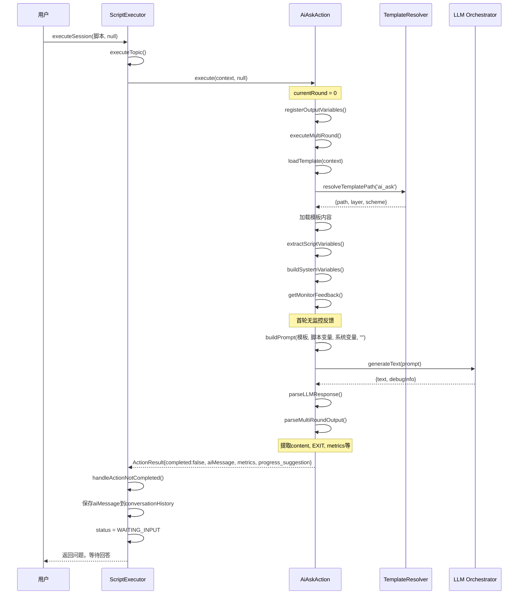
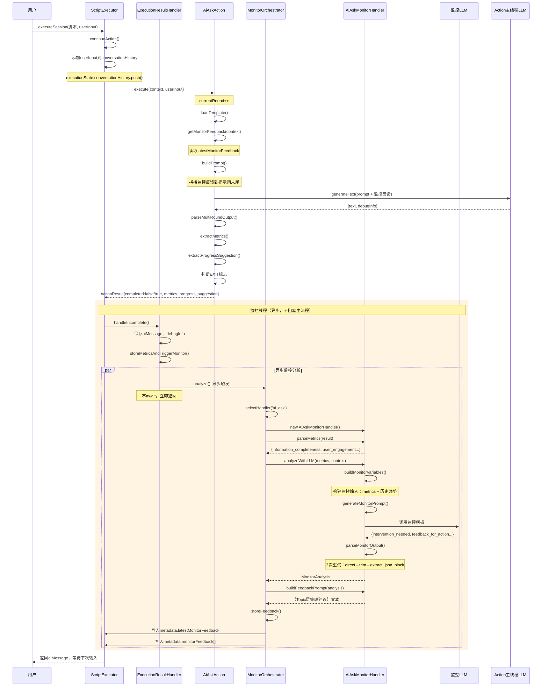
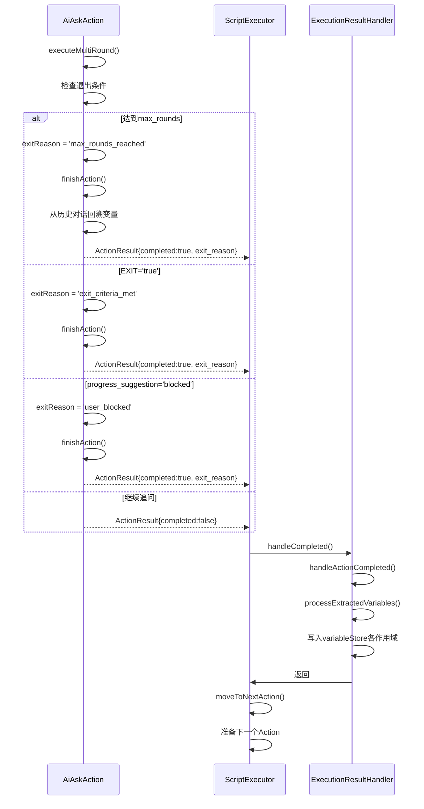
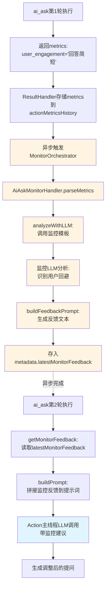

# ai_ask Action 完整执行时序图

## 概述

本文档描述 ai_ask Action 从首轮执行、多轮交互、监控反馈闭环到最终退出的完整执行流程，包含与 ScriptExecutor、MonitorOrchestrator、AiAskMonitorHandler 等组件的交互时序。

## 1. 首轮执行（发送问题）



## 2. 后续轮次（用户回答 + 监控反馈）



## 3. 退出判断与完成



## 4. 监控反馈闭环（关键机制）



## 核心设计要点

### 异步监控机制

- 监控分析通过 `.catch()` 异步触发，不阻塞 Action 主流程
- ResultHandler.storeMetricsAndTriggerMonitor() 不使用 `await`
- 监控失败不影响会话继续执行

### 监控反馈闭环

1. Action 执行返回 metrics（用户参与度、信息完整度等）
2. ResultHandler 存储到 actionMetricsHistory
3. MonitorOrchestrator 异步调用 AiAskMonitorHandler
4. 监控 LLM 分析用户回答模式，生成调整建议
5. 建议存入 metadata.latestMonitorFeedback
6. 下一轮 Action 执行时读取并拼接到提示词
7. Action LLM 根据反馈调整提问策略

### 退出条件

- **max_rounds_reached**: 达到最大轮次
- **exit_criteria_met**: LLM 判断信息已充分（EXIT='true'）
- **user_blocked**: progress_suggestion='blocked'，用户明确拒答

### 变量提取与作用域

- Action 完成时从 conversationHistory 回溯提取 output 变量
- 通过 VariableScopeResolver 写入对应作用域（topic/phase/session/global）
- 支持作用域覆盖规则：topic > phase > session > global

## 相关文件

- `packages/core-engine/src/domain/actions/ai-ask-action.ts` - AiAskAction 实现
- `packages/core-engine/src/engines/script-execution/script-executor.ts` - ScriptExecutor（已重构）
- `packages/core-engine/src/application/handlers/execution-result-handler.ts` - 结果处理器
- `packages/core-engine/src/application/orchestrators/monitor-orchestrator.ts` - 监控编排器
- `packages/core-engine/src/application/monitors/ai-ask-monitor-handler.ts` - ai_ask 监控处理器
- `packages/core-engine/src/application/monitors/base-monitor-handler.ts` - 监控基类

## ScriptExecutor 重构说明

### 重构原则（Martin Fowler）

按照《重构：改善既有代码的设计》原则，对 ScriptExecutor 进行了以下重构：

#### 1. Extract Method（提炼函数）

**原 executeSession (150行) 拆分为：**

- `executeSession` (32行) - 主流程编排
- `initializeSession` (13行) - 初始化会话
- `resumeCurrentActionIfNeeded` (34行) - 恢复未完成的 action
- `handleIncompleteAction` (19行) - 处理未完成的 action
- `handleCompletedAction` (14行) - 处理已完成的 action
- `executeAllPhases` (15行) - 执行所有 phases
- `moveToNextPhase` (9行) - 移动到下一个 phase
- `updatePositionForNextPhase` (19行) - 更新 phase 位置信息
- `clearPositionIds` (5行) - 清除位置 IDs
- `clearActionIds` (3行) - 清除 action IDs
- `clearTopicAndActionIds` (4行) - 清除 topic 和 action IDs

**原 updateVariablesWithScope (60行) 拆分为：**

- `updateVariablesWithScope` (15行) - 变量更新主逻辑
- `writeVariablesToScopes` (18行) - 写入变量到作用域
- `writeVariableToScope` (12行) - 写入单个变量
- `verifyVariablesWritten` (25行) - 验证变量写入成功

**原 executePhase (47行) 拆分为：**

- `executePhase` (14行) - Phase 执行主逻辑
- `moveToNextTopic` (9行) - 移动到下一个 topic
- `updatePositionForNextTopic` (13行) - 更新 topic 位置信息

#### 2. Single Responsibility Principle（单一职责原则）

每个提炼出的函数都只承担一个明确的职责：

- **初始化类**：解析脚本、设置元数据、恢复状态
- **执行类**：执行 phase、topic、action
- **状态管理类**：更新位置、清除位置、保存状态
- **变量处理类**：写入变量、验证变量、确定作用域

#### 3. Composed Method（组合方法）

重构后的主方法采用组合模式，每个步骤都由一个清晰命名的子方法完成：

```typescript
async executeSession(...) {
  const phases = this.initializeSession(...);
  const shouldContinue = await this.resumeCurrentActionIfNeeded(...);
  if (!shouldContinue) return executionState;
  await this.executeAllPhases(...);
  executionState.status = ExecutionStatus.COMPLETED;
  return executionState;
}
```

#### 4. Guard Clauses（卫语句）

使用早返回模式减少嵌套：

```typescript
if (!executionState.variableStore) {
  console.warn('...');
  return; // 早返回，避免深层嵌套
}
```

### 重构效果

- ✅ **可读性提升**：函数长度从 150行 降至 32行
- ✅ **可测试性增强**：每个子函数都可独立测试
- ✅ **可维护性改善**：职责清晰，易于定位问题
- ✅ **向后兼容**：所有现有测试通过（Phase 1, Phase 8）
- ✅ **性能无损**：无额外开销，纯逻辑重组
