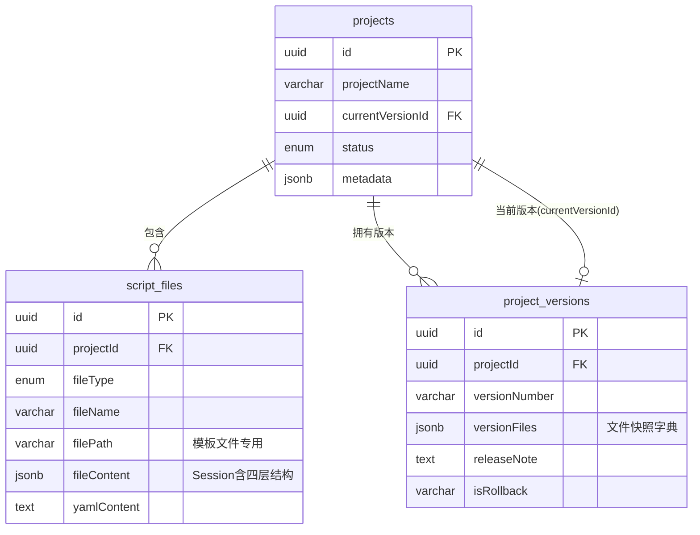
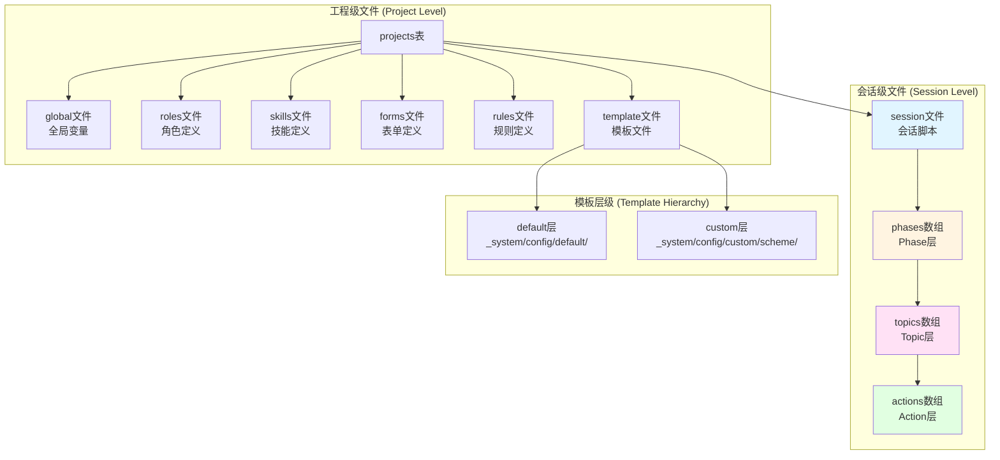
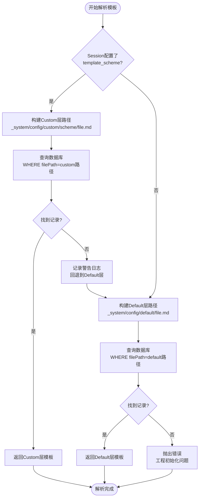
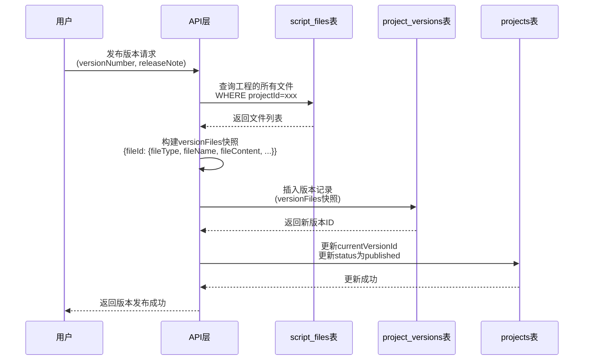

# Story 0.1: 脚本工程数据库Schema与四层脚本目录语义统一

## 文档信息

- **Story编号**: 0.1
- **优先级**: P0 - 高
- **状态**: 已完成
- **完成日期**: 2026-02-03
- **文档类型**: 架构规范文档

## 概述

本文档明确了脚本工程(Project)、脚本文件(script_files)、版本管理(project_versions)三张核心数据库表的职责边界,以及与四层脚本目录语义(Session/Phase/Topic/Action+模板目录)的映射关系,确保脚本工程作为数据库资源的架构清晰性和稳定演进能力。

## 架构原则

### 核心原则

1. **数据库作为唯一真相源**: 所有脚本工程数据以数据库为准,虚拟路径系统解耦物理存储
2. **职责单一明确**: 三张表各司其职,projects管理元信息,script_files存储内容,project_versions管理版本
3. **嵌套结构表达**: Session/Phase/Topic/Action通过JSON嵌套表达,不对应独立表记录
4. **版本化机制**: 通过快照机制实现工程的完整版本管理和时间旅行能力

### 临时兼容方案

⚠️ **当前系统保留`workspace/projects/`物理目录作为临时缓存**:

- **定位**: 临时兼容层,用于支持尚未数据库化的组件(如core-engine的TemplateResolver)
- **生命周期**: 待core-engine完全数据库化后废弃
- **不计入架构规范**: 本文档不规范workspace相关逻辑,后续Story将移除此依赖

## 数据库表职责边界

### projects表 - 工程元信息容器

**职责定位**:

- 存储工程级元数据(名称、描述、作者、标签、引擎版本等)
- 管理工程状态生命周期(draft → published → archived → deprecated)
- 维护工程与当前激活版本的关联(currentVersionId)
- 定义工程的引擎兼容性要求(engineVersion, engineVersionMin)

**不负责**:

- ❌ 不存储具体的脚本内容(由script_files负责)
- ❌ 不存储版本快照(由project_versions负责)
- ❌ 不关心脚本的内部结构(Phase/Topic/Action)

**与四层结构的关系**:

- projects表是整个脚本工程的顶层容器
- 一个project可以包含多个session文件
- 每个session文件内部包含完整的Phase/Topic/Action四层结构

### script_files表 - 脚本内容存储层

**职责定位**:

- 存储工程的所有文件内容(会话脚本、全局变量、模板等)
- 通过fileType枚举区分不同类型的文件职责
- 为模板文件提供虚拟路径映射(filePath字段)
- 保留YAML原始内容(yamlContent)用于编辑器展示和编辑

**不负责**:

- ❌ 不管理工程级元数据(由projects负责)
- ❌ 不保存历史版本(由project_versions负责)
- ❌ 不执行脚本逻辑(由core-engine负责)

**与四层结构的关系**:

- `fileType=session`的记录存储完整的Session脚本
- Session的`fileContent`字段(JSONB)包含嵌套的phases/topics/actions结构
- 四层结构是Session文件的内部组织形式,不对应独立的数据库记录

### project_versions表 - 版本快照管理

**职责定位**:

- 快照指定时刻的所有文件状态(versionFiles字段)
- 记录版本发布元信息(版本号、发布人、发布时间、发布说明)
- 支持版本回滚追溯(isRollback、rollbackFromVersionId)
- 通过快照实现工程的时间旅行能力

**不负责**:

- ❌ 不直接编辑文件内容(通过script_files编辑,然后快照)
- ❌ 不管理当前工作区状态(由script_files负责)
- ❌ 不执行版本切换逻辑(由API层负责)

**与四层结构的关系**:

- 版本快照保存整个Session文件(包含其内部的四层结构)
- Phase/Topic/Action作为Session的一部分被整体快照
- 版本切换时,恢复Session文件会同时恢复其内部的四层结构

## 表关系图



**关系说明**:

1. **projects → script_files** (一对多): 一个工程包含多个脚本文件
2. **projects → project_versions** (一对多): 一个工程拥有多个历史版本
3. **projects → project_versions** (一对一,可选): 工程通过currentVersionId指向当前激活的版本

## fileType枚举语义映射

### 工程级文件类型

| fileType | 职责定义                | 文件数量 | 必需性 | filePath使用    |
| -------- | ----------------------- | -------- | ------ | --------------- |
| global   | 全局变量定义文件        | 0-1个    | 推荐   | ❌ NULL         |
| roles    | AI角色定义文件          | 0-N个    | 可选   | ❌ NULL         |
| skills   | 技能/技术定义文件       | 0-N个    | 可选   | ❌ NULL         |
| forms    | 表单/量表定义文件       | 0-N个    | 可选   | ❌ NULL         |
| rules    | 规则/约束定义文件       | 0-N个    | 可选   | ❌ NULL         |
| template | 模板文件(AI Prompt模板) | N个      | 必需   | ✅ 使用虚拟路径 |

### 会话级文件类型

| fileType | 职责定义     | 文件数量 | 必需性      | 内部结构         |
| -------- | ------------ | -------- | ----------- | ---------------- |
| session  | 会话脚本文件 | 1-N个    | 必需至少1个 | 包含完整四层结构 |

**Session文件内部四层结构**:

```json
{
  "metadata": { "name": "...", "version": "..." },
  "session": {
    "session_id": "...",
    "session_name": "...",
    "template_scheme": "...",  // 可选,模板方案名称
    "phases": [                 // 第2层: Phase阶段
      {
        "phase_id": "...",
        "phase_name": "...",
        "topics": [              // 第3层: Topic话题
          {
            "topic_id": "...",
            "topic_name": "...",
            "actions": [         // 第4层: Action动作
              {
                "action_id": "...",
                "action_type": "ai_say | ai_ask | ...",
                "config": { ... }
              }
            ]
          }
        ]
      }
    ]
  }
}
```

## 文件类型与层级映射



## filePath虚拟路径规范

### 使用规则

仅**template类型文件**使用filePath字段存储虚拟路径,其他fileType不使用(值为NULL)。

### 虚拟路径格式

| 层级      | 路径格式                                    | 示例                                                     | 说明           |
| --------- | ------------------------------------------- | -------------------------------------------------------- | -------------- |
| Default层 | `_system/config/default/{fileName}`         | `_system/config/default/ai_ask_v1.md`                    | 系统默认模板   |
| Custom层  | `_system/config/custom/{scheme}/{fileName}` | `_system/config/custom/crisis_intervention/ai_ask_v1.md` | 自定义方案模板 |

### 路径组成规则

- **Default层**: `_system/config/default/` + `{模板文件名}`
- **Custom层**: `_system/config/custom/` + `{方案名称}/` + `{模板文件名}`
- **方案名称**: 小写字母、数字、下划线,长度1-50字符
- **模板文件名**: 遵循系统模板命名约定(如ai_ask_v1.md)

### 模板解析优先级



**解析规则**:

1. 如果Session配置了`template_scheme`,优先查找Custom层模板
2. Custom层不存在时,记录警告日志并回退到Default层
3. Default层也不存在时,抛出错误(说明工程初始化有问题)

## 版本快照机制

### versionFiles结构规范

版本快照使用JSONB字段`versionFiles`存储,结构为文件ID到文件快照的映射字典:

```json
{
  "<file_id_1>": {
    "fileType": "session",
    "fileName": "cbt_assessment.yaml",
    "fileContent": {
      /* 完整的Session JSON,包含phases/topics/actions */
    },
    "yamlContent": "session:\n  session_id: ...",
    "filePath": null
  },
  "<file_id_2>": {
    "fileType": "global",
    "fileName": "global.yaml",
    "fileContent": {
      /* 全局变量定义 */
    },
    "yamlContent": "...",
    "filePath": null
  },
  "<file_id_3>": {
    "fileType": "template",
    "fileName": "ai_ask_v1.md",
    "fileContent": { "content": "..." },
    "filePath": "_system/config/default/ai_ask_v1.md",
    "yamlContent": null
  }
}
```

### 快照覆盖范围

**实际实现**: 快照工程的所有script_files记录,不区分fileType。

**理论分类**:

- **必需快照**: session、template(影响核心执行逻辑)
- **应当快照**: global(影响变量替换)
- **可选快照**: roles、skills、forms、rules(扩展配置)

### 版本发布流程



### 版本快照与四层结构关系

- Session文件的快照包含了完整的Phase/Topic/Action结构
- Phase/Topic/Action不需要单独快照,它们作为Session的fileContent的一部分被整体快照
- 模板文件独立快照,因为它们被多个Action引用
- 版本切换时,恢复Session文件会同时恢复其内部的四层结构

## 数据完整性规则

### 工程创建时的初始文件

创建工程时,系统自动创建以下文件记录到script_files表:

| fileType | 必需性 | 初始内容                                                             | 实现位置             |
| -------- | ------ | -------------------------------------------------------------------- | -------------------- |
| global   | 推荐   | 创建空的全局变量文件                                                 | `POST /api/projects` |
| template | 必需   | 从`config/prompts`复制系统模板到数据库,filePath设为default层         | `POST /api/projects` |
| session  | 可选   | 根据template参数生成示例Session(blank/cbt-assessment/cbt-counseling) | `POST /api/projects` |

**实现代码**: `packages/api-server/src/routes/projects.ts`

### 版本发布时的快照范围

发布版本时,查询工程的所有script_files记录,全部纳入versionFiles快照。

**实现代码**: `packages/api-server/src/routes/versions.ts` - `POST /projects/:id/publish`

## API数据流验证

### 验证点1: 工程创建

**API**: `POST /api/projects`

**验证查询**:

```sql
-- 查询工程的所有文件
SELECT fileType, fileName, filePath
FROM script_files
WHERE projectId = '<project_id>'
ORDER BY fileType;
```

**期望结果**:

- 至少包含fileType='template'且filePath以'\_system/config/default/'开头的记录
- 可能包含fileType='global'的记录

### 验证点2: Session加载

**API**: `POST /api/sessions`

**验证查询**:

```sql
-- 查询Session文件结构
SELECT fileContent->'session'->'phases' as phases
FROM script_files
WHERE id = '<script_id>' AND fileType = 'session';
```

**期望结果**:

- fileContent包含完整的session对象
- session.phases是数组,每个phase包含topics数组
- 每个topic包含actions数组

### 验证点3: 模板解析

**验证查询**:

```sql
-- 场景1: 使用默认模板
SELECT filePath, fileContent
FROM script_files
WHERE projectId = '<project_id>'
  AND fileType = 'template'
  AND filePath = '_system/config/default/ai_ask_v1.md';

-- 场景2: 使用自定义方案
SELECT filePath, fileContent
FROM script_files
WHERE projectId = '<project_id>'
  AND fileType = 'template'
  AND filePath = '_system/config/custom/crisis_intervention/ai_ask_v1.md';
```

### 验证点4: 版本发布

**API**: `POST /api/projects/:id/publish`

**验证查询**:

```sql
-- 查询版本快照内容
SELECT
  versionNumber,
  jsonb_object_keys(versionFiles) as file_ids
FROM project_versions
WHERE id = '<version_id>';
```

**期望结果**:

- versionFiles包含所有session类型文件
- versionFiles包含所有template类型文件
- 每个文件快照包含完整的fileContent

## 技术约束

1. **数据库**: PostgreSQL 16
2. **ORM**: Drizzle ORM
3. **不修改表结构**: 本规范基于现有Schema,不引入新表或字段
4. **向后兼容**: 规范描述现有系统已实现的机制,不创造新约定

## 后续规划

### Story 0.2: core-engine模板数据库化

**目标**: core-engine的DatabaseTemplateProvider完全替代磁盘读取

**任务**:

- 重构`TemplateResolver`使用`DatabaseTemplateProvider`
- 移除`SessionManager.syncTemplatesToDisk()`临时方案
- 移除`ProjectInitializer`的磁盘目录创建逻辑

### Story 0.3: 清理workspace依赖

**目标**: 完全移除workspace物理目录

**任务**:

- 移除`PROJECTS_WORKSPACE`环境变量
- 删除workspace物理目录相关代码
- 更新相关文档和测试

## 参考资料

### 相关文档

- `docs/product/productbacklog.md`: Story来源
- `packages/api-server/src/db/schema.ts`: 数据库Schema定义
- `_system/README.md`: 模板系统两层机制说明

### 相关代码

- `packages/api-server/src/routes/projects.ts`: 工程API实现
- `packages/api-server/src/routes/versions.ts`: 版本API实现
- `packages/api-server/src/services/project-initializer.ts`: 工程初始化逻辑
- `packages/api-server/src/services/database-template-provider.ts`: 数据库模板提供器

### 数据库表

- `projects`: 工程元信息
- `script_files`: 脚本文件存储
- `project_versions`: 版本快照管理

---

**文档版本**: 1.0  
**最后更新**: 2026-02-03  
**维护人**: 架构组
