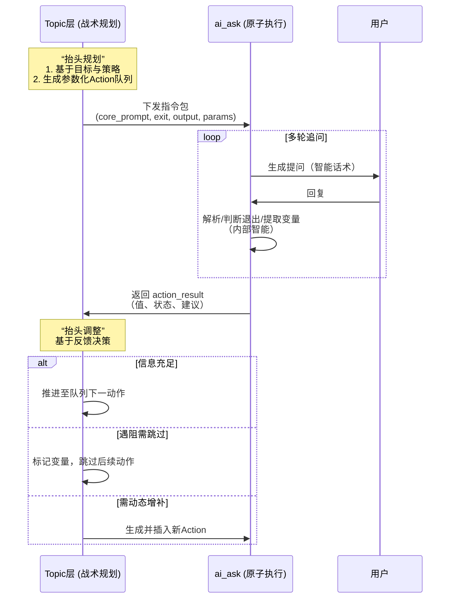

## **Action层(ai_ask)与Topic层的职能边界**

---

### **一、 核心设计哲学：分层规划与执行**

本设计遵循 **“抬头规划，低头执行”** 的递归式智能架构：

- **Action层（低头执行）**：是系统的“手”与“嘴”，作为**原子执行单元**，专注于稳定、流畅、安全地完成单次交互。其智能是 **“条件反射式”** 的，追求零延迟的可靠输出。
- **Topic层（抬头规划）**：是系统的“战术大脑”，作为**目标攻坚单元**，负责将抽象目标转化为具体行动方案，并在执行中动态调整。其智能是 **“审慎决策式”** 的，应对复杂性与不确定性。

---

### **二、 Action层 (`ai_ask`) 的职责与内置智能**

Action层是一个 **“参数化的单目标追问引擎”**。它接收来自Topic层的明确指令，在限定的对话空间内，通过智能化的多轮交互，完成一次具体的收集任务。

#### **内部智能边界（应包含的能力）**

1.  **微观话术生成与适配**
    - **职责**：将Topic层下发的抽象任务描述（`core_prompt`），转化为自然、流畅的提问语句。
    - **灵活性**：根据用户**上一轮回复的完整性、情绪和语言风格**，动态调整追问策略（如从开放提问转为选择提问）。
    - **实现**：通过轻量级、规则驱动的 `dynamic_prompting` 或极简LLM调用来实现，绝不改变提问的根本目标。

2.  **表达风格调整**
    - **职责**：根据脚本配置的 `tone`（如“温和”、“专业”）和 `ai_role`，自动调整生成语句的语气、人称和用词。
    - **边界**：此调整是统一的、基于配置的，不涉及业务逻辑判断。

3.  **退出条件判断（自主决策）**
    - **职责**：严格按照预定义的 `exit_condition`（如“获得具体事例”、“用户明确拒绝”、“情绪超阈值”）和 `max_rounds`（最大轮次）**独立判断**何时结束本轮追问。
    - **决策流程**：遵循四级优先级（参考思路），确保退出判断的果断与一致。Topic层**不干预**此过程。

4.  **结构化响应解析与变量提取**
    - **职责**：1）解析LLM的原始响应为标准化结构（如 `{EXIT, 咨询师回复, BRIEF, 变量}`）；2）依据 `output` 配置，从对话历史中**提取并填充**目标变量。
    - **提取策略**：采用多级后备策略（直接提取 -> LLM专门提取 -> 使用用户原话），确保鲁棒性。
    - **边界**：只负责“提取”和“填充”，对信息的“充分性”或“价值”不做最终判断，但可给出初步的进度标签建议（如 `待补充`）。

5.  **基本输入验证与偏离纠正**
    - **职责**：当用户的单次回复与**当前 `ai_ask` 任务的直接目标**明显无关时，Action层应基于预置策略（如在提示词中嵌入指令），在1-2个回合内进行温和提醒与拉回，以维持当前追问线程的聚焦。
    - **边界**：Action层**不判断**这是否属于需要关注的“系统性跑题”，也**不决定**拉回的策略（如先倾听还是立即拉回）。它只执行预设的、标准化的纠正动作，并将本次交互中用户的**配合度**或**回答相关性**作为元数据（如 `{reply_relevance: low}`）反馈给Topic层。**全局性的跑题识别与策略应对，是Topic层的职责。**

#### **Action层输入/输出契约**

```yaml
# Topic层下发的指令包
ai_ask_config:
  core_prompt: “引导用户描述失眠的具体频率。” # 任务本质
  exit_condition: “用户给出频率描述或表达不确定”
  output: # 收集目标
    - get: 失眠频率
      define: 具体的频率描述
  tone: “温和” # 执行风格
  max_rounds: 5 # 资源约束

# Action层返回的结构化结果
action_result:
  completed: true # 是否已退出
  extracted_variables: { 失眠频率: “每周三四次” } # 提取值
  metadata:
    BRIEF: “用户自述每周失眠三四次” # 摘要
    exit_reason: “满足退出条件” # 退出原因
    progress_suggestion: “待补充” # 进度建议（供Topic层参考）
```

---

### **三、 Topic层的职责与统筹智能**

Topic层是一个 **“动态的战术规划中心”**。它拥有一个高阶目标，并通过编排、调整和参数化一组 `Action` 来实现它。

#### **核心统筹职责**

1.  **动作序列的生成与编排**
    - **职责**：将抽象的 `default_action_template`（如“收集一位抚养者信息”）**实例化并编排**成具体的、顺序执行的 `Action` 队列。
    - **典型案例**：当用户提及“父亲、母亲、奶奶”时，Topic层动态生成针对三人的平行提问子序列。

2.  **参数的动态注入与上下文管理**
    - **职责**：为每个实例化的 `Action` 注入运行时参数（如将 `{抚养者称呼}` 替换为“母亲”），并维护Topic级别的上下文状态（如 `已收集列表`、`用户阻抗水平`），供后续 `Action` 条件判断使用。

3.  **条件分支与流程调整（核心决策）**
    - **职责**：监听所有下属 `Action` 的 `action_result`，并做出关键的战术决策：
      - **遇阻处理**：若收集“父亲记忆”的 `ai_ask` 因情绪激动退出，Topic层决定**跳过**深入追问，标记变量状态为 `遇阻`，并可**插入**一个安抚性 `ai_talk`。
      - **进度调控**：若某个信息收集进度为 `待补充` 但时间紧迫，Topic层可决定**暂存当前结果**，推进后续更关键的动作。
      - **动态增删**：根据新信息（如用户意外提到“爷爷”），动态**插入**新的追问动作组。
      - **系统性跑题的识别与应对**：
        - **识别**：Topic层通过综合分析下属多个 `Action` 反馈的元数据（如 `reply_relevance` 持续偏低），并结合对话历史，判断用户是否出现了**需要干预的跑题模式**，而非针对单个问题的短暂偏离。
        - **决策与应对**：一旦识别出系统性跑题，Topic层需基于其 `strategy` 做出决策：
        1.  **判断价值**：跑题内容是否蕴含对达成Topic目标有潜在价值的信息？若有，可短暂倾听并探索关联，然后引导回归。
        2.  **判断原因**：跑题是源于困惑、情绪回避，还是关系阻抗？根据不同原因，Topic层应动态生成不同的应对动作序列（如插入一个 `ai_talk` 进行共情与澄清，或临时插入一个简短的 `ai_answer` 解答困惑），之后再恢复主线程。
        3.  **调整计划**：若跑题严重且持续，Topic层可决策简化后续收集目标，或提前结束本Topic并标记原因，将问题上报给Phase层。
        - **本质**：Topic层将“跑题”视为一种**对话状态信号**，并调用相应的预置或动态生成的咨询技术（子话题）来处理这一状态，确保整体目标不受根本性影响。

4.  **Topic目标达成度的综合判断**
    - **职责**：基于所有变量的最终状态集合，评估本Topic目标是 `完全达成`、`部分达成` 还是 `需延期`，并将此结论上报给Phase层，作为更高层规划的依据。

#### **Topic层决策逻辑示意**

```yaml
topic:
  goal: “收集童年主要抚养者信息”
  strategy: “遇强烈情绪则跳过深入挖掘，确保至少完成一位核心抚养者信息收集。”

  # 根据Action结果反馈的决策逻辑
  decision_matrix:
    - condition: “action_result.metadata.progress_suggestion == ‘遇阻-情绪性’”
      action: “标记对应变量为‘遇阻’；跳过当前抚养者的后续‘深度记忆’提问。”
    - condition: “action_result.metadata.progress_suggestion == ‘待补充’ && 剩余时间 < 2min”
      action: “标记对应变量为‘部分收集’；继续执行下一个高优先级抚养者的提问。”
```

---

### **四、 明确的职责边界与协作机制**

#### **边界划分总原则**

| 决策维度           | **Action层 (ai_ask)**                  | **Topic层**                                              |
| :----------------- | :------------------------------------- | :------------------------------------------------------- |
| **目标**           | **如何完成**一次具体的询问。           | **要完成什么**一组询问以实现子目标。                     |
| **智能范畴**       | 微观交互智能（话术、纠偏、单点退出）。 | 战术规划智能（编排、参数化、条件分支、资源调配）。       |
| **调整对象**       | 调整自身的**下一句话**。               | 调整**后续动作的队列和参数**。                           |
| **状态关注**       | 当前追问的**对话流与直接目标**。       | 所有收集项的**进度、质量与组合价值**。                   |
| **关键输出**       | 提取的值、**本次执行的详细状态**。     | 所有变量的**最终状态集合**、**目标达成度**。             |
| **对“跑题”的职责** | 纠正与**当前单次询问**的直接偏离。     | 识别**跨多次询问**的跑题模式，并决策与生成整体应对策略。 |

#### **协作流程图解**



---

### **五、 设计约束与总结**

#### **✅ Action层必须且仅需负责（确保稳定）**

1.  将指令转化为自然、得体的话术。
2.  基于固定配置进行风格调整与退出判断。
3.  从对话历史中准确提取并结构化指定变量。
4.  处理当前对话线程内的微观偏离。

#### **❌ Action层严禁涉及（防止膨胀）**

1.  决定要询问哪些主题或变量（由Topic层通过 `output` 配置定义）。
2.  管理多个Action之间的状态依赖或执行顺序。
3.  进行业务逻辑判断（如“是否需要安抚”）。
4.  动态生成全新的、目标不同的后续动作。

#### **✅ Topic层核心权力（保障灵活）**

1.  定义询问的抽象目标与变量蓝图。
2.  将蓝图实例化为具体、参数化的动作序列。
3.  根据动作执行反馈，动态调整后续序列（增、删、改、跳）。
4.  综合判断子目标的完成情况，并向上层汇报。

**总结**：此边界约定通过 **“指令包”** 与 **“结果反馈”** 的清晰契约，将 `ai_ask` 严格约束为一个高性能、可预测的**专业执行器**；同时赋予Topic层基于实时反馈进行**动态战术规划**的全部权力。这完美实现了“低头时专注划水，抬头时果断看路”的智能协作，是系统兼具可靠性、灵活性及可维护性的基石。
