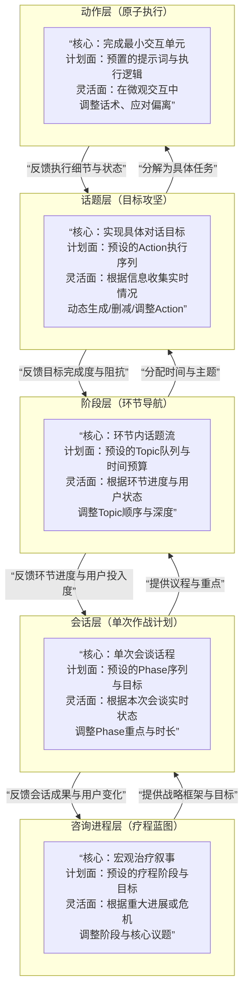

# HeartRule咨询智能实现机制

## 顶层思想

### **抬头规划，低头执行：构建稳定而灵动的专业对话系统**

**目标**：在专业对话（如心理咨询）中，构建一个既**可靠**又**智能**的AI系统。它不追求全能，而追求在关键处明智，确保每一次互动都兼具专业流程的严谨性与应对变化的灵活性。

**核心做法**：我们采用“分层规划-专注执行”的双层思维模型。

- **低头执行（稳定层）**：系统绝大部分时间在“划水”——即严格遵循由专家经验固化、可预测的**脚本（剧本）** 执行标准化动作（如提问、共情）。这确保了专业流程的可靠性、高效率和低能耗。
- **抬头规划（调节层）**：在关键节点（如话题转换、出现阻抗时），系统会“抬头看路”——启动**策略性LLM思考**。它基于对话现状和总体目标，重新评估并动态调整后续的脚本计划，如同导航仪重新规划路线。调整后，系统再次进入高效的“执行”状态。

**背后哲学**：这一设计源于**控制论的分层调节思想**和**人类专家的“双过程”认知模型**。它不以单一的、消耗巨大的“全能大脑”去应对所有不确定性，而是将**稳定的专业套路（系统1快思考）** 与**间歇性的战略反思（系统2慢思考）** 分离。用结构化的确定性承载任务，将宝贵的智能用于最关键的决策，从而在复杂领域实现可扩展、可信任的专业服务。

### **从个案到模式：经验的蒸馏与活化循环**

**目标**：将领域专家（如顶尖咨询师）处理复杂、模糊现实问题的隐性经验，转化为AI系统可理解、可存储、可复用的显性智能资产。其目的不是简单记录案例，而是构建一个能持续从具体问题中**自动识别模式、应用策略、并生成个性化方案**的“经验反应炉”。

**核心做法**：建立一个 **“具体→抽象→具体”的双向转换引擎**。

1.  **经验沉淀（抽象化路径）**：系统引导分析**具体案例**，将其关键要素（情境、问题、反应、结果）归纳为**抽象概念与模式**（如“首次晋升后的表现焦虑”），并关联到已验证的**本质问题**（如“对评价的恐惧”）与**策略原型**（如“逐步暴露练习”）。
2.  **经验复用（具象化路径）**：当面对**新的具体用户情景**时，系统将其与沉淀的**抽象概念库**进行匹配，定位到相关的**本质问题**，再从本质层找到**本质解**，再结合新情景的独特细节，动态生成**量身定制的具象解决方案**（如“针对您下周市政府发言的模拟演练计划”）。

**背后哲学**：这一思维深植于 **“个别性”与“普遍性”辩证统一**的哲学传统，并融合了现代**案例推理**与**模式识别**理论。它承认真正专业的智慧不在于记住无数孤立的事实，而在于透过纷繁的表象，洞察并连接那些重复出现的“原型”。通过建立这套从具体中提炼抽象、再用抽象照亮具体的循环，AI便不再是机械执行指令的工具，而成为了一个能够吸收经验、识别规律、并创造性应用的“专业智慧伙伴”。这与“抬头规划，低头执行”的架构哲学相结合——**前者解决了“用什么智慧去执行”的问题，后者解决了“如何让智慧可靠地执行”的问题**，共同构成专业AI系统的完整心智。

基于“抬头规划，低头执行”哲学，对五层架构进行审视。分层逻辑可以更明确地体现各层之间 **“战略约束与战术自由”** 的递进关系。

## 核心架构

以下是优化后的五层设计剖析，每一层都是一个独立的“规划-执行”单元，同时又是上层计划的执行者、下层调整的约束者。



---

### **各层核心剖析**

**1. Action层（原子执行层）**

- **核心职责**：**专业、安全、流畅地完成一个最小对话交互单元。** 这是系统的“手”和“嘴”。
- **计划面**：由脚本预定义动作类型（`ai_ask`/`ai_say`等）、核心提示词、退出条件和输出规范。它决定了动作的**根本目的和边界**。
- **灵活面（调控什么）**：在边界内进行**表达适应性调整**。例如，`ai_ask`根据用户前一句的复杂度，自动选择“进一步追问”或“换比喻重问”；`ai_say`根据用户的教育背景，调整解释的抽象程度。其灵活性是 **“话术微调”** ，绝不改变动作的根本类型和目标。
- **关键审视**：这层的灵活是“条件反射式”的，应基于明确的规则或极轻量的LLM调用，目标是**零延迟**。

**2. Topic层（目标攻坚层）**

- **核心职责**：**采取一切必要战术，实现一个具体的、可验证的对话子目标。**（如：“收集与三位抚养者的关系记忆”）。
- **计划面**：脚本预置的 **“默认行动方案”** —— 一个理想的Action序列模板（如您例子中的提问模板）。它代表了经验中的最佳实践路径。
- **灵活面（调控什么）**：**动态重写行动方案**。这正是您例子中的精髓：当发现用户提及“父亲、母亲、奶奶”时，Topic层的大脑会**将默认模板实例化、复制、调整为三条并行的子任务流**。它调控的是**Action的序列、重复和参数**，甚至因遇到强烈阻抗而插入一个`ai_talk`（安抚）动作，或在时间不足时跳过次要问题。
- **关键审视**：您设计的“根据用户表达生成队列”完全正确。此层是 **“战术规划”** 的核心，需要“抬头”评估当前信息状态，并“低头”生成接下来几分钟要执行的具体动作列表。

**3. Phase层（环节导航层）**

- **核心职责**：**管理会话的节奏与资源，确保在一个咨询环节内（如“评估阶段”、“干预阶段”）覆盖所有核心议题。**
- **计划面**：由脚本定义的**Topic队列、时间预算和各Topic的优先级权重**。例如：“评估阶段”共有5个核心Topic，总计45分钟。
- **灵活面（调控什么）**：**实时调度Topic队列**。例如：当“收集抚养者信息”Topic耗时远超预期时，Phase大脑可能决定将优先级较低的“收集学校经历”Topic推迟或转为快速收集；反之，若进展神速，则可启动一个备用的深入探索Topic。它调控的是 **“议程的实时排序与资源分配”**。
- **关键审视**：此层的灵活度是关于 **“取舍”与“节奏”** 。它需要基于对剩余时间、已完成议题质量、用户疲劳度的综合判断来调整。

**4. Session层（单次作战层）**

- **核心职责**：**保障单次会谈的整体有效性，形成闭环。**
- **计划面**：本次会谈的**总体目标**和**Phase结构**（如：“本次目标是完成问题评估，包含建立关系、主诉收集、背景了解、总结反馈四个Phase”）。
- **灵活面（调控什么）**：**在极端情况下调整本次会谈的终极目标与结构**。例如：若用户在会谈中途暴露出未预料的危机信息（如自伤念头），Session大脑必须果断“抬头发起重大重规划”，可能将后半程全部调整为危机干预，并临时生成对应的Phase和Topic。它调控的是 **“本次会谈的战略方向”**。
- **关键审视**：此层灵活度应**低频但重大**。绝大多数会话应按计划进行，只在触及安全红线或发生根本性信息颠覆时才启动重规划。

**5. Consultation层（疗程蓝图层）**

- **核心职责**：**管理整个咨询疗程的叙事弧线，追求长期改变。**
- **计划面**：**预设的疗程阶段蓝图**，例如：“阶段一：评估与关系建立（2次）；阶段二：认知重构（4次）；阶段三：行为实验与巩固（3次）”。
- **灵活面（调控什么）**：**基于跨会话的进展，调整疗程蓝图**。例如：如果用户在“认知重构”阶段进展迅速，Consultation大脑可能建议减少1次会谈，提前进入“行为实验”；反之，若遭遇瓶颈，则可能插入一个“动机强化”专题Session。它甚至能根据沉淀的新模式，**动态生成一个全新Session的脚本框架**。
- **关键审视**：这是最高阶的“抬头看路”。它的灵活体现在**疗程的宏观编排**上，决策周期以“周”为单位，依据是对所有历史会话数据的宏观分析。

### **五层协同架构**

五层设计精准地实现了 **“递归式的规划-执行”** ，每一层都为其下一层提供**稳定的计划框架**，同时接收下一层的**状态反馈**作为自己“抬头规划”的输入。这避免了让单一LLM处理所有问题的“上帝模式”，将不确定性分层隔离、逐级消化。

**信息跨层传递**：为确保各层“大脑”高效协同，需要设计一套清晰的 **“状态变量”上下行通信协议**。例如，Action层将 `{信息充分度}` 上报给Topic层，Topic层将 `{目标达成度}` 和 `{用户阻抗水平}` 上报给Phase层。这样，每一层的“抬头”决策都基于扎实的数据，而非凭空猜测。

**预置提示词统一嵌入**: 各层都采用提示词模板，把本咨询领域通用策略要求进行编写，具体脚本聚焦在本次具体目标。例如每个ai_ask都会有输出格式的提示词定义，引用聊天上下文等，不用在每个ai_ask中去编写提示词。topic层可以预置一些领域通用的安全策略提示词，或着何时调整智能生成动作队列，如何遵守动作脚本的语法等。phase层可以预置一些领域通用的话题调整策略，如果编排topic的语法，如果管控时间节奏等。session层会预置一些调整会谈目标的策略，phase层的编排策略等。

## 落地示例

基于我们深入探讨的“抬头规划，低头执行”五层架构，以下是为每一层补充的YAML脚本示例，以直观展现其计划性与灵活性如何落地。里面的yaml格式仅示例，非最终语法。

### **1. Consultation层（疗程蓝图层）**

此层定义整个咨询旅程的宏观叙事和阶段目标。

```yaml
# consultation_plan.yaml
consultation:
  title: “焦虑情绪与公众发言表现管理”
  overview: “通过认知行为疗法，识别并调整与公众发言相关的自动化思维与信念，减少焦虑，提升表现。”

  phases:
    - phase: 评估与概念化
      goal: 建立信任，全面评估问题，完成初步认知概念化
      session_count: 1-2
      optional: false

    - phase: 认知重构
      goal: 针对核心自动化思维进行工作，发展替代性思维
      session_count: 3-4
      optional: false

    - phase: 行为实验与暴露
      goal: 通过行为练习验证并巩固新的认知与行为模式
      session_count: 2-3
      optional: true # 如果评估阶段发现行为回避不严重，此阶段可简化

    - phase: 巩固与预防复发
      goal: 总结收获，制定未来应对策略，结束咨询
      session_count: 1
      optional: false

  # 灵活面：疗程大脑的调整逻辑（以注释形式说明）
  adaptation_logic: |
    1. 如果‘评估与概念化’阶段发现核心问题是“完美主义信念”而非“表现焦虑”，则增强‘认知重构’阶段中针对核心信念的干预比重。
    2. 如果用户在前两阶段进展远超预期，可合并或缩减后续阶段次数。
    3. 若触发危机协议，则暂停当前蓝图，插入危机干预专题session。
```

### **2. Session层（单次作战层）**

此层定义单次会谈的结构，并在必要时调整核心目标。

```yaml
# session_2_intervention.yaml
session:
  seq: 2
  global_goal: “干预与‘必须做到完美’相关的自动化思维，降低发言前焦虑。”

  # 计划面：预设的阶段流程
  planned_phases:
    - phase: 检查与连接
      goal: 连接上次会谈，检查作业，设定本次议程
      time_budget: 10min
    - phase: 核心干预
      goal: 针对“上次模拟发言中，我觉得自己磕巴了一下，整个就失败了”这一思维进行工作
      time_budget: 30min
      core_topic: topic_identify_automatic_thought # 计划干预的Topic
    - phase: 总结与布置作业
      goal: 巩固收获，协商布置行为实验
      time_budget: 10min

  # 灵活面：Session大脑的重规划协议（当核心干预目标需要变更时）
  adaptation_protocol:
    trigger_condition: “用户在连接阶段暴露出另一个更强烈、更紧急的自动化思维（例如：‘我永远无法让领导满意’）”
    reassessment_prompt: |
      基于用户最新陈述“{用户原话}”，请评估：
      1. 原计划的自动化思维与当前表达的思维，哪一个更核心、情绪反应更强？
      2. 本次剩余时间是否足够转向干预新思维？
      请输出JSON决策：{“new_goal”: “”, “adjustment”: “replace|add|postpone”}
    # 根据上述LLM评估，可能动态调整
    possible_adjustment:
      - action: replace
        new_core_topic: topic_identify_core_belief # 转向干预更核心的信念
        postpone_original_to: session_3 # 将原计划议题推迟到下次
```

### **3. Phase层（环节导航层）**

此层负责一个环节内的时间与话题调度。

```yaml
# phase_core_intervention.yaml (在session中被引用)
phase:
  name: 核心干预
  goal: 针对特定自动化思维进行工作
  total_time_budget: 30min

  # 计划面：预设的Topic队列及理想时间分配
  topic_queue:
    - topic: topic_identify_automatic_thought
      time_budget: 10min
      priority: high
    - topic: topic_examine_evidence
      time_budget: 12min
      priority: high
    - topic: topic_develop_alternative_thought
      time_budget: 8min
      priority: high
    - topic: topic_imagery_rehearsal # 一个备选的深入技术
      time_budget: 5min
      priority: low # 低优先级，时间充裕才进行

  # 灵活面：Phase大脑的动态调度逻辑
  scheduling_logic:
    # 规则1：时间不足时的取舍
    - condition: “剩余时间 < {topic.time_budget} && topic.priority == ‘low’”
      action: “skip_topic” # 跳过低优先级话题
    # 规则2：当前话题遇到阻抗或进展迅速
    - condition: “current_topic.engagement == ‘low’ && elapsed_time > 1.5 * {topic.time_budget}”
      action: “move_to_next_topic” # 强行推进到下一话题
    # 规则3：进展超预期，增加深度
    - condition: “current_topic.progress == ‘excellent’ && remaining_time > 10min”
      action: “activate_topic(topic_imagery_rehearsal)” # 启动备用话题
```

### **4. Topic层（目标攻坚层）**

此层负责实现一个具体目标，并能动态生成动作序列。

```yaml
# topic_identify_automatic_thought.yaml
topic:
  name: 识别自动化思维
  goal: 引导来访者在具体情境中识别出引发情绪的自动化思维
  strategy: |
    1. 引导用户描述具体情境和情绪。
    2. 使用“当时你心里在想什么？”等问题捕捞思维。
    3. 若思维模糊，使用“箭头向下”技术深入。
    4. 若用户对某个思维有强烈情绪反应，标记为重点。

  # 计划面：一个最简化的默认行动模板
  default_action_template:
    - ai_ask: “请描述一个最近一次让你感到{目标情绪}的具体情境。”
      output:
        - get: 具体情境
    - ai_ask: “在那个情境中，你心里瞬间闪过的念头或想法是什么？”
      output:
        - get: 潜在思维

  # 灵活面：Topic大脑根据实际情况动态生成最终Actions
  # 以下是一个动态生成的示例（非直接编写，而是由引擎根据策略和用户输入实时生成）
  dynamic_generated_actions:
    # 当用户提到了多个情境时，动态展开
    - ai_choice: “你提到了‘开会发言’和‘向领导汇报’两个情境，我们先聚焦哪一个来深入探讨？”
      choices:
        - A: 开会发言
        - B: 向领导汇报
      output:
        - get: 选择的情境

    - ai_ask: “很好。在{选择的情境}时，你感到焦虑程度有几分？心里最强烈的念头是什么？”
      exit_condition: “已捕捉到一个清晰的、带有情绪的自动化思维”
      output:
        - get: 自动化思维
        - get: 情绪强度

    # 策略判断：如果思维模糊（例如“我就是觉得完了”），则追加“箭头向下”提问
    - condition: “{自动化思维} 包含‘觉得’、‘完了’等模糊词汇”
      ai_ask: “如果‘{自动化思维}’这个想法成真，对你来说意味着什么？或者那会说明什么？”
      output:
        - get: 深层思维
```

根据用户情况，具体生成actions队列计划。
例如：topic目标了解用户小时候直接抚养者情况。例如脚本中预置：

- ai_ask：了解小时候与来访
- ai_ask：{与抚养者}关系如何，是什么怎么称呼；
- ai_ask:{与抚养者}是否住一块，
- ai_ask:{与抚养者}记忆最深刻的事，挖得细一些。

如果用户说的时候，表达出父亲，母亲，还有奶奶，则会生成下面的action队列计划。

- ai_ask：{与母亲}关系如何，是什么怎么称呼；
- ai_ask:{与母亲}是否住一块，
- ai_ask:{与母亲}记忆最深刻的事，挖得细一些。
- ai_ask：{与父亲}关系如何，是什么怎么称呼；
- ai_ask:{与父亲}是否住一块，
- ai_ask:{与父亲}记忆最深刻的事，挖得细一些。
- ai_ask：{与奶奶}关系如何，是什么怎么称呼；
- ai_ask:{与奶奶}是否住一块，
- ai_ask:{与奶奶}记忆最深刻的事，简单收集。
- ai_ask:询问是否还有别的，如果没有

### **5. Action层（原子执行层）**

此层是系统与用户交互的原子单元，每个动作都内置微观智能。

```yaml
# 以下动作可能出现在任何Topic的动态生成序列中
actions:
  # 示例1：智能介绍 (ai_say)
  - action_type: ai_say
    id: introduce_cognitive_model
    tone: “教育性、支持性”
    content_template: |
      接下来，我想和你介绍一个简单的模型，帮助我们理解你的反应。
      这个模型认为：**情境 → 想法 → 情绪 → 行为**。
      刚才你提到的‘{用户提及的情境}’，可能正是通过了‘{捕捉到的想法}’这个想法，才引发了强烈的{用户情绪}。你觉得有道理吗？
    # 灵活面：根据用户认知水平调整比喻
    adaptation:
      - condition: “{用户教育水平} == ‘high’”
        add_analogy: “这就像计算机的‘输入-处理-输出’过程。”
      - condition: “{用户年龄} < 18”
        add_analogy: “这就像看到乌云（情境），以为一定会下暴雨（想法），于是感到害怕（情绪）。”

  # 示例2：智能收集 (ai_ask) - 收集与抚养者的记忆
  - action_type: ai_ask
    id: ask_caregiver_memory
    # 核心提示词定义了收集任务的根本
    core_prompt: “引导用户分享一段与{抚养者称呼}的、印象深刻的具体记忆，关注其中的互动细节和情感。”
    exit_condition: “用户提供了一段包含具体事件和感受的记忆，或明确表示不愿回忆”
    # 灵活面：根据关系属性调整问法
    dynamic_prompting:
      - condition: “{与该抚养者关系} == ‘紧张’”
        opening_question: “和{抚养者称呼}相处，有时可能不太容易。有没有哪一个具体的时刻，让你特别有这种感受？”
      - condition: “{与该抚养者关系} == ‘亲密’”
        opening_question: “想起{抚养者称呼}，有没有哪一个特别温暖或让你有安全感的瞬间？”
    output:
      - get: 深刻记忆描述
      - get: 记忆中的情感

  # 示例3：智能整理 (ai_think)
  - action_type: ai_think
    id: analyze_thought_pattern
    input_vars: [“自动化思维1”， “自动化思维2”， “情境1”， “情境2”]
    prompt: |
      分析以下两组“情境-思维”：
      {input_vars}
      找出其中反复出现的思维模式或主题（例如：全或无、灾难化、过度负责）。
    output:
      - set: 思维模式
      - set: 干预建议点

  # 示例4：智能引导填表 (ai_form)
  - action_type: ai_form
    id: fill_thought_record
    form: “三栏思维记录表（情境、想法、情绪）”
    # 灵活面：根据用户完成度动态引导
    guidance:
      - step: 1
        prompt: “我们先来填‘情境’栏，简单说下：何时、何地、发生了什么？”
        skip_condition: “用户已自行清晰描述情境”
      - step: 2
        prompt: “当时你心里冒出的‘想法’是什么？哪怕它一闪而过。”
        retry_prompt: “这个想法可能有点难捕捉。换句话说，那个情境对你意味着什么？”

  # 示例5：展示 (show)
  - action_type: show
    content_type: “markdown”
    title: “你的认知概念化草图”
    content: |
      ### 初步概念化
      **核心情境**：{公众发言}
      **自动化思维**： “我必须完美无缺，否则就是失败。”
      **情绪与行为**： 焦虑（90%）、回避准备、反复检查。
      **潜在信念**： “我必须要做到极致，才能获得认可。”
```

这个多层示例体系展示了：**高层的计划为底层提供稳定的目标和框架，而底层的实时反馈和智能执行，又为高层的动态调整提供了依据**。从Consultation的宏观蓝图，到Action的微观话术，每一层都在“规划”与“执行”的循环中，共同构建出一个既稳定又灵动的专业对话系统。
