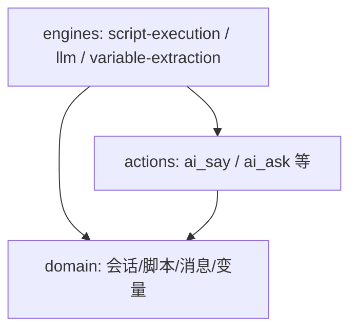

## 轻量

好的，从DDD（领域驱动设计）的角度来看，`packages/core-engine/src` 下的这三个目录很好地体现了分层架构和领域驱动的设计思想：

1.  **`domain/` (领域层)**:
    - **职责**: 这是系统的核心，包含了业务领域的实体、值对象、聚合根、领域服务、领域事件以及最重要的领域逻辑和业务规则。
    - **内容**: 在这个项目中，它存放了 `session.ts`, `message.ts`, `script.ts`, `variable.ts` 等文件。这些都是代表业务核心概念的模型，它们封装了与这些概念相关的数据和行为（或至少定义了行为接口）。例如，`Session` 实体不仅包含ID、状态等数据，还可能包含与其生命周期相关的业务规则和方法（如如何移动到下一阶段等）。
    - **特点**: 这一层应该是纯粹的业务模型，不依赖于任何外部框架、数据库或UI。它是业务知识的集中体现。

2.  **`actions/` (应用层/领域服务实现)**:
    - **职责**: 这一层定义了系统中具体的操作单元，即各种 "Action"（如 `ai_say`, `ai_ask` 等）。每个 Action 本质上是一个领域服务的实现，它封装了执行特定业务任务的逻辑。
    - **内容**: 包含了 `BaseAction` 以及具体的 Action 实现（如 `ai-say-action.ts`, `ai-ask-action.ts`）。这些 Action 接收上下文（Context），与领域模型（`domain` 中的实体/值对象）交互，执行业务逻辑（可能涉及领域服务），并产生结果（如 AI 消息、提取变量等）。
    - **特点**: 虽然这些 Action 实现了具体的业务行为，但它们通常是协调者，主要调用领域层的模型和逻辑。它们也可能包含一些与执行流程相关的应用层逻辑（如状态管理），但核心业务规则仍在 `domain` 层。

3.  **`engines/` (基础设施层/应用服务)**:
    - **职责**: 这一层包含了支撑核心业务逻辑运行的各种引擎或编排器。它们负责协调、管理和执行更复杂的业务流程。
    - **内容**: 包含了 `script-execution`, `llm-orchestration`, `variable-extraction` 等引擎。例如，`ScriptExecutor` 负责编排整个脚本的执行流程（遍历 Phases/Tasks/Actions），它会调用 `actions/` 中的具体 Action，并与 `domain/` 中的 `Session` 等模型交互。`VariableExtractor` 负责变量提取的逻辑。`LLMOrchestrator` 负责与 LLM 交互。
    - **特点**: 这些引擎通常处于较高的抽象层级，它们组合使用领域层的模型和应用层的 Action 来完成复杂的业务任务。它们可能依赖外部服务（如 LLM API），并通过适配器模式与领域层解耦。

**总结 (DDD视角)**:

- **`domain`** 是核心，定义了业务是什么。
- **`actions`** 是核心业务能力的具体实现，是领域服务的一种形式。
- **`engines`** 是协调者和编排者，利用领域模型和 Action 来完成更复杂的业务流程，并可能与其他系统（如 LLM）交互。

这种结构清晰地分离了业务核心（Domain）、业务操作（Actions）和支持这些操作的高级编排/工具（Engines），符合 DDD 分层和关注点分离的原则。

## 经济

在 DDD（领域驱动设计）的架构框架下，`packages/core-engine/src` 下的这三个目录构成了核心领域层的核心逻辑。以下是基于 DDD 原则对这三个目录职责的深入理解：

### 1. `domain` (领域层 - Domain Layer)

这是整个系统的“灵魂”，包含最核心、最稳定的业务逻辑和模型。

- **职责**：定义核心实体（Entities）、值对象（Value Objects）、领域事件（Domain Events）以及领域接口。
- **在本项目中**：它定义了 `Session`（会话）、`Script`（脚本）、`Message`（消息）、`Variable`（变量）等模型。
- **DDD 特点**：
  - **高内聚**：不依赖于任何外部框架或具体实现（如数据库、API）。
  - **业务语言**：其命名和逻辑直接映射业务用例，不含技术实现细节。

### 2. `actions` (动作/行为模式 - Domain Behavior)

在脚本驱动的系统中，Action 是领域模型执行具体任务的“最小单元”。

- **职责**：实现各种具体的业务行为（如 `ai_say`, `ai_ask`, `ai_think`）。
- **在 DDD 中的定位**：
  - 它可以看作是领域层中的 **策略模式实现 (Strategy Pattern)**。每种 Action 类型都是一种策略，定义了在特定脚本节点下系统应该如何表现。
  - 它们是高度多态的业务单元，通过 `BaseAction` 基类进行规范，确保行为的统一性和可扩展性。

### 3. `engines` (领域服务/引擎 - Domain Services)

这是驱动领域模型运转的“原动力”，负责处理无法归属于单一实体、涉及多个模型交互的复杂逻辑。

- **职责**：实现脚本解析、执行流控制、变量提取、记忆管理等复杂逻辑。
- **在 DDD 中的定位**：
  - 属于典型的 **领域服务 (Domain Services)**。例如 `ScriptExecutor`（脚本执行引擎）并不属于 `Session` 实体，也不属于 `Script` 实体，而是负责编排两者协作的第三方。
  - 它处于实体之上，负责驱动业务流程（Phase -> Topic -> Action）的运转。

---

### 整体架构的 DDD 协同逻辑

- **状态存储在 `domain`**：所有的状态（变量、当前位置、执行状态）都由实体持有。
- **逻辑封装在 `actions`**：具体的每一步“怎么做”封装在独立的 Action 类中。
- **流程驱动由 `engines` 负责**：引擎负责读取脚本，根据当前 `domain` 实体的状态，调度相应的 `actions` 执行。

**结论：**
这种划分方式非常符合 DDD 的 **“瘦 Application 层，厚 Domain 层”** 的理念。它将复杂的业务执行逻辑（Engines）和具体的业务动作（Actions）从基础的数据模型（Domain）中解耦出来，既保证了核心模型的纯净，又通过领域服务（Engines）提供了强大的业务驱动能力。

## 性能

我先从项目里查一下 core-engine 下这三个目录的大致职责，再结合 DDD 给你一个结构化解释。
先给结论，再展开：

- `domain`：纯领域模型层（实体 / 值对象）
- `actions`：领域行为单元（一个个“用例步骤”/策略对象）
- `engines`：应用编排引擎（驱动流程、协调 Actions 与领域模型）

---

## 1. 用 DDD 视角看这三个目录

### 1）`domain` —— 领域模型层（Domain Layer）

对应你提倡的 DDD 里的“领域层”：

- 内容：
  - `domain/session.ts`：会话聚合根，包含 sessionId、执行状态、position、变量等
  - `domain/message.ts`：消息实体，role/content/actionId/metadata
  - `domain/script.ts`：脚本实体，封装脚本内容、解析结果
  - `domain/variable.ts`：变量模型、类型信息等
- 职责：
  - 表达“心理咨询会话脚本系统”的**核心概念和不变条件**
  - 不关心脚本如何执行、LLM 如何调用，只关心“一个会话 / 消息 / 脚本是什么”
- DDD 对应：
  - 实体（Entity）、值对象（Value Object）、聚合（Aggregate）
  - 可以在这里放领域逻辑（如 Session 状态迁移、变量校验等）

**理解方式**：  
`domain` = “名词层”，描述世界里有哪些东西、有哪些属性、状态怎么变化。

---

### 2）`actions` —— 领域行为单元（Domain Behaviors / Use Case Steps）

这一层是你脚本系统里的“动作系统”，在 DDD 里可理解为：

- 靠近“领域服务 / 策略对象”的层
- 但在实现上，更像是“用例被拆成一小步一小步”的行为单元

内容示例：

- `base-action.ts`：Action 基类，定义：
  - `ActionContext`（包含 sessionId、variables、conversationHistory、metadata 等）
  - `execute(context, userInput)` 的规范
- `ai-say-action.ts`：负责“AI 说话”这类行为
- `ai-ask-action.ts`：负责“AI 提问 + 变量提取”的行为
- `action-registry.ts`：动作注册表，负责把 `action_type`（如 `ai_say`）映射到具体类

职责：

- 实现**一个个原子级业务行为**，比如：
  - 发送欢迎语
  - 提问“你的称呼是什么”
  - 提取“来访者称呼”变量并写入 variableStore
- 对 `domain` 做读写（变量、消息），但不关心“整个会话从头到尾怎么跑”

DDD 对应：

- 更接近“领域服务 + 策略对象”，每个 Action 代表一块可复用的业务规则
- 从脚本的角度看，每个 Action 就是一条“脚本里的业务语句”

**理解方式**：  
`actions` = “动词层”，一个 Action = “在当前会话上下文中完成某件具体事”。

---

### 3）`engines` —— 应用编排 / 流程驱动层（Application Layer）

`engines` 目录下是“六大引擎”，当前关键的是：

- `engines/script-execution`：**脚本执行引擎**
  - 负责读 YAML → 解析为结构化脚本（Phase / Topic / Action 列表）
  - 根据 `ExecutionState` 当前的位置（phaseIdx/topicIdx/actionIdx）驱动 Action 执行
  - 控制 WAITING_INPUT / COMPLETED / RUNNING 等状态
- `engines/llm-orchestration`：
  - 负责与底层 LLM Provider 打交道（模型、温度、token 限制等）
- `engines/variable-extraction`：
  - 封装“从 LLM 输出里提取变量”的逻辑
- `engines/memory`：
  - 负责记忆存取（长期/短期）
- `engines/variable-scope/variable-scope-resolver.ts`：
  - 解析变量应该落到 global/session/phase/topic 哪个作用域

职责（DDD 角度）：

- 更接近**应用层（Application Layer）**：
  - 协调多个领域对象与 Actions 完成一个完整的“用例”
  - 比如：从 Phase0/Topic0/Action0 开始一路跑到等待用户输入为止
- 保持自身尽量“无业务规则”，只是：
  - 读脚本（类似配置）
  - 决定“现在该调哪个 Action”
  - 把执行结果更新回 ExecutionState / variableStore / conversationHistory

**理解方式**：  
`engines` = “流程编排层”，负责“怎么走完整个脚本”，而不是每一步的业务细节。

---

## 2. 用 DDD 看三者之间的依赖关系

可以用一个简化关系图（符合你项目现状）：



- **依赖方向是“外层依赖内层”**：
  - engines 依赖 actions + domain
  - actions 依赖 domain
  - domain 不依赖其它两层
- 和典型 DDD 分层对齐：
  - Domain Layer：`domain`
  - Application Layer：`engines`
  - Domain Behaviors / Policies：`actions`（可以看作领域层的一部分，但实践上单独拆包）

---

## 3. 按 DDD 扩展时的落点建议

以后你在 core-engine 里扩展功能，可以这样选择位置：

1. **增加新的领域概念 / 状态**：
   - 比如“会谈阶段等级”、“风险评估结果”
   - 放到 `domain/*`，作为实体/值对象/字段，并在这里实现不变条件校验

2. **增加新的 Action 行为**（例如 `ai_think`, `use_skill`, `show_pic`）：
   - 放到 `actions/*`，继承 `BaseAction`
   - 在 `action-registry.ts` 注册
   - 业务逻辑尽量写在 Action 内部或配合 domain 方法

3. **增加/修改流程编排逻辑**：
   - 比如“支持 Topic 跳转”、“支持并行分支”
   - 放到 `engines/script-execution`（修改 `ScriptExecutor`）
   - 不要让 engine 直接写死业务规则，而是通过配置 + 调用不同 Actions 来实现

---

## 4. 跟你强调的 DDD 规则的契合点

- **领域核心收敛在 `domain` 包**：所有“心理咨询脚本会话”核心概念都集中在这里。
- **业务行为通过 `actions` 显式建模**：每一个 Action 是一个“可命名的业务操作”，而不是散落在巨大 service 里的 if/else。
- **应用层（`engines`）只做编排，不做业务细节**：
  - 执行哪一个 Action、何时等待用户输入、何时标记完成。
  - 业务含义（比如“这个问题问的是来访者称呼”）仍然在 Action 里。

如果你之后想做更“纯粹”的 DDD：

- 可以把 `actions` 也看作领域层的一部分（“领域行为”），只是为了工程清晰单独起目录；
- `engines` 明确定位为**应用服务层**，并保证它只依赖 domain/actions，不直接碰基础设施（数据库等由 API 层的 SessionManager 负责）。

如果你愿意，我可以再帮你画一张“整个项目（api-server + core-engine + script-editor）”的 DDD 分层图，把每个包放到 Domain/Application/Infrastructure 上，对齐你的 DDD 规则。

## 极致

基于 DDD 视角，我来分析 `core-engine/src` 下的三个目录：

## 当前结构与 DDD 对照

```
core-engine/src/
├── domain/        → DDD 领域层 (Domain Layer)
│   ├── session.ts    # 聚合根 (Aggregate Root)
│   ├── script.ts     # 实体 (Entity)
│   ├── message.ts    # 值对象 (Value Object)
│   └── variable.ts   # 值对象 (Value Object)
│
├── actions/       → DDD 领域服务/策略 (Domain Service / Strategy)
│   ├── base-action.ts    # 抽象基类
│   ├── ai-ask-action.ts  # 具体策略
│   ├── ai-say-action.ts  # 具体策略
│   └── action-registry.ts # 工厂/注册表
│
└── engines/       → DDD 应用服务 (Application Service)
    ├── script-execution/    # 脚本执行编排
    ├── llm-orchestration/   # LLM 调用编排
    ├── variable-extraction/ # 变量提取服务
    └── variable-scope/      # 变量作用域解析
```

## 评估与建议

### ✅ 符合 DDD 的方面

| 层次       | 当前实现                                                | DDD 概念                      |
| ---------- | ------------------------------------------------------- | ----------------------------- |
| `domain/`  | Session 包含状态转换方法 (`start`, `pause`, `complete`) | **充血模型** - 领域行为内聚   |
| `actions/` | 策略模式 + 注册表                                       | **领域服务** - 封装跨实体逻辑 |
| `engines/` | 编排多个领域对象协作                                    | **应用服务** - 用例协调层     |

### ⚠️ 可改进的方面

1. **`actions/` 定位模糊**
   - 当前：独立目录，与 `domain/` 平级
   - DDD 建议：Action 是领域行为的一部分，应归属于 `domain/actions/` 或直接作为领域服务

2. **缺少明确的聚合边界**
   - `Session` 应作为聚合根，`Message`、`Variable` 应通过 `Session` 访问
   - 当前各实体相对独立，聚合关系不明显

3. **`engines/` 职责过重**
   - 包含了应用服务 + 基础设施适配
   - 建议拆分：
     - `application/` - 用例编排
     - `infrastructure/` - LLM 调用、外部服务适配

## 推荐的 DDD 目录结构

```
core-engine/src/
├── domain/                    # 领域层
│   ├── session/              # Session 聚合
│   │   ├── session.ts        # 聚合根
│   │   ├── message.ts        # 实体
│   │   └── variable.ts       # 值对象
│   ├── script/               # Script 聚合
│   │   └── script.ts
│   └── actions/              # 领域服务（Action 策略）
│       ├── base-action.ts
│       ├── ai-ask-action.ts
│       └── ai-say-action.ts
│
├── application/              # 应用层
│   ├── script-executor.ts    # 脚本执行用例
│   └── session-service.ts    # 会话管理用例
│
└── infrastructure/           # 基础设施层
    ├── llm/                  # LLM 适配器
    ├── variable-extraction/  # 变量提取
    └── prompt-template/      # 模板管理
```

## 结论

当前结构已具备 DDD 的基础特征（领域模型、领域服务分离），但 `actions` 的定位和 `engines` 的职责边界可进一步明确。如果要严格遵循 DDD：

- **短期**：将 `actions/` 移至 `domain/actions/`
- **中期**：将 `engines/` 拆分为 `application/` + `infrastructure/`
- **长期**：按聚合组织 `domain/` 子目录

是否需要我帮你规划具体的重构步骤？
