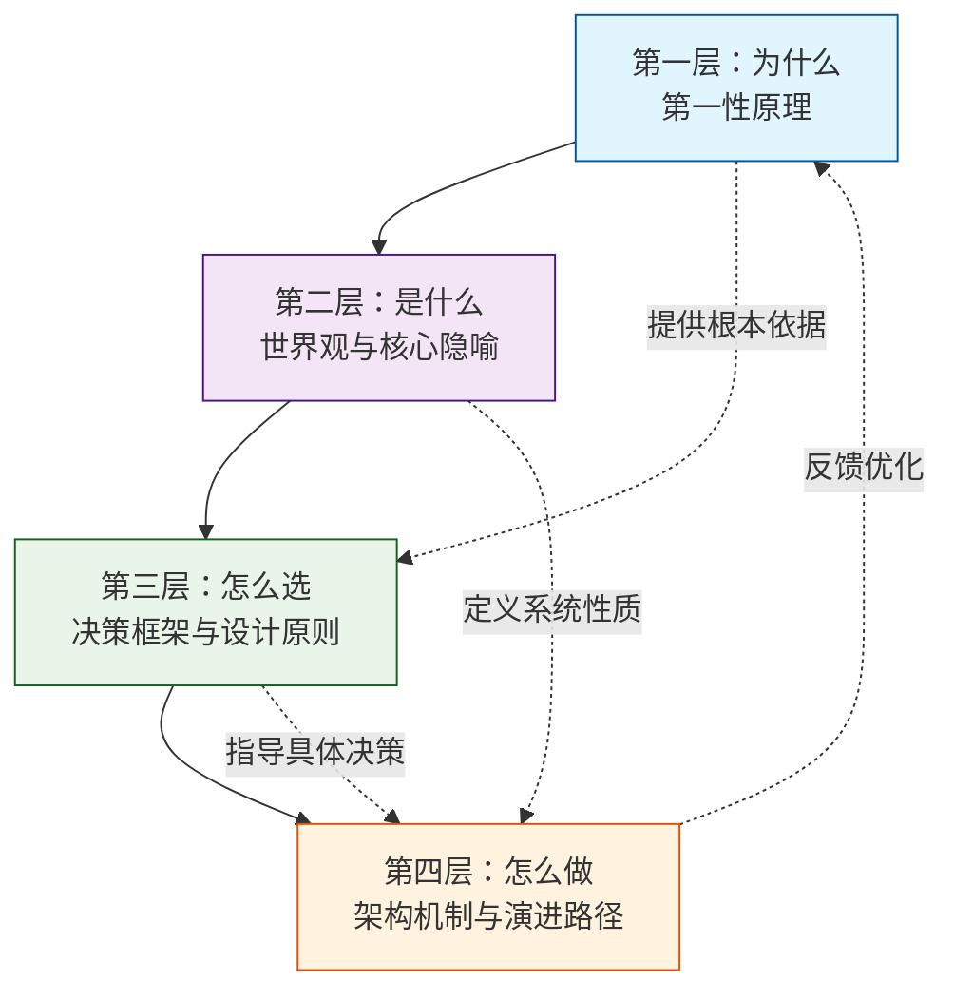
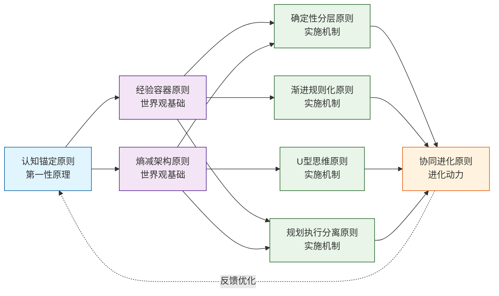
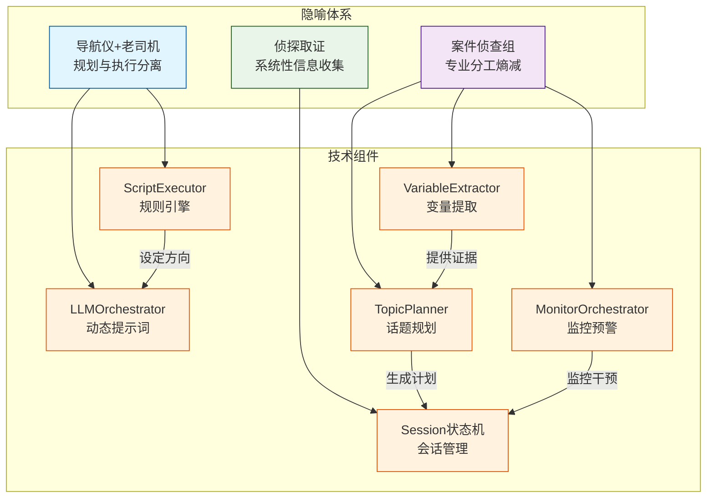
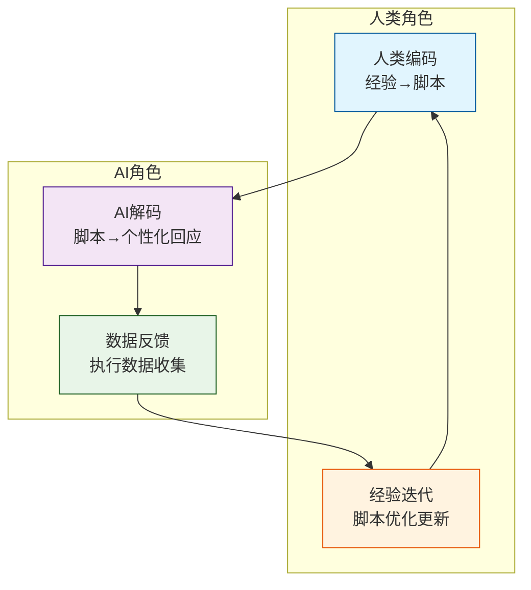

# HeartRule设计哲学v2：从第一性原理到实践指导

> **文档定位**：本文件是HeartRule AI咨询引擎的**根本性设计哲学**，阐述系统设计的"为什么"、"是什么"、"怎么选"、"怎么做"，形成从理论到实践的完整逻辑闭环。
>
> **版本说明**：v2版本基于五轮哲学对话提炼，采用四层连接机制重构，严格分离哲学（道）与技术（术），并整合'抬头低头'概念作为第八设计原则。
>
> **最后更新**：2026-03-12

---

## 📋 文档结构导航

```
第一层：为什么（第一性原理）
├── 1.1 认知能源有限性公理
├── 1.2 核心矛盾分析
└── 1.3 U型思维作为解决方案

第二层：是什么（世界观与核心隐喻）
├── 2.1 HeartRule世界观：多元经验的活容器
├── 2.2 三大核心隐喻体系
└── 2.3 人机协同进化模型

第三层：怎么选（决策框架与设计原则）
├── 3.1 三区决策框架
├── 3.2 TDD式渐进规则化
└── 3.3 八大显式设计原则

第四层：怎么做（架构机制与演进路径）
├── 4.1 五层架构实现
├── 4.2 进化度量体系
└── 4.3 未来演进方向
```

---

# 第一层：为什么（第一性原理）

## 1.1 认知能源有限性公理

### 根本约束：认知能源的稀缺性

**公理**：在认知能源有限的约束下，高熵的连接主义智能必须依赖低熵的符号主义结构来锚定注意力，以实现生存所需的确定性。

**解释**：

- **认知能源**：智能系统处理信息、做出决策的有限计算资源
- **高熵连接主义智能**：大语言模型（LLM）为代表的概率性、生成式智能，具有强大的模式识别与创造性，但缺乏确定性
- **低熵符号主义结构**：规则、脚本、状态机等确定性符号系统，提供稳定的认知锚点
- **注意力锚定**：在信息海洋中聚焦关键信息，避免认知资源浪费

### 工程意义

这一公理决定了HeartRule的**根本设计方向**：不是用规则限制LLM，也不是让LLM完全自由，而是**用符号结构为LLM提供认知锚点**，在有限认知资源下实现确定性目标。

## 1.2 核心矛盾分析

### 矛盾的本质

**核心矛盾**：生成式智能的"概率性失控"与专业咨询的"确定性刚需"之间的根本矛盾。

| 维度         | 生成式智能（LLM）      | 专业咨询需求           |
| ------------ | ---------------------- | ---------------------- |
| **输出特性** | 概率性、创造性、多样性 | 确定性、专业性、一致性 |
| **决策基础** | 统计模式匹配           | 专业理论与临床经验     |
| **风险控制** | 难以保证100%安全       | 必须保证100%安全       |
| **进化方式** | 参数优化、提示工程     | 经验积累、理论发展     |

### 传统解决方案的局限

```
                  确定性与灵活性光谱
传统规则引擎 ●─────────────┼─────────────● 纯LLM实现
           │                            │
           ▼                            ▼
      过度结构化                     过度自由化
           ◀─────  HeartRule平衡点 ────▶
```

**传统规则引擎困境**：

- 认知复杂性陷阱：需预先编码所有可能路径
- 自然语言理解的脆弱性：依赖关键词匹配
- 流程僵化风险：强制状态跳转破坏自然性
- 知识更新滞后：修改策略需重新部署

**纯LLM实现局限**：

- 系统性缺失：无法保证阶段递进逻辑
- 专业合规风险：可能生成违反伦理的回应
- 状态管理薄弱：无法可靠跟踪已收集信息
- 知识幻觉干扰：虚构不存在的咨询技术
- 领域数据稀缺：咨询对话数据难以获取
- 交互被动性：本质是“反应式”智能，缺乏主动引导能力

## 1.3 U型思维作为解决方案

### U型思维定义

**定义**：在有限认知资源的约束下，智能系统必须通过"抽象压缩"来跨越"无限具体情境"与"有限专业策略"之间的鸿沟。

### 四步解决流程

```
      ┌───────────────┐                      ┌───────────────┐
      │  用户具体讲话  │                      │  咨询师具体回复 │
      └───────┬───────┘                      └───────▲───────┘
              │                                      │
          (LLM概念化)                          (LLM具体化生成)
              ▼                                      │
      ┌───────────────┐                      ┌───────────────┐
      │  领域抽象概念  │                      │  领域回复套路  │
      └───────┬───────┘                      └───────────────┘
              └───────────────┬──────────────────────┘
                           (提示词，给出句式)
```

### 具体案例

**用户说**："每次汇报时手抖冒汗，怕领导觉得我无能"

**U型思维处理**：

1. **具体→抽象**：`社交焦虑障碍 + 预期性认知扭曲 + 自主神经亢进`
2. **抽象→策略**：匹配CBT的"认知重构"技术
3. **策略→具体**：生成个性化回应："这种紧张反应很常见，我们可以一起探索背后的想法..."

### 为什么必须用U型思维？

因为**无限的具体情境**无法被预先编码，但**有限的抽象策略**可以被系统掌握。U型思维是连接无限与有限的**认知桥梁**。

---

# 第二层：是什么（世界观与核心隐喻）

## 2.1 HeartRule世界观：多元经验的活容器

### 世界观核心

**咨询本质观**：咨询是多元经验的艺术，不存在唯一真理。

**系统定位**：HeartRule致力于成为容纳不同流派咨询智慧的"活容器"，让人类经验以脚本形式沉淀、积累、进化，在百花齐放中推动咨询领域的发展。

**AI角色定位**：AI不是独立的咨询师，而是人类经验的智能执行体——它通过符号规则锚定专业框架，利用LLM将抽象策略解压为用户情境的个性化回应，让每一次对话都成为某位专家经验与用户独特生命的相遇。

### 世界观的技术体现

| 世界观元素   | 技术实现                              | 设计意义                     |
| ------------ | ------------------------------------- | ---------------------------- |
| **多元经验** | YAML脚本多版本共存，不同流派独立脚本  | 不强制统一，支持并存竞争     |
| **活容器**   | 经验转成脚本，不断记录，支持版本管理  | 支持经验的持续积累与优化     |
| **AI执行体** | 为agent配置咨询技术，选不同流派的工程 | AI角色一致：执行者，非创造者 |

## 2.2 三大核心隐喻体系

### 隐喻一：导航仪+老司机

**隐喻描述**：规则引擎是导航仪（规划大方向），动态提示词是老司机（灵活应对路况）。

**技术映射**：

- **导航仪（规则引擎）**：YAML脚本定义咨询阶段与话题序列
- **老司机（动态提示词）**：LLM在话题框架内自由生成个性化回应
- **协作机制**：导航仪设定目的地和主要路径，老司机根据实时路况灵活调整

**设计意义**：分离规划与执行，确保系统性不跑偏的同时保持对话自然性。

### 隐喻二：案件侦查组

**隐喻描述**：世界是一个充满迷雾的案发现场（高熵环境），系统通过分工明确的侦查组（低熵架构），像侦探一样从混乱中提取证据（熵减动作）。

**技术映射**：

```
🕵️‍♂️ 侦查指挥中心（Session层）
├── 🕵️‍♂️ 第一侦查组：现场勘查（VariableExtractor）
│   ├── 直接取证（direct）：用户明确陈述
│   ├── 模式匹配（pattern）：正则提取
│   └── 智能审讯（llm）：语义分析
├── 🕵️‍♂️ 第二侦查组：线索分析（TopicPlanner）
│   ├── 分析现有证据
│   ├── 确定信息缺口
│   └── 生成下一步提问策略
└── 🕵️‍♂️ 第三侦查组：监控预警（MonitorOrchestrator）
    ├── 监控对话质量
    ├── 检测异常模式
    └── 触发干预措施
```

**设计意义**：专业分工的系统熵减架构，从高熵对话中系统性地提取低熵证据。

### 隐喻三：侦探取证

**隐喻描述**：每个咨询对话都是精心设计的「侦讯密室」——话题单元是不同审讯室，咨询师像侦探一样通过系统性提问提取关键证据。

**技术映射**：

- **侦讯密室**：结构化的咨询会话框架
- **审讯室**：独立的话题单元，有明确的侦查目标
- **取证流程**：系统性提问→证据收集→分析→下一步侦查
- **结案标准**：证据链完整，问题清晰界定

**设计意义**：将咨询过程转化为可管理、可度量、可复制的侦查流程。

### 隐喻体系的技术映射表

| 隐喻              | 技术组件                                                     | 数据流                                  | 设计目标                         |
| ----------------- | ------------------------------------------------------------ | --------------------------------------- | -------------------------------- |
| **导航仪+老司机** | `ScriptExecutor` + `LLMOrchestrator`                         | YAML脚本 → LLM提示词 → 个性化回应       | 分离规划与执行，确保系统性不跑偏 |
| **案件侦查组**    | `VariableExtractor` + `TopicPlanner` + `MonitorOrchestrator` | 自然语言输入 → 结构化变量 → 侦查计划    | 专业分工的系统熵减架构           |
| **侦探取证**      | `Session`状态机 + `Topic`单元 + `Action`队列                 | 用户陈述 → 证据收集 → 分析 → 下一步侦查 | 咨询过程的可管理、可度量、可复制 |

### 隐喻协同工作流程

```
用户输入（高熵情境）
    │
    ▼ 案件侦查组开始工作
VariableExtractor提取初步证据
    │
    ▼ 侦查指挥中心分析
TopicPlanner基于证据规划下一步
    │
    ▼ 导航仪设定方向
ScriptExecutor加载对应Topic脚本
    │
    ▼ 老司机灵活执行
LLMOrchestrator生成个性化回应
    │
    ▼ 侦探持续取证
循环直至证据链完整
```

## 2.3 人机协同进化模型

### 协同进化定义

**关系定位**：协同进化，而非替代或辅助。

**进化循环**：

```
      ┌─────────────┐
      │   人类编码   │
      │ 经验→脚本    │
      └──────┬──────┘
             │
             ▼
      ┌─────────────┐
      │   AI解码    │
      │脚本→个性化回应│
      └──────┬──────┘
             │
             ▼
      ┌─────────────┐
      │   数据反馈   │
      │  →经验迭代   │
      └──────┬──────┘
             │
             ▼
      ┌─────────────┐
      │   智慧进化   │
      │沉淀·积累·繁衍│
      └─────────────┘
```

### 角色分工

**人类角色**：

- **经验创造者**：将模糊实践经验结晶为可沉淀脚本
- **伦理监督者**：确保咨询过程的安全性与合规性
- **进化引导者**：基于反馈数据优化咨询策略

**AI角色**：

- **经验执行者**：将脚本解压为无数具体情境中的个性化回应
- **规模放大器**：实现人类经验的规模化应用
- **进化加速器**：通过数据反馈加速经验迭代速度

### 协同进化的技术实现

1. **编码接口**：人类友好的YAML脚本格式，支持渐进式完善
2. **解码引擎**：LLM + 规则混合执行，平衡确定性与灵活性
3. **反馈通道**：结构化执行数据收集与分析
4. **进化机制**：脚本版本管理、A/B测试、效果度量

---

# 第三层：怎么选（决策框架与设计原则）

## 3.1 三区决策框架

### 框架定义

面对具体设计选择时，架构师应根据以下三区框架决策：

1. **必须确定的区域**：用规则锁死
   - 安全性要求（如自杀风险评估）
   - 伦理底线（如保密原则）
   - 核心流程节点（如评估完成标志）

2. **可以灵活的区域**：放LLM自由
   - 个性化表达方式
   - 情境适应性调整
   - 创造性问题解决

3. **不确定的区域**：通过反馈让系统进化
   - 边界案例处理
   - 新兴咨询技术
   - 文化适应性调整

### 决策流程图

```
开始设计决策
    │
    ▼
识别决策类型
    │
    ├── 涉及安全/伦理/核心流程？
    │       │
    │       ▼
    │    必须确定 → 用规则锁死
    │
    ├── LLM能可靠处理？
    │       │
    │       ▼
    │    可以灵活 → 放LLM自由
    │
    └── 既不确定也不灵活？
            │
            ▼
        不确定 → 建立反馈机制 → 系统学习进化
```

## 3.2 TDD式渐进规则化

### 核心原则

**规则定位**：规则是LLM能力的"补丁"，而非前置的"牢笼"。

### TDD式实施流程

```
红：让LLM自由尝试（测试失败）
    │
    ▼
绿：发现LLM能力不足（测试失败）
    │
    ▼
重构：添加规则修补缺陷（写代码让测试通过）
    │
    ▼
持续重构：随着LLM能力提升，简化冗余规则
```

### 具体实践

**阶段一：红（自由尝试）**

- 让LLM处理目标场景
- 收集失败案例
- 分析失败模式

**阶段二：绿（识别需求）**

- 明确LLM的能力边界
- 定义确定性需求
- 设计最小必要规则

**阶段三：重构（添加规则）**

- 实现规则修补缺陷
- 验证规则有效性
- 确保规则最小化

**阶段四：持续重构（优化规则）**

- 监控LLM能力变化
- 移除过时规则
- 简化规则复杂度

## 3.3 八大显式设计原则

### 原则体系总览

```
认知锚定原则（第一性原理）
    ↓
经验容器原则 + 熵减架构原则（世界观基础）
    ↓
确定性分层原则 + 渐进规则化原则 + U型思维原则 + 规划执行分离原则（实施机制）
    ↓
协同进化原则（进化动力）
```

### 原则一：认知锚定原则

**表述**：在认知能源有限的约束下，系统必须使用低熵符号结构锚定高熵连接主义智能的注意力。

**依据**：第一性原理（1.1节）
**实践指导**：

- 设计稳定的符号框架（YAML脚本）作为注意力锚点
- 在锚点框架内允许LLM自由探索
- 通过反馈循环优化锚点位置

### 原则二：确定性分层原则

**表述**：系统必须明确区分并差异化处理三个决策区域：必须确定的（规则锁死）、可以灵活的（LLM自由）、通过反馈进化的（系统学习）。

**依据**：三区决策框架（3.1节）
**实践指导**：

- 识别核心流程中必须100%确定的部分（安全性、伦理、关键节点）
- 在非关键交互中最大化LLM灵活性
- 建立反馈机制将不确定区域逐步转化为确定或灵活区域

### 原则三：渐进规则化原则

**表述**：规则是LLM能力的"补丁"而非"牢笼"，应以TDD方式在LLM失败处渐进添加。

**依据**：TDD式渐进规则化（3.2节）
**实践指导**：

- 红：让LLM自由尝试，暴露能力边界
- 绿：识别LLM失败模式，明确规则需求
- 重构：添加最小必要规则修补缺陷
- 持续重构：随着LLM能力提升，简化冗余规则

### 原则四：经验容器原则

**表述**：系统是咨询智慧的"活容器"，必须支持多元经验的沉淀、积累、进化和跨流派融合。

**依据**：HeartRule世界观（2.1节）
**实践指导**：

- 设计可扩展的脚本格式，支持不同咨询流派
- 建立经验编码（人类→脚本）和解码（脚本→个性化回应）的标准接口
- 实现反馈数据→经验迭代的闭环
- 支持经验的版本化、复用和进化

### 原则五：熵减架构原则

**表述**：架构必须系统性地从高熵对话情境中提取低熵结构证据，实现持续的熵减过程。

**依据**：案件侦查组隐喻（2.2节）
**实践指导**：

- 设计专业分工的"侦查组"模块（六大核心引擎）
- 实现"侦探取证"式的变量提取与证据收集机制
- 建立"案件侦查"式的系统性信息收集流程
- 通过结构化数据存储实现对话熵的持续降低

### 原则六：U型思维原则

**表述**：系统必须实现具体→抽象→策略→具体的U型思维循环，通过抽象压缩跨越无限具体情境与有限专业策略之间的鸿沟。

**依据**：U型思维解决方案（1.3节）
**实践指导**：

- 实现具体情境的特征提取与抽象化
- 建立抽象特征到专业策略的映射机制
- 将策略解压为具体情境的个性化回应
- 通过反馈优化抽象压缩与解压的准确性

### 原则七：协同进化原则

**表述**：人机关系是编码-解码-反馈-进化的协同循环，人类保持创造力与伦理责任，AI实现规模化与进化加速。

**依据**：人机协同进化模型（2.3节）
**实践指导**：

- 明确人类角色：经验创造者、伦理监督者、进化引导者
- 明确AI角色：经验执行者、规模放大器、进化加速器
- 设计双向反馈通道：AI执行数据→人类经验迭代
- 建立进化度量体系：量化咨询智慧的沉淀速度与质量

### 原则八：规划执行分离原则

**表述**：系统必须将稳定的执行模式与间歇的战略规划分离，绝大部分时间在确定性框架内高效执行，仅在关键节点启动昂贵的规划资源。

**依据**：控制论分层调节思想 + 双过程认知模型（系统1快思考/系统2慢思考）
**实践指导**：

- 设计"低头执行"的稳定层：脚本定义的标准化动作序列，确保专业流程的可靠性与高效率
- 设计"抬头规划"的调节层：关键节点的LLM战略反思，基于对话现状和总体目标动态调整后续计划
- 明确"抬头"触发条件：话题转换、阻抗出现、危机信号、信息颠覆等关键决策点
- 确保"低头"时间占比远高于"抬头"（如90%执行/10%规划），实现认知资源的高效分配
- 建立"抬头→低头"的平滑切换机制：规划完成后迅速回归高效执行状态，避免持续高能耗思考

### 原则特性

每条原则都具备：

1. **可追溯性**：能追溯到具体的理论依据
2. **可操作性**：提供具体的实践指导
3. **可度量性**：有明确的成功标准
4. **可进化性**：支持系统的持续改进

---

# 第四层：怎么做（架构机制与演进路径）

## 4.1 五层架构实现

### 架构总览

```
┌─────────────────────────────────────────────┐
│  表现层：用户前端、领域工程师工作台         │
├─────────────────────────────────────────────┤
│  应用层：会话管理、脚本调试、脚本编辑       │
├─────────────────────────────────────────────┤
│  引擎层：六大核心引擎                       │
│  ├─ 脚本执行引擎                            │
│  ├─ LLM编排引擎                             │
│  ├─ 变量提取引擎                            │
│  ├─ 记忆引擎                                │
│  ├─ 话题调度引擎                            │
│  └─ 意识触发引擎                            │
├─────────────────────────────────────────────┤
│  脚本层：YAML脚本（会谈流程、咨询技术）     │
├─────────────────────────────────────────────┤
│  基础设施层：LLM服务、PostgreSQL、Redis     │
└─────────────────────────────────────────────┘
```

### 各层设计要点

#### 脚本层：经验的符号化编码

- **格式**：YAML结构，支持Phase→Topic→Action层次
- **特性**：人类可读可写，机器可解析执行
- **进化**：支持版本管理、兼容性检查、效果追踪

#### 引擎层：六大核心引擎分工

1. **脚本执行引擎**：解析YAML，管理咨询流程
2. **LLM编排引擎**：统一管理多个LLM提供者
3. **变量提取引擎**：从对话中提取结构化变量
4. **记忆引擎**：短期/中期/长期记忆管理
5. **话题调度引擎**：动态话题切换（计划驱动+意识驱动）
6. **意识触发引擎**：监控对话情境，优先级干预

#### 应用层：人机交互界面

- **会话管理**：创建、恢复、监控咨询会话
- **脚本调试**：实时测试与优化脚本
- **脚本编辑**：可视化编辑与版本控制

#### 表现层：用户体验优化

- **用户前端**：自然流畅的咨询对话界面
- **工程师工作台**：专业的脚本开发与调试环境

## 4.2 进化度量体系

### 度量维度

#### 经验沉淀速度

- **脚本数量增长**：每月新增脚本数量
- **脚本复杂度演进**：脚本的平均深度与广度
- **跨流派覆盖**：支持的咨询流派数量

#### 规则有效性

- **规则命中率**：规则触发的准确率
- **规则简化趋势**：随着LLM能力提升，规则数量的变化
- **规则维护成本**：每月规则修改次数

#### 咨询质量

- **用户满意度**：咨询后的评分与反馈
- **问题解决率**：识别问题并提供有效建议的比例
- **会话完成率**：完整咨询流程的完成比例

#### 熵减效率

- **信息结构化速度**：从对话开始到关键变量提取的时间
- **证据链完整度**：咨询结束时结构化证据的覆盖率
- **对话熵值变化**：会话过程中的熵值降低曲线

### 反馈循环机制

```
执行数据收集 → 效果分析 → 经验优化 → 脚本更新 → 再次执行
    │           │           │           │           │
    ▼           ▼           ▼           ▼           ▼
会话日志    质量评估    策略调整    版本迭代    效果验证
变量记录    用户反馈    规则优化    A/B测试    度量对比
```

## 4.3 未来演进方向

### 短期演进（1-2年）

#### 技术深化

- **长期记忆实现**：向量检索支持跨会话经验复用
- **多模态扩展**：支持语音、图像等输入形式
- **实时适应优化**：基于会话反馈的动态策略调整

#### 体验优化

- **游戏化界面**：Pixi.js实现沉浸式咨询体验
- **个性化适配**：基于用户特征的咨询风格调整
- **进度可视化**：咨询进展的实时可视化反馈

### 中期演进（3-5年）

#### 能力扩展

- **跨领域迁移**：将咨询智慧迁移到教育、医疗等领域
- **自主进化机制**：系统自主发现并优化咨询策略
- **群体智慧融合**：多专家经验的智能融合与创新

#### 生态建设

- **开放脚本市场**：咨询师共享与交易脚本的平台
- **协作编辑工具**：多人实时协作的脚本开发环境
- **认证与标准**：脚本质量认证与行业标准制定

### 长期愿景（5年以上）

#### 范式突破

- **咨询智慧自主创造**：系统不仅执行经验，还能创造新咨询方法
- **人机深度融合**：咨询师与AI的认知协同达到新高度
- **咨询科学革命**：基于大规模数据的新咨询理论发现

#### 社会影响

- **咨询民主化**：让高质量心理咨询惠及每个人
- **智慧传承**：将顶尖咨询师的智慧永久保存与传承
- **领域进化加速**：推动整个心理咨询领域的快速发展

---

## 📚 技术文档分离说明

### 哲学文档（本文件）与技术文档的分离原则

根据问题11的回答："哲学文档是'道'，技术文档是'术'。道要纯粹深刻，术要详尽实用。"

| 文档类型                       | 内容定位                     | 读者对象                     | 示例内容                               |
| ------------------------------ | ---------------------------- | ---------------------------- | -------------------------------------- |
| **哲学文档**（本文件）         | 设计思想、根本原理、决策框架 | 架构师、产品经理、哲学思考者 | 第一性原理、世界观、设计原则、隐喻体系 |
| **技术文档**（分离到其他文件） | 具体实现、代码示例、API文档  | 工程师、开发者、脚本编写者   | YAML语法、API接口、代码示例、配置说明  |

### 已从哲学文档移除的技术内容

原始`HeartRule设计哲学.md`中的以下技术内容已分离到相应技术文档：

1. **代码示例**：Python伪代码、YAML脚本片段、API调用示例
2. **具体实现细节**：变量提取算法、状态机实现、错误处理逻辑
3. **配置说明**：提示词模板、参数调优、部署配置
4. **演进路径的具体技术方案**：弱LLM vs 强LLM的具体实现对比

### 技术文档体系

**核心技术文档**：

- `docs/technical/architecture-guide.md` - 五层架构详细实现指南
- `docs/technical/scripting-guide.md` - YAML脚本编写规范与示例
- `docs/technical/api-reference.md` - REST API与WebSocket接口文档
- `docs/technical/engine-implementation.md` - 六大核心引擎实现细节

**领域特定文档**：

- `docs/technical/cbt-implementation.md` - CBT咨询技术的具体实现
- `docs/technical/variable-extraction.md` - 变量提取引擎技术细节
- `docs/technical/memory-engine.md` - 分层记忆架构设计

### 哲学与技术文档的连接

哲学文档提供**设计思想与决策框架**，技术文档提供**具体实现与操作指南**。

**连接机制**：

1. 哲学文档中的每个设计原则，在技术文档中有对应的实现章节
2. 技术文档的每个实现决策，能追溯到哲学文档的设计原则
3. 两者通过交叉引用形成完整的知识体系

**示例连接**：

- 哲学文档的"U型思维原则" → 技术文档的"VariableExtractor实现"
- 哲学文档的"经验容器原则" → 技术文档的"ScriptRegistry设计"
- 哲学文档的"熵减架构原则" → 技术文档的"MonitorOrchestrator实现"

---

## 🎨 结构模型图与逻辑快照

### 1. 四层连接机制结构图



**图注**：四层结构形成完整的逻辑闭环，每一层都为下一层提供依据，同时接受下层的反馈优化。

### 2. 八大设计原则关系图



**图注**：原则体系从第一性原理出发，通过世界观基础，形成实施机制，最终驱动协同进化。

### 3. 三大隐喻技术映射图



**图注**：每个隐喻对应多个技术组件，组件间形成协同工作流。

### 4. 熵减过程逻辑快照

```mermaid
gantt
    title 咨询会话熵减过程
    dateFormat  HH:mm
    axisFormat %H:%M

    section 熵值变化
    高熵状态 (8/10) :a1, 09:00, 5m
    熵减进行中 (6/10) :a2, after a1, 10m
    熵减显著 (4/10) :a3, after a2, 8m
    低熵状态 (2/10) :a4, after a3, 7m

    section 证据积累
    初步证据收集 :b1, 09:00, 8m
    关键变量提取 :b2, after b1, 7m
    关系分析建立 :b3, after b2, 8m
    证据链完整 :b4, after b3, 7m

    section 侦查活动
    现场勘查 :c1, 09:00, 5m
    线索分析 :c2, after c1, 8m
    深度审讯 :c3, after c2, 10m
    结案准备 :c4, after c3, 7m
```



**图注**：熵值随时间持续降低，证据逐步积累，侦查活动系统推进。

### 5. 协同进化循环图



**图注**：人机协同形成完整的进化循环，人类负责创造与优化，AI负责执行与反馈。

---

## 🔄 文档演进与维护

### 版本管理

| 版本 | 发布日期   | 主要变更                           | 状态 |
| ---- | ---------- | ---------------------------------- | ---- |
| v1.0 | 2025-01-01 | 原始设计哲学文档                   | 归档 |
| v2.0 | 2026-03-12 | 基于五轮哲学对话重构，采用四层结构 | 当前 |

### 维护原则

1. **哲学纯粹性**：保持文档的哲学高度，不混入技术细节
2. **逻辑完整性**：确保四层结构的逻辑闭环
3. **可追溯性**：所有设计决策能追溯到第一性原理
4. **可进化性**：支持哲学思想的持续演进与完善

### 贡献指南

**哲学文档贡献**：

- 讨论设计思想的根本原理
- 提出新的设计原则或隐喻
- 完善逻辑推导链条
- 补充结构模型图

**技术文档贡献**：

- 提供具体实现方案
- 编写代码示例
- 完善API文档
- 优化配置说明

**分离提交**：哲学变更与技术变更应分开提交，确保文档定位清晰。

---

**文档完成状态**：v2.0初稿完成，已整合'抬头低头'概念作为第八设计原则。
**下一步**：创建配套技术文档体系，完善可视化图表。
**维护团队**：HeartRule设计哲学工作组 + 技术实现团队

---

## 🎯 总结：HeartRule设计哲学的核心

HeartRule不是另一个"AI咨询工具"，而是**咨询智慧的活容器、进化加速器、民主化平台**。

它的设计哲学可以概括为：

**在认知能源有限的根本约束下，通过符号结构锚定概率智能的注意力，在承认咨询多元性的世界观中，构建支持经验沉淀、熵减侦查、协同进化的活容器系统，以TDD式渐进规则化平衡确定性与灵活性，最终实现咨询智慧的规模化应用与加速进化。**

这一哲学既提供了**不可动摇的理论根基**，又给出了**清晰可操作的实践指南**，既保持了**足够的理论高度**，又能**具体指导每一行代码的编写**。

读者无论从哪一层进入——无论是思考"为什么这样设计"的哲学家，还是决定"怎么选"的架构师，或是负责"怎么做"的工程师——都能找到通往其他层的路径，最终形成完整的认知图景。

这就是HeartRule设计哲学v2：**从第一性原理出发，通过世界观定位，导出核心原则，体现在架构机制中，落实为决策框架，并展望演进路径**的完整逻辑闭环。

---

**文档状态**：v2.0 初稿完成  
**下一步**：技术文档分离、结构模型图补充、逻辑快照完善  
**维护者**：HeartRule设计哲学工作组  
**最后审阅**：2026-03-12
