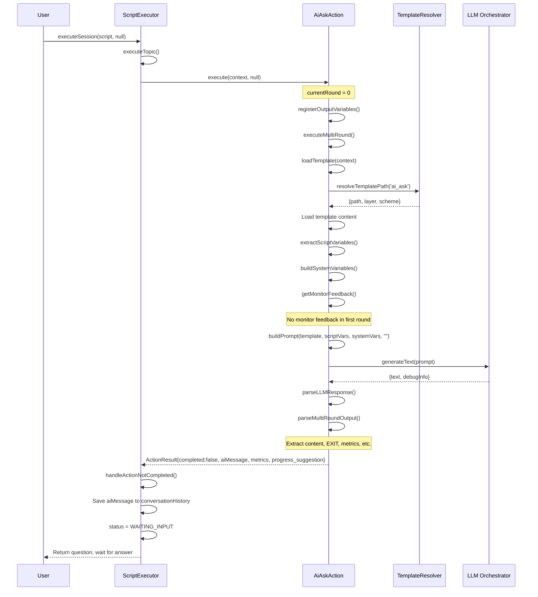
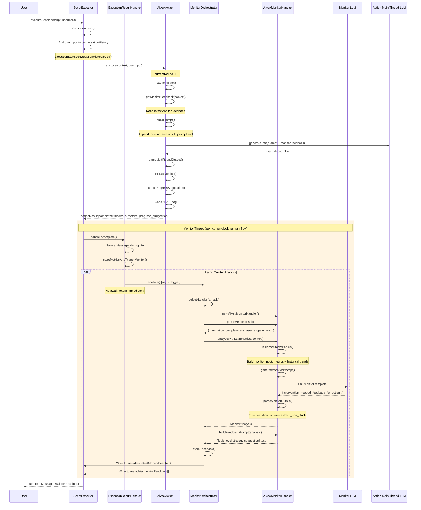
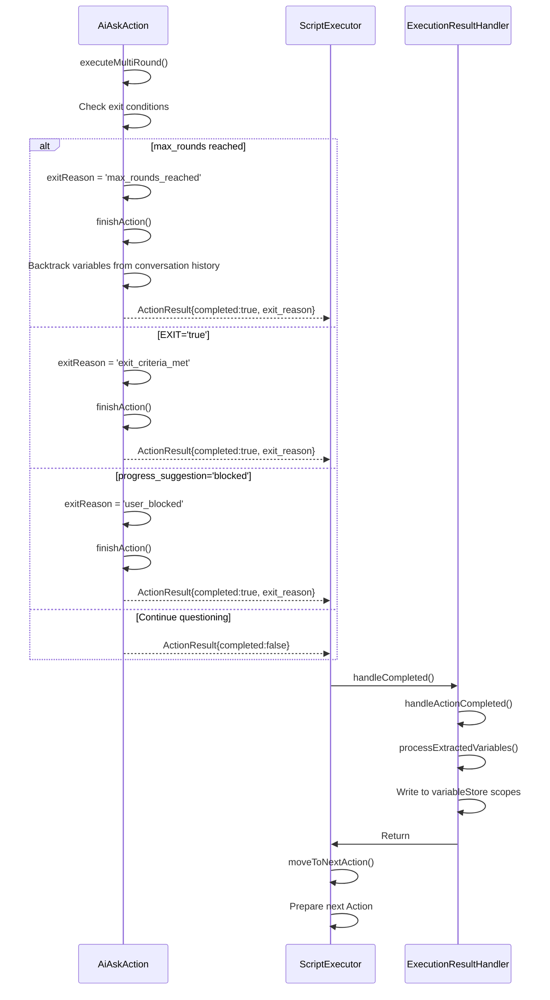
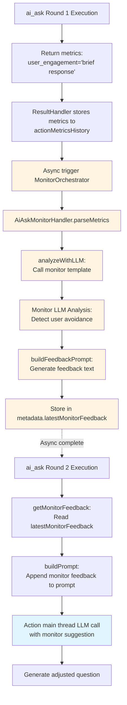

# ai_ask Action Complete Execution Sequence

## Overview

This document describes the complete execution flow of the ai_ask Action, from first-round execution, multi-round interaction, monitoring feedback loop, to final exit, including interaction sequences with components such as ScriptExecutor, MonitorOrchestrator, and AiAskMonitorHandler.

## 1. First Round Execution (Sending Question)



## 2. Subsequent Rounds (User Answer + Monitor Feedback)



## 3. Exit Condition and Completion



## 4. Monitor Feedback Loop (Key Mechanism)



## Core Design Points

### Async Monitor Mechanism

- Monitor analysis is triggered asynchronously via `.catch()`, not blocking Action main flow
- ResultHandler.storeMetricsAndTriggerMonitor() does not use `await`
- Monitor failure does not affect session continuation

### Monitor Feedback Loop

1. Action execution returns metrics (user engagement, information completeness, etc.)
2. ResultHandler stores to actionMetricsHistory
3. MonitorOrchestrator asynchronously calls AiAskMonitorHandler
4. Monitor LLM analyzes user response patterns, generates adjustment suggestions
5. Suggestions stored in metadata.latestMonitorFeedback
6. Next round Action execution reads and appends to prompt
7. Action LLM adjusts questioning strategy based on feedback

### Exit Conditions

- **max_rounds_reached**: Maximum rounds reached
- **exit_criteria_met**: LLM determines information is sufficient (EXIT='true')
- **user_blocked**: progress_suggestion='blocked', user explicitly refuses to answer

### Variable Extraction and Scope

- When Action completes, backtrack and extract output variables from conversationHistory
- Write to corresponding scope via VariableScopeResolver (topic/phase/session/global)
- Support scope override rules: topic > phase > session > global

## Related Files

- `packages/core-engine/src/domain/actions/ai-ask-action.ts` - AiAskAction implementation
- `packages/core-engine/src/engines/script-execution/script-executor.ts` - ScriptExecutor (refactored)
- `packages/core-engine/src/application/handlers/execution-result-handler.ts` - Result handler
- `packages/core-engine/src/application/orchestrators/monitor-orchestrator.ts` - Monitor orchestrator
- `packages/core-engine/src/application/monitors/ai-ask-monitor-handler.ts` - ai_ask monitor handler
- `packages/core-engine/src/application/monitors/base-monitor-handler.ts` - Monitor base class

## ScriptExecutor Refactoring Notes

### Refactoring Principles (Martin Fowler)

Following "Refactoring: Improving the Design of Existing Code" principles, the following refactorings were applied to ScriptExecutor:

#### 1. Extract Method

**Original executeSession (150 lines) split into:**

- `executeSession` (32 lines) - Main flow orchestration
- `initializeSession` (13 lines) - Initialize session
- `resumeCurrentActionIfNeeded` (34 lines) - Resume incomplete action
- `handleIncompleteAction` (19 lines) - Handle incomplete action
- `handleCompletedAction` (14 lines) - Handle completed action
- `executeAllPhases` (15 lines) - Execute all phases
- `moveToNextPhase` (9 lines) - Move to next phase
- `updatePositionForNextPhase` (19 lines) - Update phase position info
- `clearPositionIds` (5 lines) - Clear position IDs
- `clearActionIds` (3 lines) - Clear action IDs
- `clearTopicAndActionIds` (4 lines) - Clear topic and action IDs

**Original updateVariablesWithScope (60 lines) split into:**

- `updateVariablesWithScope` (15 lines) - Variable update main logic
- `writeVariablesToScopes` (18 lines) - Write variables to scopes
- `writeVariableToScope` (12 lines) - Write single variable
- `verifyVariablesWritten` (25 lines) - Verify variable write success

**Original executePhase (47 lines) split into:**

- `executePhase` (14 lines) - Phase execution main logic
- `moveToNextTopic` (9 lines) - Move to next topic
- `updatePositionForNextTopic` (13 lines) - Update topic position info

#### 2. Single Responsibility Principle

Each extracted function has a single clear responsibility:

- **Initialization**: Parse script, setup metadata, restore state
- **Execution**: Execute phase, topic, action
- **State Management**: Update position, clear position, save state
- **Variable Processing**: Write variables, verify variables, determine scope

#### 3. Composed Method

The refactored main method uses composition pattern, each step completed by a clearly named sub-method:

```typescript
async executeSession(...) {
  const phases = this.initializeSession(...);
  const shouldContinue = await this.resumeCurrentActionIfNeeded(...);
  if (!shouldContinue) return executionState;
  await this.executeAllPhases(...);
  executionState.status = ExecutionStatus.COMPLETED;
  return executionState;
}
```

#### 4. Guard Clauses

Use early return pattern to reduce nesting:

```typescript
if (!executionState.variableStore) {
  console.warn('...');
  return; // Early return, avoid deep nesting
}
```

### Refactoring Results

- ✅ **Improved Readability**: Function length reduced from 150 lines to 32 lines
- ✅ **Enhanced Testability**: Each sub-function can be tested independently
- ✅ **Improved Maintainability**: Clear responsibilities, easy to locate issues
- ✅ **Backward Compatible**: All existing tests pass (Phase 1, Phase 8)
- ✅ **No Performance Loss**: No additional overhead, pure logic reorganization
