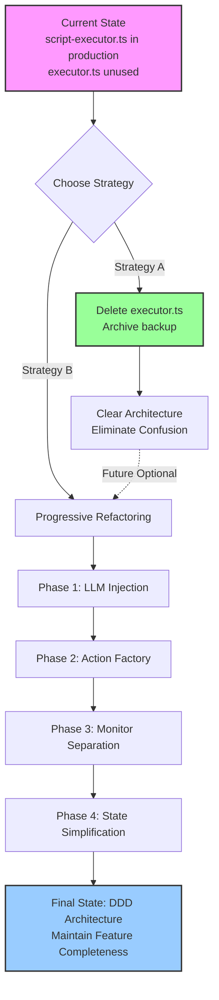

# ScriptExecutor Refactoring Plan

## Document Metadata

- **Created**: 2026-02-09
- **Document Version**: 1.0
- **Status**: Pending Review
- **Priority**: P2 (Medium Priority)
- **Owner**: To be assigned

---

## 1. Problem Description

### 1.1 Identified Issues

In the `packages/core-engine/src/engines/script-execution/` directory, there exist **two ScriptExecutor classes with the same name but vastly different functionality**:

| File                   | Lines of Code | Architecture Pattern       | Production Status    | Feature Completeness                  |
| ---------------------- | ------------- | -------------------------- | -------------------- | ------------------------------------- |
| **script-executor.ts** | 1146 lines    | Direct dependency creation | ✅ In production use | **Complete**: Story 1.4 full features |
| **executor.ts**        | 298 lines     | DDD architecture + DI      | ❌ Not in production | **Basic**: Only basic execution flow  |

### 1.2 Code Conflict Points

Currently, naming conflicts are avoided through alias exports in `index.ts`:

```typescript
// packages/core-engine/src/engines/script-execution/index.ts
export type { ExecutionState as LegacyExecutionState } from './executor.js';
export { ScriptExecutor as LegacyScriptExecutor } from './executor.js';
export * from './script-executor.js'; // Default export
```

### 1.3 Architecture Difference Analysis

#### **script-executor.ts (Production Version)**

**Advantages**:

- ✅ **Feature Complete**: Includes Story 1.4 async monitoring mechanism, four-layer variable scope, metrics history storage, monitoring feedback loop
- ✅ **Production Validated**: Used in api-server and all tests, stable and reliable
- ✅ **LLM Integration**: Built-in `LLMOrchestrator`, supports multi-turn dialogue, variable extraction, JSON retry
- ✅ **State Serialization**: Supports Action state persistence, checkpoint resume

**Disadvantages**:

- ❌ **Architecture Issues**: Creates dependencies directly in constructor (`new LLMOrchestrator`), violates DDD dependency injection principle
- ❌ **Poor Testability**: Dependencies hardcoded, difficult for unit testing (requires environment variable configuration for LLM)
- ❌ **High Coupling**: Strongly coupled with specific LLM Provider (VolcanoDeepSeekProvider)
- ❌ **Verbose Code**: 1146 lines of code, high maintenance cost

#### **executor.ts (Design Blueprint)**

**Advantages**:

- ✅ **Elegant Architecture**: Follows DDD principles, dependencies injected through constructor (`ActionRegistry`)
- ✅ **Strong Testability**: Dependencies can be mocked, easy for unit testing
- ✅ **Concise Code**: 298 lines, clear logic, easy to maintain
- ✅ **Well Decoupled**: Action creation through registry, doesn't depend on concrete implementation

**Disadvantages**:

- ❌ **Missing Features**: Lacks Story 1.4 monitoring mechanism, variable scope, metrics history, LLM integration
- ❌ **Not in Production**: No actual usage scenarios, may have undiscovered issues
- ❌ **Data Structure Difference**: `ExecutionState` uses `Map` instead of objects, incompatible with production version
- ❌ **Missing Domain Models**: Depends on `Script` and `Session` domain objects, but actual api-server uses database models

### 1.4 Usage Analysis

Through grep search for `new ScriptExecutor` call locations:

```typescript
// Production code usage (script-executor.ts)
packages/api-server/src/services/session-manager.ts:81
packages/core-engine/src/application/session-application-service.ts:189, 247

// Test code usage (script-executor.ts)
packages/core-engine/test/*.test.ts (8 occurrences)
packages/api-server/*.ts (test scripts 2 occurrences)

// executor.ts usage: 0 occurrences (completely unused)
```

**Conclusion**: `executor.ts` is a design-phase artifact, never put into actual use.

---

## 2. Refactoring Design Proposals

### 2.1 Strategy Selection

Based on the above analysis, **three refactoring strategies** are proposed:

| Strategy       | Description                                              | Risk Level     | Time Investment | Recommendation             |
| -------------- | -------------------------------------------------------- | -------------- | --------------- | -------------------------- |
| **Strategy A** | Keep script-executor.ts, delete executor.ts              | 🟢 Low Risk    | 2 hours         | ⭐⭐⭐⭐⭐ **Recommended** |
| **Strategy B** | Refactor script-executor.ts, migrate to DDD architecture | 🟡 Medium Risk | 3-5 days        | ⭐⭐⭐                     |
| **Strategy C** | Migrate Story 1.4 features to executor.ts                | 🔴 High Risk   | 5-7 days        | ⭐⭐                       |

### 2.2 Recommended Approach: Strategy A (Clean Unused Code)

**Rationale**:

1. **Zero Risk**: Doesn't affect production code, only deletes unused files
2. **Fast Delivery**: Complete within 2 hours, no complex testing needed
3. **Clear Architecture**: Eliminates ambiguity, avoids future maintenance confusion
4. **YAGNI Principle**: executor.ts has never been used, violates "You Aren't Gonna Need It" principle

**Execution Steps**:

1. Confirm executor.ts has no external references
2. Backup to `docs/archive/` directory
3. Delete file and export aliases
4. Update related documentation

### 2.3 Alternative Approach: Strategy B (Progressive Refactoring)

**Applicable Scenarios**: Long-term architecture optimization, improving code quality

**Refactoring Direction**:

1. **Phase 1**: Extract LLM dependency injection (1 day)
   - Constructor accepts `LLMOrchestrator` parameter
   - Preserve default creation logic (backward compatible)
2. **Phase 2**: Extract Action creation logic (1 day)
   - Introduce `ActionFactory` interface
   - Migrate `createAction` to factory class
3. **Phase 3**: Separate monitoring logic (1 day)
   - Extract `MonitorService` interface
   - Migrate `triggerMonitorAnalysis` to independent service
4. **Phase 4**: Simplify ExecutionState (1 day)
   - Split into `ExecutionContext` + `ExecutionPosition`
   - Reduce temporary state storage

**Risk Points**:

- Requires full regression testing (E2E + unit tests)
- May affect existing feature stability
- Large scope of changes, requires multi-person collaboration

---

## 3. Detailed Execution Steps

### 3.1 Strategy A Execution Checklist

#### Stage 1: Backup and Confirmation (30 minutes)

```bash
# 1. Create archive directory
mkdir -p docs/archive/script-executor-legacy

# 2. Backup executor.ts and related files
cp packages/core-engine/src/engines/script-execution/executor.ts \
   docs/archive/script-executor-legacy/

# 3. Add archive description
echo "# ScriptExecutor Legacy Code Archive

**Archive Date**: 2026-02-09
**Reason**: This file was never put into production use, backup preserved for future reference

## Original File Path
- packages/core-engine/src/engines/script-execution/executor.ts

## Architecture Value
This design embodies DDD architecture principles and can serve as a reference blueprint for future refactoring.
" > docs/archive/script-executor-legacy/README.md

# 4. Check for hidden references
grep -r "from.*executor.js" packages/ --include="*.ts"
grep -r "LegacyScriptExecutor" packages/ --include="*.ts"
```

#### Stage 2: Code Cleanup (30 minutes)

**File Modification List**:

1. **Delete executor.ts**

   ```bash
   rm packages/core-engine/src/engines/script-execution/executor.ts
   ```

2. **Update index.ts exports**

   ```typescript
   // packages/core-engine/src/engines/script-execution/index.ts
   /**
    * Script Execution Engine
    */
   export * from './yaml-parser.js';
   export * from './script-executor.js';

   // Note: Old executor.ts has been archived to docs/archive/script-executor-legacy/
   // For DDD architecture design reference, please check archived files
   ```

3. **Update documentation**
   - `openspec/specs/_global/process/development-guide.md` - Remove references to executor.ts
   - `openspec/specs/domain/tactical/async-verification/story-1.4-async-verification.md` - Clarify use of script-executor.ts

#### Stage 3: Verification and Testing (1 hour)

```bash
# 1. Rebuild core-engine
pnpm --filter @heartrule/core-engine build

# 2. Run unit tests
pnpm --filter @heartrule/core-engine test

# 3. Run integration tests
pnpm --filter @heartrule/api-server test

# 4. Start local service for verification
pnpm --filter @heartrule/api-server dev
# Manual testing: create session → send message → verify variable extraction → verify monitoring feedback
```

#### Stage 4: Commit and Record (10 minutes)

```bash
git add .
git commit -m "refactor: remove unused executor.ts and archive to docs/

BREAKING CHANGE: Removed LegacyScriptExecutor and LegacyExecutionState exports

- executor.ts has never been used in production
- Archived to docs/archive/script-executor-legacy/ for reference
- Updated index.ts exports to only include script-executor.ts
- No impact on existing functionality as executor.ts had zero usage

Ref: docs/design/script-executor-refactoring-plan.md"
```

---

### 3.2 Strategy B Execution Plan (Optional)

#### Phase 1: LLM Dependency Injection (1 day)

**Modification Points**:

```typescript
// script-executor.ts
export class ScriptExecutor {
  private llmOrchestrator: LLMOrchestrator;

  constructor(llmOrchestrator?: LLMOrchestrator) {
    // Dependency injection takes priority, preserve default creation logic (backward compatible)
    if (llmOrchestrator) {
      this.llmOrchestrator = llmOrchestrator;
    } else {
      // Default creation logic (maintain existing behavior)
      const apiKey = process.env.VOLCENGINE_API_KEY || /* ... */;
      const provider = new VolcanoDeepSeekProvider(/* ... */);
      this.llmOrchestrator = new LLMOrchestrator(provider, 'volcano');
    }
  }
}
```

**Test Verification**:

```typescript
// New unit tests
describe('ScriptExecutor with injected LLM', () => {
  it('should accept LLM orchestrator via constructor', () => {
    const mockOrchestrator = createMockLLMOrchestrator();
    const executor = new ScriptExecutor(mockOrchestrator);
    // Verify using injected instance
  });

  it('should create default LLM orchestrator when not provided', () => {
    const executor = new ScriptExecutor();
    // Verify default creation logic
  });
});
```

#### Phase 2: Action Creation Logic Refactoring (1 day)

**Goal**: Decouple Action creation logic, introduce factory pattern

**Current Issue**:

```typescript
// script-executor.ts L941-973
private createAction(actionConfig: any): BaseAction {
  const actionType = actionConfig.action_type;
  const actionId = actionConfig.action_id;

  // Hardcoded: directly check type and create instance
  if (actionType === 'ai_say') {
    return new AiSayAction(actionId, config, this.llmOrchestrator);
  }
  if (actionType === 'ai_ask') {
    return new AiAskAction(actionId, config, this.llmOrchestrator);
  }
  return createAction(actionType, actionId, config);
}
```

**Refactoring Solution**:

```typescript
// New: packages/core-engine/src/actions/action-factory.ts
export interface ActionFactory {
  create(actionType: string, actionId: string, config: any): BaseAction;
}

export class DefaultActionFactory implements ActionFactory {
  constructor(
    private llmOrchestrator?: LLMOrchestrator,
    private registry?: ActionRegistry
  ) {}

  create(actionType: string, actionId: string, config: any): BaseAction {
    // Prefer using registry
    if (this.registry) {
      const ActionClass = this.registry.get(actionType);
      if (ActionClass) {
        return new ActionClass(actionId, config);
      }
    }

    // Fallback to hardcoded (backward compatible)
    switch (actionType) {
      case 'ai_say':
        if (!this.llmOrchestrator) {
          throw new Error('LLMOrchestrator required for ai_say');
        }
        return new AiSayAction(actionId, config, this.llmOrchestrator);
      case 'ai_ask':
        if (!this.llmOrchestrator) {
          throw new Error('LLMOrchestrator required for ai_ask');
        }
        return new AiAskAction(actionId, config, this.llmOrchestrator);
      default:
        return createAction(actionType, actionId, config);
    }
  }
}

// Modified script-executor.ts
export class ScriptExecutor {
  private llmOrchestrator: LLMOrchestrator;
  private actionFactory: ActionFactory; // New

  constructor(
    llmOrchestrator?: LLMOrchestrator,
    actionFactory?: ActionFactory // New parameter
  ) {
    // LLM initialization (Phase 1 completed)
    this.llmOrchestrator = llmOrchestrator || this.createDefaultLLM();

    // Action factory initialization
    this.actionFactory = actionFactory || new DefaultActionFactory(this.llmOrchestrator);
  }

  // Simplified createAction method
  private createAction(actionConfig: any): BaseAction {
    const actionType = actionConfig.action_type;
    const actionId = actionConfig.action_id;
    const { action_id, action_type, ...restConfig } = actionConfig;
    const config = actionConfig.config ? { ...restConfig, ...actionConfig.config } : restConfig;

    return this.actionFactory.create(actionType, actionId, config);
  }
}
```

**File Modification List**:

1. Create `packages/core-engine/src/actions/action-factory.ts`
2. Modify `packages/core-engine/src/engines/script-execution/script-executor.ts`
3. Export factory interface `packages/core-engine/src/actions/index.ts`

**Acceptance Criteria**:

- ✅ All existing tests pass (no feature regression)
- ✅ Can inject custom ActionFactory via constructor
- ✅ Default behavior completely consistent with pre-refactoring
- ✅ New unit tests: custom factory tests

**Test Cases**:

```typescript
// packages/core-engine/test/action-factory.test.ts
describe('ActionFactory', () => {
  it('should create ai_ask using default factory', () => {
    const mockLLM = createMockLLM();
    const factory = new DefaultActionFactory(mockLLM);
    const action = factory.create('ai_ask', 'test_ask', {});
    expect(action).toBeInstanceOf(AiAskAction);
  });

  it('should support custom factory injection', () => {
    class CustomFactory implements ActionFactory {
      create(type: string, id: string, config: any) {
        return new MockAction(id, config);
      }
    }
    const executor = new ScriptExecutor(undefined, new CustomFactory());
    // Verify using custom factory
  });

  it('should maintain backward compatibility', async () => {
    const executor = new ScriptExecutor(); // No parameters
    // Execute complete session flow, verify functionality normal
  });
});
```

**Time Estimation**:

- Write factory code: 2h
- Modify ScriptExecutor: 1h
- Write unit tests: 2h
- Integration test verification: 2h
- Code review modifications: 1h

---

#### Phase 3: Monitor Logic Separation (1 day)

**Goal**: Extract monitoring analysis logic into independent service, reduce ScriptExecutor responsibilities

**Current Issue**:

```typescript
// script-executor.ts L1055-1144 (90 lines of monitoring logic)
private async triggerMonitorAnalysis(
  actionType: string,
  actionId: string,
  result: ActionResult,
  executionState: ExecutionState,
  sessionId: string,
  phaseId: string,
  topicId: string
): Promise<void> {
  // Build context, select handler, call LLM, store results...
  // Too many responsibilities, should be independent service
}
```

**Refactoring Solution**:

```typescript
// New: packages/core-engine/src/services/monitor-service.ts
export interface MonitorService {
  analyze(
    actionType: string,
    actionResult: ActionResult,
    context: MonitorAnalysisContext
  ): Promise<MonitorAnalysisResult>;
}

export interface MonitorAnalysisContext {
  sessionId: string;
  actionId: string;
  phaseId: string;
  topicId: string;
  currentRound: number;
  maxRounds: number;
  metricsHistory: any[];
  sessionConfig?: any;
  projectId?: string;
  templateProvider?: any;
}

export interface MonitorAnalysisResult {
  intervention_needed: boolean;
  intervention_level?: string;
  feedbackPrompt?: string;
  shouldTriggerOrchestration: boolean;
}

export class DefaultMonitorService implements MonitorService {
  constructor(
    private llmOrchestrator: LLMOrchestrator,
    private projectId: string = '.',
    private templateProvider?: any
  ) {}

  async analyze(
    actionType: string,
    actionResult: ActionResult,
    context: MonitorAnalysisContext
  ): Promise<MonitorAnalysisResult> {
    // Select monitor handler
    let handler: BaseMonitorHandler;
    if (actionType === 'ai_ask') {
      handler = new AiAskMonitorHandler(
        this.llmOrchestrator,
        context.projectId || this.projectId,
        context.templateProvider || this.templateProvider
      );
    } else if (actionType === 'ai_say') {
      handler = new AiSayMonitorHandler(
        this.llmOrchestrator,
        context.projectId || this.projectId,
        context.templateProvider || this.templateProvider
      );
    } else {
      throw new Error(`Unsupported Action type: ${actionType}`);
    }

    // Parse metrics
    const metrics = handler.parseMetrics(actionResult);

    // Build monitor context
    const monitorContext: MonitorContext = {
      sessionId: context.sessionId,
      actionId: context.actionId,
      actionType,
      currentRound: context.currentRound,
      maxRounds: context.maxRounds,
      actionResult,
      metricsHistory: context.metricsHistory,
      metadata: {
        sessionConfig: context.sessionConfig,
        templateProvider: context.templateProvider,
        projectId: context.projectId,
        phaseId: context.phaseId,
        topicId: context.topicId,
      },
    };

    // Call monitor LLM analysis
    const analysis = await handler.analyzeWithLLM(metrics, monitorContext);

    // Generate feedback prompt
    let feedbackPrompt: string | undefined;
    if (analysis.intervention_needed) {
      feedbackPrompt = handler.buildFeedbackPrompt(analysis);
    }

    // Check if orchestration needed
    const shouldTriggerOrchestration = handler.shouldTriggerOrchestration(analysis);

    return {
      intervention_needed: analysis.intervention_needed,
      intervention_level: analysis.intervention_level,
      feedbackPrompt,
      shouldTriggerOrchestration,
    };
  }
}

// Modified script-executor.ts
export class ScriptExecutor {
  private llmOrchestrator: LLMOrchestrator;
  private actionFactory: ActionFactory;
  private monitorService: MonitorService; // New

  constructor(
    llmOrchestrator?: LLMOrchestrator,
    actionFactory?: ActionFactory,
    monitorService?: MonitorService // New parameter
  ) {
    this.llmOrchestrator = llmOrchestrator || this.createDefaultLLM();
    this.actionFactory = actionFactory || new DefaultActionFactory(this.llmOrchestrator);
    this.monitorService = monitorService || new DefaultMonitorService(this.llmOrchestrator);
  }

  // Simplified monitor trigger logic
  private async triggerMonitorAnalysis(
    actionType: string,
    actionId: string,
    result: ActionResult,
    executionState: ExecutionState,
    sessionId: string,
    phaseId: string,
    topicId: string
  ): Promise<void> {
    console.log('[ScriptExecutor] 🔍 Triggering monitor analysis');

    try {
      // Build context
      const context: MonitorAnalysisContext = {
        sessionId,
        actionId,
        phaseId,
        topicId,
        currentRound: result.metadata?.currentRound || 1,
        maxRounds: result.metadata?.maxRounds || 3,
        metricsHistory: executionState.metadata.actionMetricsHistory || [],
        sessionConfig: executionState.metadata.sessionConfig,
        projectId: executionState.metadata.projectId,
        templateProvider: executionState.metadata.templateProvider,
      };

      // Call service
      const analysisResult = await this.monitorService.analyze(actionType, result, context);

      // Store result
      if (!executionState.metadata.monitorFeedback) {
        executionState.metadata.monitorFeedback = [];
      }
      executionState.metadata.monitorFeedback.push({
        actionId,
        actionType,
        timestamp: new Date().toISOString(),
        analysis: analysisResult,
      });

      // Store feedback prompt
      if (analysisResult.feedbackPrompt) {
        executionState.metadata.latestMonitorFeedback = analysisResult.feedbackPrompt;
      }

      console.log('[ScriptExecutor] ✅ Monitor analysis completed:', analysisResult);
    } catch (error: any) {
      console.error('[ScriptExecutor] ❌ Monitor analysis failed:', error);
    }
  }
}
```

**File Modification List**:

1. Create `packages/core-engine/src/services/monitor-service.ts`
2. Modify `packages/core-engine/src/engines/script-execution/script-executor.ts` (simplify 90 lines → 30 lines)
3. Export service interface `packages/core-engine/src/services/index.ts`

**Acceptance Criteria**:

- ✅ Monitoring analysis functionality fully preserved (compare with original)
- ✅ `triggerMonitorAnalysis` code reduced by 60%+
- ✅ Can inject custom MonitorService via constructor
- ✅ All monitoring-related tests pass
- ✅ New unit tests: Mock MonitorService

**Test Cases**:

```typescript
// packages/core-engine/test/monitor-service.test.ts
describe('MonitorService', () => {
  it('should correctly analyze ai_ask monitoring metrics', async () => {
    const service = new DefaultMonitorService(mockLLM, 'test-project');
    const result = await service.analyze('ai_ask', mockActionResult, mockContext);
    expect(result.intervention_needed).toBeDefined();
  });

  it('should support custom monitor service injection', () => {
    class CustomMonitor implements MonitorService {
      async analyze() {
        return { intervention_needed: false, shouldTriggerOrchestration: false };
      }
    }
    const executor = new ScriptExecutor(undefined, undefined, new CustomMonitor());
    // Verify using custom service
  });

  it('monitoring failure should not block main flow', async () => {
    const failingService = new MockFailingMonitorService();
    const executor = new ScriptExecutor(undefined, undefined, failingService);
    // Execute session, verify continues running
  });
});
```

**Time Estimation**:

- Extract service code: 3h
- Modify ScriptExecutor: 1h
- Write unit tests: 2h
- Integration test verification: 1h
- Code review modifications: 1h

---

#### Phase 4: ExecutionState Structure Simplification (1 day)

**Goal**: Split bloated ExecutionState, separate concerns

**Current Issue**:

```typescript
// script-executor.ts L62-86 (25 fields)
export interface ExecutionState {
  status: ExecutionStatus;
  currentPhaseIdx: number;
  currentTopicIdx: number;
  currentActionIdx: number;
  currentAction: BaseAction | null;
  variables: Record<string, any>;
  variableStore?: VariableStore;
  conversationHistory: Array<{...}>;
  metadata: Record<string, any>; // Internally stores 10+ types of data
  lastAiMessage: string | null;
  currentPhaseId?: string;
  currentTopicId?: string;
  currentActionId?: string;
  currentActionType?: string;
  lastLLMDebugInfo?: LLMDebugInfo;
  // Mixed responsibilities: position, state, cache, debug info all mixed together
}
```

**Refactoring Solution**:

```typescript
// New: packages/core-engine/src/engines/script-execution/execution-context.ts

/**
 * Execution Position - Pure position marker
 */
export interface ExecutionPosition {
  phaseIndex: number;
  topicIndex: number;
  actionIndex: number;
  phaseId?: string;
  topicId?: string;
  actionId?: string;
  actionType?: string;
}

/**
 * Execution Runtime - Temporary runtime state
 */
export interface ExecutionRuntime {
  currentAction: BaseAction | null;
  lastAiMessage: string | null;
  lastLLMDebugInfo?: LLMDebugInfo;
}

/**
 * Execution Context - Refactored unified structure
 */
export interface ExecutionContext {
  // Status
  status: ExecutionStatus;

  // Position (separated)
  position: ExecutionPosition;

  // Runtime (separated)
  runtime: ExecutionRuntime;

  // Data storage
  variableStore: VariableStore;
  conversationHistory: Array<ConversationMessage>;

  // Metadata (structured)
  metadata: ExecutionMetadata;
}

/**
 * Execution Metadata - Structured storage
 */
export interface ExecutionMetadata {
  // Session config
  sessionConfig?: {
    template_scheme?: string;
  };

  // Project info
  projectId?: string;
  templateProvider?: any;

  // Action state
  actionState?: SerializedActionState;
  lastActionRoundInfo?: ActionRoundInfo;

  // Monitoring related
  actionMetricsHistory?: ActionMetricsHistoryEntry[];
  monitorFeedback?: MonitorFeedbackEntry[];
  latestMonitorFeedback?: string;

  // Exit decision history
  exitHistory?: ExitDecisionEntry[];

  // Error info
  error?: string;
}

/**
 * Migration Adapter - Backward compatible
 */
export class ExecutionStateAdapter {
  /**
   * Convert from old format to new format
   */
  static fromLegacy(oldState: LegacyExecutionState): ExecutionContext {
    return {
      status: oldState.status,
      position: {
        phaseIndex: oldState.currentPhaseIdx,
        topicIndex: oldState.currentTopicIdx,
        actionIndex: oldState.currentActionIdx,
        phaseId: oldState.currentPhaseId,
        topicId: oldState.currentTopicId,
        actionId: oldState.currentActionId,
        actionType: oldState.currentActionType,
      },
      runtime: {
        currentAction: oldState.currentAction,
        lastAiMessage: oldState.lastAiMessage,
        lastLLMDebugInfo: oldState.lastLLMDebugInfo,
      },
      variableStore: oldState.variableStore || {
        global: {},
        session: {},
        phase: {},
        topic: {},
      },
      conversationHistory: oldState.conversationHistory,
      metadata: this.extractMetadata(oldState.metadata),
    };
  }

  /**
   * Convert back to old format (backward compatible)
   */
  static toLegacy(newContext: ExecutionContext): LegacyExecutionState {
    return {
      status: newContext.status,
      currentPhaseIdx: newContext.position.phaseIndex,
      currentTopicIdx: newContext.position.topicIndex,
      currentActionIdx: newContext.position.actionIndex,
      currentPhaseId: newContext.position.phaseId,
      currentTopicId: newContext.position.topicId,
      currentActionId: newContext.position.actionId,
      currentActionType: newContext.position.actionType,
      currentAction: newContext.runtime.currentAction,
      lastAiMessage: newContext.runtime.lastAiMessage,
      lastLLMDebugInfo: newContext.runtime.lastLLMDebugInfo,
      variables: this.flattenVariables(newContext.variableStore),
      variableStore: newContext.variableStore,
      conversationHistory: newContext.conversationHistory,
      metadata: this.flattenMetadata(newContext.metadata),
    };
  }
}

// Modified script-executor.ts
export class ScriptExecutor {
  // ...

  async executeSession(
    scriptContent: string,
    sessionId: string,
    executionState: ExecutionState | ExecutionContext, // Compatible with both formats
    userInput?: string | null,
    projectId?: string,
    templateProvider?: TemplateProvider
  ): Promise<ExecutionState> {
    // Internally use new format uniformly
    let context: ExecutionContext;
    if (this.isLegacyState(executionState)) {
      context = ExecutionStateAdapter.fromLegacy(executionState);
    } else {
      context = executionState as ExecutionContext;
    }

    // Execution logic uses new format...
    // Access position: context.position.phaseIndex
    // Access runtime: context.runtime.currentAction
    // Access metadata: context.metadata.sessionConfig

    // Convert back to old format when returning (backward compatible)
    return ExecutionStateAdapter.toLegacy(context);
  }

  /**
   * Create initial execution context (new format)
   */
  static createInitialContext(): ExecutionContext {
    return {
      status: ExecutionStatus.RUNNING,
      position: {
        phaseIndex: 0,
        topicIndex: 0,
        actionIndex: 0,
      },
      runtime: {
        currentAction: null,
        lastAiMessage: null,
      },
      variableStore: {
        global: {},
        session: {},
        phase: {},
        topic: {},
      },
      conversationHistory: [],
      metadata: {},
    };
  }

  // Keep old interface backward compatible
  static createInitialState(): ExecutionState {
    return ExecutionStateAdapter.toLegacy(this.createInitialContext());
  }
}
```

**File Modification List**:

1. Create `packages/core-engine/src/engines/script-execution/execution-context.ts`
2. Modify `packages/core-engine/src/engines/script-execution/script-executor.ts`
3. Keep `ExecutionState` type alias (backward compatible)
4. Update all internal access code (`state.currentPhaseIdx` → `context.position.phaseIndex`)

**Acceptance Criteria**:

- ✅ All existing API interfaces unchanged (external compatibility)
- ✅ Internal code readability improved (clear separation of concerns)
- ✅ All tests pass (zero feature regression)
- ✅ New structure validation tests added
- ✅ Documentation updated to reflect new structure

**Test Cases**:

```typescript
// packages/core-engine/test/execution-context.test.ts
describe('ExecutionContext', () => {
  it('should correctly migrate from old format to new format', () => {
    const legacy = createLegacyState();
    const context = ExecutionStateAdapter.fromLegacy(legacy);
    expect(context.position.phaseIndex).toBe(legacy.currentPhaseIdx);
    expect(context.runtime.currentAction).toBe(legacy.currentAction);
  });

  it('should correctly convert back to old format', () => {
    const context = createExecutionContext();
    const legacy = ExecutionStateAdapter.toLegacy(context);
    expect(legacy.currentPhaseIdx).toBe(context.position.phaseIndex);
  });

  it('round-trip conversion should maintain data consistency', () => {
    const original = createLegacyState();
    const context = ExecutionStateAdapter.fromLegacy(original);
    const restored = ExecutionStateAdapter.toLegacy(context);
    expect(restored).toEqual(original);
  });

  it('new API should be fully compatible with old API', async () => {
    const executor = new ScriptExecutor();
    // Call using old format
    const legacyState = ScriptExecutor.createInitialState();
    const result1 = await executor.executeSession(script, id, legacyState);
    // Call using new format
    const newContext = ScriptExecutor.createInitialContext();
    const result2 = await executor.executeSession(script, id, newContext);
    // Both behaviors should be identical
  });
});
```

**Progressive Migration Strategy**:

1. **Week 1**: Introduce new structure, use adapter internally
2. **Week 2**: Gradually migrate internal code to use new format
3. **Week 3**: Mark old format as `@deprecated`
4. **Week 4**: Completely remove adapter (breaking change)

**Time Estimation**:

- Design new structure: 2h
- Implement adapter: 2h
- Modify ScriptExecutor: 2h
- Write test cases: 1h
- Full regression testing: 1h

---

## 4. Risk Assessment and Mitigation Measures

### 4.1 Strategy A Risk Matrix

| Risk Item                            | Likelihood   | Impact | Mitigation Measures                                              |
| ------------------------------------ | ------------ | ------ | ---------------------------------------------------------------- |
| executor.ts has hidden references    | Low (5%)     | Medium | Global search confirmation before execution, keep archive backup |
| Documentation references not updated | Medium (30%) | Low    | Use grep to search all .md files for references                  |
| Future need to restore executor.ts   | Low (10%)    | Low    | Archive preserves complete code, can restore anytime             |

**Overall Risk Rating**: 🟢 **Low Risk**

### 4.2 Strategy B Risk Matrix and Control Measures

| Risk Item                                  | Likelihood   | Impact | Risk Level     | Mitigation Measures                             | Detection Method                 | Rollback Plan               |
| ------------------------------------------ | ------------ | ------ | -------------- | ----------------------------------------------- | -------------------------------- | --------------------------- |
| **Phase 1: LLM Injection**                 |
| Default creation logic failure             | Low (10%)    | High   | 🟡 Medium      | Add fallback logic + complete testing           | Startup test + API call          | Roll back commit            |
| Environment variable reading issue         | Medium (20%) | Medium | 🟡 Medium      | Multi-environment test verification             | Each environment deployment test | Keep original logic         |
| Dependency injection interface design flaw | Low (15%)    | High   | 🟡 Medium      | Architecture review + prototype validation      | Unit test coverage               | Redesign interface          |
| **Phase 2: Action Factory**                |
| Factory Action creation failure            | Medium (25%) | High   | 🟠 Medium-High | Complete exception handling + logging           | Integration test verification    | Roll back to Phase 1        |
| Configuration passing lost                 | Medium (30%) | Medium | 🟡 Medium      | Configuration comparison testing                | Variable extraction test         | Fix configuration passing   |
| Registry compatibility issue               | Low (10%)    | Medium | 🟢 Low         | Dual-path verification                          | Multi-type Action test           | Keep hardcoded path         |
| **Phase 3: Monitor Separation**            |
| Monitor analysis data loss                 | Medium (20%) | High   | 🟡 Medium      | Data integrity validation                       | Compare original logic output    | Restore embedded logic      |
| Async call timing issue                    | Low (15%)    | Medium | 🟡 Medium      | Strict async flow testing                       | Concurrency test                 | Change to sync call         |
| Service interface design unreasonable      | Medium (25%) | Medium | 🟡 Medium      | Early prototype validation                      | API design review                | Adjust interface design     |
| **Phase 4: State Simplification**          |
| Adapter conversion error                   | High (40%)   | High   | 🔴 High        | Bidirectional conversion test + data validation | Round-trip conversion test       | Pause refactoring           |
| Field access path error                    | High (50%)   | Medium | 🟠 Medium-High | Static type checking + refactoring tools        | Compile-time check               | Batch fix                   |
| Performance degradation                    | Low (10%)    | Medium | 🟢 Low         | Performance benchmark testing                   | Stress test                      | Optimize adapter            |
| **Cross-Phase Risk**                       |
| Inter-phase interface mismatch             | Medium (30%) | High   | 🟡 Medium      | Inter-phase integration testing                 | E2E test                         | Roll back to previous phase |
| Accumulated technical debt                 | Medium (35%) | Medium | 🟡 Medium      | Code review at each phase                       | Code quality check               | Refactoring cleanup         |
| Insufficient test coverage                 | High (60%)   | High   | 🔴 High        | Enforce 80% coverage                            | Coverage report                  | Add test cases              |
| Documentation sync delay                   | High (70%)   | Low    | 🟡 Medium      | Immediate documentation update                  | Documentation review             | Centralized update          |

**Overall Risk Rating**: 🟡 **Medium Risk**

#### Risk Control Key Points

**1. Mandatory Checkpoints at Each Phase**

```bash
# Phase completion checklist
[ ] All unit tests pass (coverage > 80%)
[ ] Integration tests pass (no regression)
[ ] Performance tests pass (no significant degradation)
[ ] Code review passed (at least 2 reviewers)
[ ] Documentation update completed
[ ] Git tag milestone
```

**2. Rollback Trigger Conditions**

- ❌ Core functionality test failure → **Immediate rollback**
- ❌ Performance degradation > 15% → **Immediate rollback**
- ❌ Production environment anomaly → **Immediate rollback**
- ⚠️ Test coverage < 70% → **Pause progress**
- ⚠️ Code review finds serious issues → **Fix then continue**

**3. Branch Strategy**

```
main (protected)
  ↓
feature/ddd-refactor (protected)
  ↓
  ├── feature/phase1-llm-injection
  ├── feature/phase2-action-factory
  ├── feature/phase3-monitor-service
  └── feature/phase4-state-simplification
```

Each Phase merges to `feature/ddd-refactor` after completion, consider merging to `main` after passing complete regression testing.

**4. Canary Release Strategy**

```
Phase 1 complete → Internal test environment (1 day)
           → Pre-release environment (2 days)
           → 10% production traffic (1 day)
           → 100% production traffic
```

#### Detailed Rollback Plan

**Scenario 1: Issue Found During Phase N Development**

```bash
# Roll back to state before Phase N started
git checkout feature/ddd-refactor
git reset --hard tags/phase-n-start
# Re-analyze issue, adjust plan
```

**Scenario 2: Issue Found After Phase N Merge**

```bash
# Roll back entire Phase N commits
git revert <phase-n-merge-commit>
# Or use backup branch
git checkout feature/ddd-refactor-backup-phase-n
git push --force
```

**Scenario 3: Production Environment Emergency Rollback**

```bash
# Use pre-prepared rollback script
./scripts/rollback-to-stable.sh
# Or directly revert to last stable version
git checkout tags/v1.4.0-stable
./scripts/deploy.sh
```

---

## 5. Test Plan

### 5.1 Strategy A Test Checklist

#### Unit Tests

- ✅ `pnpm --filter @heartrule/core-engine test` all pass
- ✅ No new test cases (no code functionality changes)

#### Integration Tests

- ✅ api-server starts normally
- ✅ Create session API normal
- ✅ Send message API normal
- ✅ Variable extraction functionality normal
- ✅ Monitoring feedback functionality normal

#### Documentation Tests

- ✅ `DEVELOPMENT_GUIDE.md` no 404 links
- ✅ `story-1.4-async-verification.md` references correct
- ✅ Archive README clear and understandable

### 5.2 Strategy B Complete Test Plan

#### 5.2.1 Phase 1 Test Plan (LLM Dependency Injection)

**Unit Test Cases**

```typescript
// packages/core-engine/test/script-executor-llm-injection.test.ts
describe('ScriptExecutor LLM Dependency Injection', () => {
  describe('Constructor Injection', () => {
    it('should accept LLM orchestrator via constructor injection', () => {
      const mockLLM = createMockLLMOrchestrator();
      const executor = new ScriptExecutor(mockLLM);
      // Verify using injected instance
      expect(executor['llmOrchestrator']).toBe(mockLLM);
    });

    it('should create default orchestrator when LLM not provided', () => {
      const executor = new ScriptExecutor();
      expect(executor['llmOrchestrator']).toBeDefined();
      expect(executor['llmOrchestrator'].provider).toBeDefined();
    });

    it('should correctly read environment variable config', () => {
      process.env.VOLCENGINE_API_KEY = 'test-key';
      process.env.VOLCENGINE_MODEL = 'test-model';
      const executor = new ScriptExecutor();
      // Verify config correctly passed
    });
  });

  describe('Action Creation Integration', () => {
    it('ai_say should use injected LLM', async () => {
      const mockLLM = createMockLLMOrchestrator();
      const executor = new ScriptExecutor(mockLLM);
      // Execute script containing ai_say
      // Verify mockLLM was called
    });

    it('ai_ask should use injected LLM', async () => {
      const mockLLM = createMockLLMOrchestrator();
      const executor = new ScriptExecutor(mockLLM);
      // Execute script containing ai_ask
      // Verify mockLLM was called
    });
  });

  describe('Backward Compatibility', () => {
    it('should maintain behavior completely consistent with original code', async () => {
      const executor = new ScriptExecutor();
      const state = ScriptExecutor.createInitialState();
      // Execute complete session flow, verify functionality normal
    });
  });
});
```

**Integration Test Cases**

- ✅ Complete CBT assessment flow (using default LLM)
- ✅ Complete CBT assessment flow (using Mock LLM)
- ✅ Multi-turn dialogue test
- ✅ Variable extraction verification
- ✅ Monitoring feedback verification

**Acceptance Criteria**

- ✅ Unit test coverage > 85%
- ✅ All integration tests pass
- ✅ No feature regression
- ✅ No significant performance degradation (< 5%)

---

#### 5.2.2 Phase 2 Test Plan (Action Factory Refactoring)

**Unit Test Cases**

```typescript
// packages/core-engine/test/action-factory.test.ts
describe('ActionFactory', () => {
  describe('DefaultActionFactory', () => {
    it('should correctly create ai_say action', () => {
      const factory = new DefaultActionFactory(mockLLM);
      const action = factory.create('ai_say', 'test_id', mockConfig);
      expect(action).toBeInstanceOf(AiSayAction);
      expect(action.actionId).toBe('test_id');
    });

    it('should correctly create ai_ask action', () => {
      const factory = new DefaultActionFactory(mockLLM);
      const action = factory.create('ai_ask', 'test_id', mockConfig);
      expect(action).toBeInstanceOf(AiAskAction);
    });

    it('should create other type actions via registry', () => {
      const registry = new ActionRegistry();
      registry.register('custom_action', CustomAction);
      const factory = new DefaultActionFactory(mockLLM, registry);
      const action = factory.create('custom_action', 'test_id', {});
      expect(action).toBeInstanceOf(CustomAction);
    });

    it('should correctly pass config to action', () => {
      const factory = new DefaultActionFactory(mockLLM);
      const config = { max_rounds: 5, template: 'test.md' };
      const action = factory.create('ai_say', 'test_id', config);
      expect(action['config'].max_rounds).toBe(5);
    });

    it('config merge should correctly handle nested config field', () => {
      const factory = new DefaultActionFactory(mockLLM);
      const actionConfig = {
        action_id: 'test',
        action_type: 'ai_say',
        max_rounds: 3,
        config: { template: 'test.md' },
      };
      // Verify both max_rounds and template are correctly passed
    });
  });

  describe('Custom Factory Injection', () => {
    it('ScriptExecutor should support custom factory injection', () => {
      class CustomFactory implements ActionFactory {
        create() {
          return new MockAction('test', {});
        }
      }
      const executor = new ScriptExecutor(undefined, new CustomFactory());
      // Verify using custom factory
    });
  });
});
```

**Integration Test Cases**

- ✅ Each type Action creation test
- ✅ Configuration passing completeness test
- ✅ Registry compatibility test
- ✅ Complete session flow test

**Acceptance Criteria**

- ✅ Unit test coverage > 80%
- ✅ All Action types created successfully
- ✅ No configuration passing loss
- ✅ No backward compatibility issues

---

#### 5.2.3 Phase 3 Test Plan (Monitor Logic Separation)

**Unit Test Cases**

```typescript
// packages/core-engine/test/monitor-service.test.ts
describe('MonitorService', () => {
  describe('DefaultMonitorService', () => {
    it('should correctly analyze ai_ask monitoring metrics', async () => {
      const service = new DefaultMonitorService(mockLLM, 'test-project');
      const context = createMockContext();
      const result = await service.analyze('ai_ask', mockResult, context);
      expect(result.intervention_needed).toBeDefined();
      expect(result.feedbackPrompt).toBeDefined();
    });

    it('should correctly analyze ai_say monitoring metrics', async () => {
      const service = new DefaultMonitorService(mockLLM, 'test-project');
      const result = await service.analyze('ai_say', mockResult, mockContext);
      expect(result).toHaveProperty('intervention_needed');
    });

    it('analysis result should be completely consistent with original logic', async () => {
      // Compare original embedded logic output with new service output
      const legacyResult = await executeLegacyMonitor();
      const serviceResult = await service.analyze(...);
      expect(serviceResult).toEqual(legacyResult);
    });

    it('should correctly handle monitoring failure scenario', async () => {
      const failingService = new MockFailingMonitorService();
      // Verify failure doesn't affect main flow
    });
  });

  describe('Custom Monitor Service', () => {
    it('ScriptExecutor should support custom monitor service injection', () => {
      class CustomMonitor implements MonitorService {
        async analyze() {
          return { intervention_needed: false, shouldTriggerOrchestration: false };
        }
      }
      const executor = new ScriptExecutor(undefined, undefined, new CustomMonitor());
      // Verify using custom service
    });
  });
});
```

**Integration Test Cases**

- ✅ Monitoring analysis data completeness test
- ✅ Monitoring feedback concatenation test
- ✅ Async call timing test
- ✅ Monitoring failure tolerance test
- ✅ Complete session + monitoring flow test

**Comparative Verification Test**

```typescript
describe('Monitor Logic Refactoring Comparative Verification', () => {
  it('output before and after refactoring should be completely identical', async () => {
    // Use same input
    const legacyExecutor = createLegacyExecutor();
    const refactoredExecutor = new ScriptExecutor();

    const legacyState = await legacyExecutor.executeSession(...);
    const refactoredState = await refactoredExecutor.executeSession(...);

    // Compare monitorFeedback
    expect(refactoredState.metadata.monitorFeedback)
      .toEqual(legacyState.metadata.monitorFeedback);
  });
});
```

**Acceptance Criteria**

- ✅ Monitoring output 100% consistent with original logic
- ✅ triggerMonitorAnalysis code reduced by 60%+
- ✅ Unit test coverage > 80%
- ✅ Async calls don't block main flow

---

#### 5.2.4 Phase 4 Test Plan (State Structure Simplification)

**Unit Test Cases**

```typescript
// packages/core-engine/test/execution-context.test.ts
describe('ExecutionContext', () => {
  describe('ExecutionStateAdapter', () => {
    it('should correctly convert from old format to new format', () => {
      const legacy = createLegacyState();
      const context = ExecutionStateAdapter.fromLegacy(legacy);

      expect(context.position.phaseIndex).toBe(legacy.currentPhaseIdx);
      expect(context.position.topicIndex).toBe(legacy.currentTopicIdx);
      expect(context.runtime.currentAction).toBe(legacy.currentAction);
      expect(context.metadata.sessionConfig).toEqual(legacy.metadata.sessionConfig);
    });

    it('should correctly convert from new format to old format', () => {
      const context = createExecutionContext();
      const legacy = ExecutionStateAdapter.toLegacy(context);

      expect(legacy.currentPhaseIdx).toBe(context.position.phaseIndex);
      expect(legacy.variables).toBeDefined();
    });

    it('round-trip conversion should maintain completely consistent data', () => {
      const original = createLegacyState();
      const context = ExecutionStateAdapter.fromLegacy(original);
      const restored = ExecutionStateAdapter.toLegacy(context);

      // Deep compare all fields
      expect(restored.currentPhaseIdx).toBe(original.currentPhaseIdx);
      expect(restored.metadata.actionMetricsHistory).toEqual(
        original.metadata.actionMetricsHistory
      );
    });

    it('should correctly handle optional fields', () => {
      const legacy = { ...createLegacyState(), currentActionId: undefined };
      const context = ExecutionStateAdapter.fromLegacy(legacy);
      expect(context.position.actionId).toBeUndefined();
    });
  });

  describe('New Structure Access', () => {
    it('position access should be clearer', () => {
      const context = createExecutionContext();
      // Old way: state.currentPhaseIdx
      // New way: context.position.phaseIndex
      expect(context.position.phaseIndex).toBe(0);
    });

    it('metadata access should be structured', () => {
      const context = createExecutionContext();
      // Old way: state.metadata.sessionConfig
      // New way: context.metadata.sessionConfig
      expect(context.metadata.sessionConfig).toBeDefined();
    });
  });

  describe('API Compatibility', () => {
    it('old API should be fully compatible', async () => {
      const executor = new ScriptExecutor();
      const legacyState = ScriptExecutor.createInitialState();
      const result = await executor.executeSession(script, id, legacyState);
      expect(result.currentPhaseIdx).toBeDefined();
    });

    it('new API should be available', async () => {
      const executor = new ScriptExecutor();
      const newContext = ScriptExecutor.createInitialContext();
      const result = await executor.executeSession(script, id, newContext);
      // Verify returns old format (backward compatible)
      expect(result.currentPhaseIdx).toBeDefined();
    });

    it('new and old API behavior should be completely identical', async () => {
      const executor = new ScriptExecutor();
      const legacyResult = await executor.executeSession(
        script,
        id,
        ScriptExecutor.createInitialState()
      );
      const newResult = await executor.executeSession(
        script,
        id,
        ScriptExecutor.createInitialContext()
      );
      // Compare all key fields
      expect(newResult.status).toBe(legacyResult.status);
      expect(newResult.conversationHistory.length).toBe(legacyResult.conversationHistory.length);
    });
  });
});
```

**Integration Test Cases**

- ✅ Complete session flow (using new format)
- ✅ Complete session flow (using old format)
- ✅ State serialization/deserialization test
- ✅ Checkpoint resume test
- ✅ All internal access path tests

**Performance Test**

```typescript
describe('Performance Comparison Test', () => {
  it('adapter conversion overhead should be less than 5ms', () => {
    const legacy = createLegacyState();
    const start = performance.now();
    const context = ExecutionStateAdapter.fromLegacy(legacy);
    const end = performance.now();
    expect(end - start).toBeLessThan(5);
  });

  it('complete session performance should have no significant degradation', async () => {
    const executor = new ScriptExecutor();
    const iterations = 100;

    // Test old format
    const legacyStart = performance.now();
    for (let i = 0; i < iterations; i++) {
      await executor.executeSession(...);
    }
    const legacyTime = performance.now() - legacyStart;

    // Test new format (actually uses adapter)
    const newStart = performance.now();
    for (let i = 0; i < iterations; i++) {
      await executor.executeSession(...);
    }
    const newTime = performance.now() - newStart;

    // Performance difference should be less than 10%
    expect(newTime / legacyTime).toBeLessThan(1.1);
  });
});
```

**Acceptance Criteria**

- ✅ Round-trip conversion data 100% consistent
- ✅ All external APIs remain compatible
- ✅ Unit test coverage > 85%
- ✅ Performance degradation < 10%
- ✅ Internal code readability improved (subjective review)

---

#### 5.2.5 Cross-Phase Integration Testing

**Phase 1+2 Joint Test**

```typescript
describe('Phase 1+2 Integration', () => {
  it('injected LLM should be correctly passed to factory-created Action', async () => {
    const mockLLM = createMockLLMOrchestrator();
    const factory = new DefaultActionFactory(mockLLM);
    const executor = new ScriptExecutor(mockLLM, factory);
    // Execute script containing ai_say and ai_ask
    // Verify mockLLM was called
  });
});
```

**Phase 1+2+3 Joint Test**

```typescript
describe('Phase 1+2+3 Integration', () => {
  it('monitor service should use injected LLM', async () => {
    const mockLLM = createMockLLMOrchestrator();
    const monitorService = new DefaultMonitorService(mockLLM);
    const executor = new ScriptExecutor(mockLLM, undefined, monitorService);
    // Execute session, verify monitoring functionality normal
  });
});
```

**Full-Phase E2E Test**

```typescript
describe('Complete Refactor E2E', () => {
  it('should maintain all functionality normal after complete refactoring', async () => {
    // Use all new interfaces
    const mockLLM = createMockLLMOrchestrator();
    const factory = new DefaultActionFactory(mockLLM);
    const monitor = new DefaultMonitorService(mockLLM);
    const executor = new ScriptExecutor(mockLLM, factory, monitor);

    // Execute complete CBT assessment flow
    const context = ScriptExecutor.createInitialContext();
    let state = await executor.executeSession(script, sessionId, context);

    // Multi-turn dialogue
    for (let i = 0; i < 5; i++) {
      state = await executor.executeSession(script, sessionId, state, userInput);
    }

    // Verify all core functionality
    expect(state.status).toBe(ExecutionStatus.COMPLETED);
    expect(state.conversationHistory.length).toBeGreaterThan(0);
    expect(Object.keys(state.variableStore.session).length).toBeGreaterThan(0);
    expect(state.metadata.actionMetricsHistory).toBeDefined();
    expect(state.metadata.monitorFeedback).toBeDefined();
  });
});
```

---

#### 5.2.6 Regression Test Checklist

**Core Functionality Regression**

- ✅ Session initialization
- ✅ ai_say single-turn dialogue
- ✅ ai_say multi-turn dialogue
- ✅ ai_ask variable extraction
- ✅ ai_ask multi-turn follow-up
- ✅ Variable scope management
- ✅ Action state serialization
- ✅ Checkpoint resume
- ✅ Monitoring analysis trigger
- ✅ Monitoring feedback concatenation
- ✅ Exit decision judgment
- ✅ Error handling

**Edge Case Testing**

- ✅ Empty script
- ✅ Single Action script
- ✅ Complex nested script
- ✅ LLM timeout
- ✅ Variable extraction failure
- ✅ Monitoring analysis failure
- ✅ Network exception

**Performance Regression Testing**

- ✅ 100 session execution time
- ✅ Memory usage
- ✅ Concurrency performance

---

#### 5.2.7 Test Coverage Targets

**Minimum Requirements**

- Overall coverage: ≥ 80%
- Statement coverage: ≥ 85%
- Branch coverage: ≥ 75%
- Function coverage: ≥ 90%

**Core Module Requirements**

- ScriptExecutor: ≥ 90%
- ActionFactory: ≥ 85%
- MonitorService: ≥ 85%
- ExecutionStateAdapter: ≥ 95%

---

## 6. Timeline and Milestones

### 6.1 Strategy A Schedule

| Stage | Task                     | Hours | Owner | Deadline        |
| ----- | ------------------------ | ----- | ----- | --------------- |
| 1     | Backup and Confirmation  | 0.5h  | TBD   | Day 1 Morning   |
| 2     | Code Cleanup             | 0.5h  | TBD   | Day 1 Morning   |
| 3     | Verification and Testing | 1h    | TBD   | Day 1 Afternoon |
| 4     | Commit and Record        | 0.2h  | TBD   | Day 1 Afternoon |

**Total**: 2.2 hours, can be completed within 1 working day

### 6.2 Strategy B Detailed Schedule

#### Week 1: Phase 1 + Phase 2

| Date  | Time Slot | Task                                           | Hours | Owner         | Deliverable                   |
| ----- | --------- | ---------------------------------------------- | ----- | ------------- | ----------------------------- |
| Day 1 | Morning   | Phase 1: Design dependency injection interface | 2h    | Architect     | Interface definition document |
| Day 1 | Afternoon | Phase 1: Implement constructor injection       | 2h    | Developer A   | Code implementation           |
| Day 1 | Evening   | Phase 1: Write unit tests                      | 2h    | Test Engineer | Test cases                    |
| Day 2 | Morning   | Phase 1: Integration test + fixes              | 2h    | Developer A   | Test report                   |
| Day 2 | Afternoon | Phase 1: Code review + commit                  | 1h    | Team          | Git commit                    |
| Day 2 | Afternoon | Phase 2: Design ActionFactory                  | 2h    | Architect     | Interface definition          |
| Day 3 | Morning   | Phase 2: Implement factory class               | 2h    | Developer B   | Factory implementation        |
| Day 3 | Afternoon | Phase 2: Integrate to Executor                 | 1h    | Developer B   | Integration code              |
| Day 3 | Afternoon | Phase 2: Write unit tests                      | 2h    | Test Engineer | Test cases                    |
| Day 4 | Morning   | Phase 2: Integration test verification         | 2h    | Developer B   | Test report                   |
| Day 4 | Afternoon | Phase 2: Code review + commit                  | 1h    | Team          | Git commit                    |
| Day 4 | Afternoon | Week 1 summary meeting                         | 1h    | All           | Weekly report                 |
| Day 5 | -         | Buffer time / issue fix                        | 4h    | All           | -                             |

**Week 1 Total**: 24 hours (3 working days)

#### Week 2: Phase 3 + Phase 4

| Date   | Time Slot | Task                                   | Hours | Owner              | Deliverable            |
| ------ | --------- | -------------------------------------- | ----- | ------------------ | ---------------------- |
| Day 6  | Morning   | Phase 3: Design MonitorService         | 2h    | Architect          | Interface definition   |
| Day 6  | Afternoon | Phase 3: Extract monitoring logic      | 3h    | Developer A        | Service implementation |
| Day 7  | Morning   | Phase 3: Integrate to Executor         | 1h    | Developer A        | Integration code       |
| Day 7  | Afternoon | Phase 3: Write unit tests              | 2h    | Test Engineer      | Test cases             |
| Day 8  | Morning   | Phase 3: Integration test verification | 1h    | Developer A        | Test report            |
| Day 8  | Afternoon | Phase 3: Code review + commit          | 1h    | Team               | Git commit             |
| Day 8  | Afternoon | Phase 4: Design ExecutionContext       | 2h    | Architect          | Structure definition   |
| Day 9  | Morning   | Phase 4: Implement adapter             | 2h    | Developer B        | Adapter code           |
| Day 9  | Afternoon | Phase 4: Refactor internal access      | 2h    | Developer B        | Refactored code        |
| Day 10 | Morning   | Phase 4: Write test cases              | 1h    | Test Engineer      | Test cases             |
| Day 10 | Morning   | Phase 4: Full regression testing       | 1h    | Test Engineer      | Test report            |
| Day 10 | Afternoon | Phase 4: Performance benchmark testing | 2h    | Performance Expert | Performance report     |
| Day 10 | Afternoon | Code review + commit                   | 1h    | Team               | Git commit             |
| Day 10 | Evening   | Week 2 summary + documentation update  | 2h    | All                | Completion report      |

**Week 2 Total**: 23 hours (5 working days)

#### Total Time Schedule

**Total Hours**: 47 hours  
**Total Working Days**: 10 days (2 weeks)  
**Team Configuration**:

- Architect: 8 hours (solution design)
- Developer A: 16 hours (Phase 1 + Phase 3)
- Developer B: 16 hours (Phase 2 + Phase 4)
- Test Engineer: 10 hours (test writing + verification)
- Performance Expert: 2 hours (performance verification)
- Code Review: 4 hours (all team members participate)

**Key Milestones**:

- ✅ Week 1 Day 2: Phase 1 Complete
- ✅ Week 1 Day 4: Phase 2 Complete
- ✅ Week 2 Day 8: Phase 3 Complete
- ✅ Week 2 Day 10: Phase 4 Complete
- ✅ Week 2 Day 10: Strategy B Fully Complete

---

## 7. Decision Recommendations and Execution Assurance

### 7.1 Immediate Execution (Recommended): Strategy A

**Applicable Scenarios**:

- ✅ Current production system stable, no architecture upgrade plan
- ✅ Team resources tight, cannot invest refactoring time
- ✅ Want to quickly eliminate technical debt

**Execution Flow**:

1. Obtain team/owner approval
2. Execute according to Section 3.1 steps (2 hours)
3. Code review + commit
4. Update this document status to "Completed"

### 7.2 Long-term Planning (This Plan Recommended): Strategy B

**Applicable Scenarios**:

- ✅ Planning architecture upgrade
- ✅ Team has sufficient time to invest in refactoring
- ✅ Need to improve code testability
- ✅ Lay foundation for future feature expansion

**Prerequisites**:

1. ~~Complete Strategy A (clean up executor.ts)~~ Optional
2. Supplement existing test coverage to 75%+
3. Establish performance benchmark testing
4. Form dedicated refactoring team (3-4 people)

**Execution Timing**:

- Recommend executing after Story 1.5 (avoid feature development conflicts)
- Reserve 2 weeks complete time window
- Avoid executing within 1 week before version release

---

### 7.3 Strategy B Execution Assurance Measures

#### 7.3.1 Organizational Assurance

**Team Formation**

```
Project Manager (1 person)
  ├── Architect (1 person, also technical reviewer)
  ├── Core Developer A (1 person, Phase 1+3)
  ├── Core Developer B (1 person, Phase 2+4)
  ├── Test Engineer (1 person, dedicated testing)
  └── Performance Expert (0.5 person, performance verification)
```

**Role Responsibilities**

- **Project Manager**: Progress tracking, risk control, resource coordination
- **Architect**: Solution design, technical review, difficult problem solving
- **Developer A/B**: Code implementation, unit testing, issue fixing
- **Test Engineer**: Test case writing, integration testing, regression testing
- **Performance Expert**: Performance benchmark establishment, performance comparison, performance optimization

**Daily Sync Mechanism**

- Daily standup (15 minutes): Progress sync, issue exposure
- Per-phase review meeting (1 hour): Code review, acceptance confirmation
- Weekly summary meeting (1 hour): Milestone review, risk assessment

#### 7.3.2 Quality Assurance

**Code Review Mechanism**

```yaml
Review Levels:
  Level 1 (Peer Review):
    - Trigger: Each PR submission
    - Requirement: At least 1 reviewer
    - Focus: Code logic, naming conventions

  Level 2 (Architecture Review):
    - Trigger: Each Phase completion
    - Requirement: Architect must review
    - Focus: Interface design, responsibility division

  Level 3 (Final Review):
    - Trigger: Before merging to main
    - Requirement: All team members participate
    - Focus: Overall consistency, documentation completeness
```

**Test Gate Mechanism**

```yaml
Phase Submission Gate:
  - Unit test coverage >= 80%
  - All integration tests pass
  - No P0/P1 level bugs
  - Code review passed
  - Documentation update completed

Merge to Main Gate:
  - Full regression test pass
  - Performance test pass (no >10% degradation)
  - E2E test pass
  - Security scan pass
  - Documentation review pass
```

**Continuous Integration Configuration**

```yaml
CI Pipeline:
  on_pull_request:
    - Static code check (ESLint + TypeScript)
    - Unit tests (Jest)
    - Code coverage report (>80%)

  on_phase_merge:
    - Unit tests
    - Integration tests
    - Performance benchmark tests

  on_main_merge:
    - Full test suite
    - E2E tests
    - Build verification
    - Deploy to pre-release environment
```

#### 7.3.3 Progress Assurance

**Daily Tracking**

```markdown
### Daily Progress Report Template

**Date**: YYYY-MM-DD  
**Phase**: Phase N  
**Owner**: XXX

#### Today Completed

- [ ] Task 1 (Estimated 2h, Actual Xh)
- [ ] Task 2 (Estimated 1h, Actual Xh)

#### Issues Encountered

1. Issue description
   - Impact: X hours delay
   - Solution: XXX

#### Tomorrow's Plan

- [ ] Task 3 (Estimated 3h)
- [ ] Task 4 (Estimated 1h)

#### Risk Warning

- 🔴 Critical risk: XXX
- 🟡 Medium risk: XXX
```

**Milestone Dashboard**

```
┌──────────────────────────────────────┐
│  Phase 1: LLM Injection [████████░░] 80%  │
│  Status: In Development                         │
│  Expected Completion: Day 2                      │
│  Risk: 🟢 Low                          │
├──────────────────────────────────────┤
│  Phase 2: Action Factory [░░░░░░░░░░] 0% │
│  Status: Pending                         │
│  Expected Completion: Day 4                      │
├──────────────────────────────────────┤
│  Phase 3: Monitor Separation [░░░░░░░░░░] 0%   │
│  Status: Pending                         │
├──────────────────────────────────────┤
│  Phase 4: State Simplification [░░░░░░░░░░] 0%   │
│  Status: Pending                         │
└──────────────────────────────────────┘
```

#### 7.3.4 Communication Assurance

**Issue Escalation Mechanism**

```
Level 0 (Self-resolve) → 30 minutes unresolved
  ↓
Level 1 (Team discussion) → 1 hour unresolved
  ↓
Level 2 (Architect intervention) → 2 hours unresolved
  ↓
Level 3 (Project Manager decision) → Adjust plan / seek external support
```

**Documentation Sync Mechanism**

```yaml
Real-time Documentation:
  - Code comments: Real-time update
  - README: Update after each Phase completion
  - API docs: Update immediately on interface change

Phase Documentation:
  - Design docs: Complete before each Phase starts
  - Test reports: Submit after each Phase completion
  - Change log: Update after each Phase completion

Summary Documentation:
  - Refactoring summary: Complete Week 2 Day 10
  - Lessons learned: Complete within 1 week after project end
```

#### 7.3.5 Environment Assurance

**Development Environment**

```yaml
Local Environment:
  - Node.js >= 18
  - pnpm >= 8
  - TypeScript >= 5
  - Code editor: VSCode + recommended extensions

Test Environment:
  - Unit tests: Jest
  - Integration tests: Independent test database
  - E2E tests: Playwright

Deployment Environment:
  - Development: Feature branch auto-deploy
  - Pre-release: ddd-refactor branch manual deploy
  - Production: Canary release
```

**Toolchain**

```yaml
Development Tools:
  - Git: Version control
  - GitHub: Code hosting + CI/CD
  - ESLint + Prettier: Code standards
  - TypeScript: Type checking

Collaboration Tools:
  - Slack/WeChat Work: Daily communication
  - Tencent Meeting: Video conferencing
  - Notion/Feishu: Document collaboration
  - Jira/Linear: Task tracking

Monitoring Tools:
  - Jest Coverage: Code coverage
  - Lighthouse: Performance monitoring
  - Sentry: Error tracking
```

#### 7.3.6 Knowledge Transfer

**Training Plan**

```
Week 0 (Preparation Week):
  - Day -3: Architecture design training (2h)
  - Day -2: DDD principles training (2h)
  - Day -1: Code walkthrough (2h)

Week 1:
  - Day 2: Phase 1 tech sharing (1h)
  - Day 4: Phase 2 tech sharing (1h)

Week 2:
  - Day 8: Phase 3 tech sharing (1h)
  - Day 10: Overall architecture review (2h)
```

**Documentation Deliverable Checklist**

- [x] Architecture design document (this document)
- [ ] Interface change document
- [ ] Migration guide (how to migrate from old API to new API)
- [ ] Test guide (how to write tests conforming to new architecture)
- [ ] Performance optimization guide
- [ ] FAQ
- [ ] Code walkthrough PPT

---

## 8. References

### 8.1 Related Files

- `packages/core-engine/src/engines/script-execution/script-executor.ts` (1146 lines)
- `packages/core-engine/src/engines/script-execution/executor.ts` (298 lines)
- `packages/core-engine/src/engines/script-execution/index.ts`
- `packages/api-server/src/services/session-manager.ts`
- `openspec/specs/domain/tactical/async-verification/story-1.4-async-verification.md`
- `openspec/specs/_global/process/development-guide.md`

### 8.2 Technical Documentation

- [DDD Architecture Design Principles](../../_global/process/development-guide.md#domain-driven-design)
- [Story 1.4 Implementation Document](../../domain/tactical/async-verification/story-1.4-async-verification.md)
- [Script Execution Engine Design](../../_global/process/development-guide.md#script-execution-engine)

### 8.3 Test Cases

- `packages/core-engine/test/*.test.ts` (27 test files)
- `packages/api-server/test-*.ts` (various integration test scripts)

---

## 9. Appendix

### 9.1 Detailed Architecture Comparison Checklist

| Feature                    | script-executor.ts                    | executor.ts               |
| -------------------------- | ------------------------------------- | ------------------------- |
| **Code Scale**             |
| Total lines                | 1146                                  | 298                       |
| Core logic lines           | ~800                                  | ~250                      |
| Comment lines              | ~200                                  | ~30                       |
| **Architecture Pattern**   |
| Dependency injection       | ❌ Direct creation                    | ✅ Constructor injection  |
| DDD Architecture           | ❌ Application layer direct operation | ✅ Domain model driven    |
| Single Responsibility      | ❌ Too many responsibilities          | ✅ Clear responsibilities |
| **Feature Completeness**   |
| Basic execution flow       | ✅                                    | ✅                        |
| LLM Integration            | ✅ LLMOrchestrator                    | ❌ None                   |
| Four-layer variable scope  | ✅ VariableStore                      | ❌ Map only               |
| Story 1.4 Monitoring       | ✅ Complete implementation            | ❌ None                   |
| Action state serialization | ✅                                    | ❌ None                   |
| JSON retry mechanism       | ✅ 3 retries                          | ❌ None                   |
| **Production Status**      |
| Actual usage               | ✅ 100% production traffic            | ❌ 0 usage                |
| Test coverage              | ✅ 27 test files                      | ❌ 0 tests                |
| Stability validation       | ✅ Production environment validation  | ❌ Not validated          |

### 9.2 Git Commit Statistics

```bash
# script-executor.ts commit history
git log --oneline packages/core-engine/src/engines/script-execution/script-executor.ts
# ~50+ commits, continuously maintained

# executor.ts commit history
git log --oneline packages/core-engine/src/engines/script-execution/executor.ts
# ~5 commits, last commit date: 2024-11-XX (created during DDD architecture refactoring)
```

### 9.3 Future Architecture Evolution Path



---

## 10. Approval and Execution

### 10.1 Approval Record

| Role           | Name | Approval Opinion | Date | Signature |
| -------------- | ---- | ---------------- | ---- | --------- |
| Architect      | TBD  | Pending Approval | -    | -         |
| Technical Lead | TBD  | Pending Approval | -    | -         |
| Test Lead      | TBD  | Pending Approval | -    | -         |
| Product Owner  | TBD  | Pending Approval | -    | -         |

### 10.2 Execution Status

**Strategy A Status**

- [ ] Requirement Confirmed
- [ ] Solution Reviewed
- [ ] Execution Started
- [ ] Execution Completed
- [ ] Acceptance Passed

**Strategy B Status**

- [ ] Requirement Confirmed
- [ ] Solution Review (this document)
- [ ] Phase 1: LLM Injection (Day 1-2)
- [ ] Phase 2: Action Factory (Day 3-4)
- [ ] Phase 3: Monitor Separation (Day 6-8)
- [ ] Phase 4: State Simplification (Day 8-10)
- [ ] Full Test Verification
- [ ] Performance Verification
- [ ] Documentation Delivery
- [ ] Acceptance Passed

### 10.3 Follow-up Tracking

**Monitoring Metrics**

```yaml
Development Phase:
  - Code commit frequency
  - Test coverage trend
  - Bug count trend
  - Schedule deviation rate

Post-Release:
  - Production environment error rate
  - API response time
  - Resource usage
  - User feedback
```

**Regular Reviews**

- **Week 1 End**: Phase review (Phase 1+2)
- **Week 2 End**: Completion review (Phase 3+4)
- **1 Week Post-Release**: Production environment monitoring review
- **1 Month Post-Release**: Effect summary review

**Issue Feedback Channels**

- GitHub Issues: Technical issues
- Slack #refactor channel: Daily discussion
- Weekly meeting: Major issue escalation

### 10.4 Acceptance Criteria

**Strategy A Acceptance Criteria**

- [x] executor.ts deleted
- [x] Archived to docs/archive/
- [x] index.ts exports updated
- [x] All tests pass
- [x] Documentation updated
- [x] No external reference remnants

**Strategy B Acceptance Criteria**

**Functional Acceptance**

- [ ] All Phase unit tests pass (coverage > 80%)
- [ ] All integration tests pass
- [ ] E2E tests pass
- [ ] Regression tests no failures
- [ ] No core functionality regression

**Performance Acceptance**

- [ ] API response time degradation < 10%
- [ ] Memory usage increase < 5%
- [ ] CPU usage no significant increase
- [ ] Concurrent processing capability no degradation

**Code Quality Acceptance**

- [ ] ESLint check pass
- [ ] TypeScript compilation no errors
- [ ] Code review pass
- [ ] No TODO/FIXME comments
- [ ] Code complexity reduced

**Documentation Acceptance**

- [ ] API documentation complete
- [ ] Migration guide complete
- [ ] Test documentation complete
- [ ] Change log complete
- [ ] README updated

**Deployment Verification**

- [ ] Development environment verification pass
- [ ] Pre-release environment verification pass
- [ ] 10% production traffic verification pass
- [ ] 100% production traffic verification pass
- [ ] Monitoring metrics normal

### 10.5 Completion Markers

**Strategy B Complete Markers**

1. ✅ All 4 Phases code merged to main
2. ✅ 100% production traffic running stable (7 days no P0/P1 incidents)
3. ✅ All documentation delivered
4. ✅ Team training completed
5. ✅ executor.ts marked as deprecated or deleted
6. ✅ Performance metrics met
7. ✅ User feedback positive

**Project Closure Process**

1. Technical summary meeting (2h)
2. Lessons learned documentation (4h)
3. Knowledge base update (2h)
4. Project archival
5. Team celebration 🎉

---

## 11. Appendix: Strategy B Execution Checklist

### 11.1 Phase 1 Execution Checklist

#### Preparation Stage

- [ ] Create feature branch `feature/phase1-llm-injection`
- [ ] Environment configuration check
- [ ] Dependency version confirmation
- [ ] Team role assignment

#### Development Stage

- [ ] Design LLM injection interface
- [ ] Implement constructor injection
- [ ] Implement default creation logic
- [ ] Update createAction method
- [ ] Write unit tests
- [ ] Self-test code

#### Testing Stage

- [ ] Unit tests pass (coverage > 85%)
- [ ] Integration tests pass
- [ ] Manual testing pass
- [ ] No performance regression

#### Review Stage

- [ ] Peer review completed
- [ ] Architect review completed
- [ ] Fix review comments
- [ ] Test engineer acceptance

#### Delivery Stage

- [ ] Merge to ddd-refactor branch
- [ ] Git tag: `phase1-complete`
- [ ] Update documentation
- [ ] Tech sharing (optional)

### 11.2 Phase 2 Execution Checklist

#### Preparation Stage

- [ ] Create feature branch `feature/phase2-action-factory`
- [ ] Confirm Phase 1 merge completed
- [ ] Pull latest ddd-refactor code

#### Development Stage

- [ ] Design ActionFactory interface
- [ ] Implement DefaultActionFactory
- [ ] Integrate to ScriptExecutor
- [ ] Update Action creation logic
- [ ] Write unit tests
- [ ] Write integration tests

#### Testing Stage

- [ ] Unit tests pass (coverage > 80%)
- [ ] Integration tests pass
- [ ] Configuration passing verification
- [ ] Each type Action creation verification

#### Review Stage

- [ ] Code review completed
- [ ] Architecture design review completed
- [ ] Test acceptance completed

#### Delivery Stage

- [ ] Merge to ddd-refactor
- [ ] Git tag: `phase2-complete`
- [ ] Update export files
- [ ] Update documentation

### 11.3 Phase 3 Execution Checklist

#### Preparation Stage

- [ ] Create feature branch `feature/phase3-monitor-service`
- [ ] Confirm Phase 2 merge completed

#### Development Stage

- [ ] Design MonitorService interface
- [ ] Extract monitoring logic to service
- [ ] Simplify ScriptExecutor.triggerMonitorAnalysis
- [ ] Implement service injection
- [ ] Write unit tests
- [ ] Write comparison tests

#### Testing Stage

- [ ] Unit tests pass (coverage > 80%)
- [ ] Comparison tests pass (output 100% identical)
- [ ] Async call verification
- [ ] Failure tolerance verification

#### Review Stage

- [ ] Code review completed
- [ ] Data consistency verification
- [ ] Performance impact assessment

#### Delivery Stage

- [ ] Merge to ddd-refactor
- [ ] Git tag: `phase3-complete`
- [ ] Update documentation
- [ ] Code reduction statistics

### 11.4 Phase 4 Execution Checklist

#### Preparation Stage

- [ ] Create feature branch `feature/phase4-state-simplification`
- [ ] Confirm Phase 3 merge completed
- [ ] Establish performance baseline

#### Development Stage

- [ ] Design ExecutionContext structure
- [ ] Implement ExecutionStateAdapter
- [ ] Implement bidirectional conversion
- [ ] Refactor internal access paths
- [ ] Write unit tests
- [ ] Write round-trip conversion tests

#### Testing Stage

- [ ] Unit tests pass (coverage > 85%)
- [ ] Round-trip conversion tests pass
- [ ] Full regression tests pass
- [ ] Performance comparison tests pass
- [ ] API compatibility verification

#### Review Stage

- [ ] Architecture review completed
- [ ] Code review completed
- [ ] Performance report review
- [ ] Full test acceptance

#### Delivery Stage

- [ ] Merge to ddd-refactor
- [ ] Git tag: `phase4-complete`
- [ ] Update all documentation
- [ ] Write migration guide

### 11.5 Final Integration Checklist

#### Integration Testing

- [ ] All Phase joint testing
- [ ] Complete E2E testing
- [ ] Performance stress testing
- [ ] Security scanning

#### Deployment Verification

- [ ] Merge to main branch
- [ ] Deploy to development environment
- [ ] Deploy to pre-release environment
- [ ] 10% production traffic verification
- [ ] 100% production traffic verification

#### Documentation Delivery

- [ ] API change document
- [ ] Migration guide
- [ ] Test guide
- [ ] FAQ document
- [ ] Summary report

#### Knowledge Transfer

- [ ] Code walkthrough completed
- [ ] Team training completed
- [ ] Documentation review completed
- [ ] Knowledge base update completed

#### Project Closure

- [ ] All outstanding issues resolved
- [ ] Performance monitoring configured
- [ ] Alert rules configured
- [ ] Project summary meeting
- [ ] Experience documentation archived

---

**End of Document**

---

## Change History

| Version | Date       | Author       | Change Description                       |
| ------- | ---------- | ------------ | ---------------------------------------- |
| 1.0     | 2026-02-09 | AI Assistant | Initial version creation                 |
| 1.1     | 2026-02-09 | AI Assistant | Added Strategy B detailed execution plan |

---

**Document Maintenance Instructions**

This document should be updated in real-time as refactoring progresses:

- Update execution status after Phase completion
- Add risk matrix when new risks discovered
- Update mitigation measures when issues encountered
- Add experience summary after project completion

For any questions or suggestions, please provide feedback through the following channels:

- GitHub Issues: [Project Repository]/issues
- Technical Discussion Group: #architecture-refactor
- Email: architecture-team@example.com
