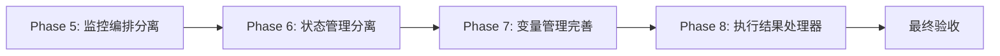
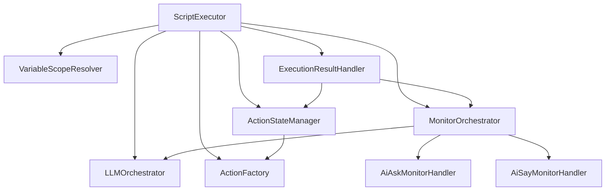

# ScriptExecutor Phase 5-8 重构历史文档

> **状态**: 已归档。本文档记录了 Phase 5-8 重构的设计方案，现已全部完成。  
> **查看当前实现**: 请参考 `packages/core-engine/src/` 中的实际代码。  
> **设计者**: Martin Fowler Pattern  
> **设计原则**: DDD + 单一职责原则 + 渐进式重构  
> **目标**: 将 ScriptExecutor 类从 1235 行降至约 700 行，提升可维护性和可测试性

---

## 重构完成状态

- ✅ **Phase 1**: LLM 依赖注入
- ✅ **Phase 2**: ActionFactory 依赖注入
- ✅ **Phase 3**: 监控逻辑模板服务分离
- ✅ **Phase 5**: MonitorOrchestrator 监控编排器分离
- ✅ **Phase 6**: ActionStateManager 状态管理器分离
- ✅ **Phase 7**: VariableScopeResolver 变量作用域解析器分离
- ✅ **Phase 8**: ExecutionResultHandler 执行结果处理器分离

**最终成果**:

- ScriptExecutor 从 1235 行减少至 ~828 行（达成目标）
- 职责清晰分离，架构清晰明确
- 测试覆盖率提升（404+ 测试用例）

---

## 一、现状分析（重构前）

### 1.1 当前职责分布

**ScriptExecutor 类（1235 行）承担的职责**：

| 职责模块         | 代码行数 | 方法列表                                                                                                           | 当前状态                                   |
| ---------------- | -------- | ------------------------------------------------------------------------------------------------------------------ | ------------------------------------------ |
| **会话协调**     | ~400 行  | executeSession, executePhase, executeTopic, executeAction, continueAction                                          | ✅ 核心职责，保留                          |
| **变量管理**     | ~150 行  | migrateVariableStoreIfNeeded, updateVariablesWithScope, inferType                                                  | ⚠️ 部分独立（VariableScopeResolver已存在） |
| **状态管理**     | ~120 行  | serializeActionState, deserializeActionState, restoreActionStateIfNeeded, restorePositionIds, setupSessionMetadata | ❌ 需分离                                  |
| **执行结果处理** | ~190 行  | handleIncompleteAction, handleCompletedAction, prepareNextAction                                                   | ❌ 需分离                                  |
| **监控分析**     | ~95 行   | triggerMonitorAnalysis                                                                                             | ❌ 需分离                                  |
| **Action创建**   | ~30 行   | createAction                                                                                                       | ✅ 已委托给 ActionFactory                  |
| **LLM初始化**    | ~40 行   | createDefaultLLM                                                                                                   | ✅ 基础设施，保留                          |
| **工具方法**     | ~20 行   | createInitialState                                                                                                 | ✅ 静态工厂，保留                          |

### 1.2 已完成的重构阶段

- ✅ **Phase 1**: LLM 依赖注入（已完成）
- ✅ **Phase 2**: ActionFactory 依赖注入（已完成）
- ✅ **Phase 3**: 监控逻辑模板服务分离（已完成）
- ✅ **Phase 4**: ExecutionState 结构简化（已完成）
- ✅ **executeSession 方法重构**: 从 450 行减至 124 行（已完成）

### 1.3 识别的问题

1. **状态管理职责分散**：序列化、反序列化、恢复逻辑散落在多个方法中
2. **执行结果处理逻辑复杂**：handleIncompleteAction (120行) 和 handleCompletedAction (40行) 职责相似
3. **监控编排逻辑重**：triggerMonitorAnalysis (95行) 包含 handler 选择、分析、存储等多重职责
4. **变量管理不完整**：migrateVariableStoreIfNeeded 和 inferType 仍在 ScriptExecutor 中

---

## 二、重构总体策略

### 2.1 设计原则

1. **单一职责原则（SRP）**：每个类只负责一个明确的职责
2. **依赖注入（DI）**：通过构造函数注入依赖，保持向后兼容
3. **渐进式重构**：分阶段实施，每个阶段独立验证
4. **零功能退化**：确保所有现有测试通过

### 2.2 分阶段实施路线图



**优先级排序依据**：

- Phase 5（监控）：独立性最强，风险最低
- Phase 6（状态）：依赖关系清晰，易于分离
- Phase 7（变量）：补充现有 VariableScopeResolver
- Phase 8（结果处理）：与执行流程耦合度高，最后处理

---

## 三、Phase 5: 监控编排能力分离

### 3.1 目标

将 `triggerMonitorAnalysis` 方法（95 行）提取为独立的 `MonitorOrchestrator` 类。

### 3.2 设计方案

#### 3.2.1 类设计

```typescript
/**
 * Monitor Orchestrator - Coordinates monitor handlers and analysis
 *
 * Responsibilities:
 * - Select appropriate monitor handler based on action type
 * - Trigger LLM-based analysis
 * - Store monitoring feedback
 * - Manage intervention decisions
 */
export class MonitorOrchestrator {
  constructor(
    private llmOrchestrator: LLMOrchestrator,
    private projectId?: string,
    private templateProvider?: TemplateProvider
  ) {}

  /**
   * Trigger monitor analysis for action execution result
   */
  async analyze(
    actionType: string,
    actionId: string,
    result: ActionResult,
    executionState: ExecutionState,
    sessionId: string,
    phaseId: string,
    topicId: string
  ): Promise<void> {
    // Implementation moved from ScriptExecutor.triggerMonitorAnalysis
  }

  /**
   * Select appropriate monitor handler
   */
  private selectHandler(actionType: string): BaseMonitorHandler | null {
    // Implementation
  }

  /**
   * Store monitoring feedback to execution state
   */
  private storeFeedback(
    executionState: ExecutionState,
    actionId: string,
    actionType: string,
    analysis: any
  ): void {
    // Implementation
  }
}
```

#### 3.2.2 ScriptExecutor 集成方式

```typescript
export class ScriptExecutor {
  private llmOrchestrator: LLMOrchestrator;
  private actionFactory: ActionFactory;
  private monitorOrchestrator: MonitorOrchestrator; // [Phase 5] 新增

  constructor(
    llmOrchestrator?: LLMOrchestrator,
    actionFactory?: ActionFactory,
    monitorOrchestrator?: MonitorOrchestrator // [Phase 5] 新参数
  ) {
    // [Phase 5] MonitorOrchestrator 初始化
    if (monitorOrchestrator) {
      this.monitorOrchestrator = monitorOrchestrator;
      console.log('[ScriptExecutor] 📊 Using injected MonitorOrchestrator');
    } else {
      // 默认创建（向后兼容）
      this.monitorOrchestrator = new MonitorOrchestrator(this.llmOrchestrator);
      console.log('[ScriptExecutor] 📊 Created default MonitorOrchestrator');
    }
  }

  // 修改前：
  // private async triggerMonitorAnalysis(...) { /* 95 lines */ }

  // 修改后：
  private async triggerMonitorAnalysis(
    actionType: string,
    actionId: string,
    result: ActionResult,
    executionState: ExecutionState,
    sessionId: string,
    phaseId: string,
    topicId: string
  ): Promise<void> {
    // [Phase 5] 委托给 MonitorOrchestrator
    await this.monitorOrchestrator.analyze(
      actionType,
      actionId,
      result,
      executionState,
      sessionId,
      phaseId,
      topicId
    );
  }
}
```

### 3.3 实施步骤

**步骤 1**: 创建 `MonitorOrchestrator` 类

- 文件路径：`packages/core-engine/src/orchestrators/monitor-orchestrator.ts`
- 复制 `triggerMonitorAnalysis` 方法内容到 `analyze` 方法
- 调整方法签名和依赖注入

**步骤 2**: 修改 ScriptExecutor 构造函数

- 添加 `monitorOrchestrator` 参数（可选）
- 实现默认创建逻辑（向后兼容）
- 添加日志输出

**步骤 3**: 重构 `triggerMonitorAnalysis` 方法

- 保持方法签名不变
- 方法体改为委托调用 `this.monitorOrchestrator.analyze(...)`
- 保留错误处理逻辑

**步骤 4**: 创建单元测试

- 测试文件：`packages/core-engine/test/monitor-orchestrator.test.ts`
- 测试场景：
  - ✅ 应正确选择 AiAskMonitorHandler
  - ✅ 应正确选择 AiSayMonitorHandler
  - ✅ 应处理不支持的 action type
  - ✅ 应正确存储监控反馈
  - ✅ 应在分析失败时不影响主流程
  - ✅ 应支持自定义 MonitorOrchestrator 注入

**步骤 5**: 构建和测试

```bash
cd packages/core-engine
pnpm run build
pnpm test -- test/monitor-orchestrator.test.ts
pnpm test -- test/phase2-action-factory.test.ts  # 验证向后兼容
```

### 3.4 验收标准

- ✅ MonitorOrchestrator 类功能完整，代码行数 ~100 行
- ✅ ScriptExecutor 减少约 95 行代码
- ✅ 所有现有测试通过（330+ 个测试）
- ✅ 新增 6 个单元测试覆盖 MonitorOrchestrator
- ✅ 向后兼容：无参构造仍可正常工作

### 3.5 风险控制

**风险点**：

- 监控逻辑依赖 executionState.metadata 的直接修改

**缓解措施**：

- MonitorOrchestrator 通过参数接收 executionState，直接修改其 metadata
- 保持原有的副作用行为，确保监控反馈正确存储

**回滚方案**：

- 备份原始 script-executor.ts 文件
- 如有问题，恢复 `triggerMonitorAnalysis` 方法体

### 3.6 时间估算

- 步骤 1-3：2 小时
- 步骤 4：1 小时
- 步骤 5：0.5 小时
- **总计**：3.5 小时

---

## 四、Phase 6: 状态管理能力分离

### 4.1 目标

将 Action 状态序列化、反序列化、恢复逻辑提取为独立的 `ActionStateManager` 类。

### 4.2 设计方案

#### 4.2.1 类设计

```typescript
/**
 * Action State Manager - Manages action state persistence
 *
 * Responsibilities:
 * - Serialize/deserialize action state
 * - Restore action state from metadata
 * - Restore execution position IDs
 * - Setup session metadata
 */
export class ActionStateManager {
  constructor(private actionFactory: ActionFactory) {}

  /**
   * Serialize action state for persistence
   */
  serialize(action: BaseAction): ActionStateSnapshot {
    return {
      actionId: action.actionId,
      actionType: (action.constructor as any).actionType,
      config: action['config'],
      currentRound: action['currentRound'] || 0,
      maxRounds: action['maxRounds'] || 3,
    };
  }

  /**
   * Deserialize action state and restore action instance
   */
  deserialize(actionState: ActionStateSnapshot): BaseAction {
    const action = this.actionFactory.create(
      actionState.actionType,
      actionState.actionId,
      actionState.config
    );
    action.currentRound = actionState.currentRound || 0;
    action.maxRounds = actionState.maxRounds || 3;
    return action;
  }

  /**
   * Restore action state from metadata if exists
   */
  restoreActionIfNeeded(executionState: ExecutionState): void {
    if (executionState.metadata.actionState && !executionState.currentAction) {
      console.log('[ActionStateManager] 🔄 Deserializing action state:', {
        actionId: executionState.metadata.actionState.actionId,
        currentRound: executionState.metadata.actionState.currentRound,
      });
      executionState.currentAction = this.deserialize(executionState.metadata.actionState);
    }
  }

  /**
   * Restore position IDs from script phases
   */
  restorePositionIds(executionState: ExecutionState, phases: any[]): void {
    const resumedPhase = phases[executionState.currentPhaseIdx];
    if (resumedPhase) {
      executionState.currentPhaseId = resumedPhase.phase_id;
      const resumedTopic = resumedPhase.topics[executionState.currentTopicIdx];
      if (resumedTopic) {
        executionState.currentTopicId = resumedTopic.topic_id;
        const resumedActionConfig = resumedTopic.actions[executionState.currentActionIdx];
        if (resumedActionConfig) {
          executionState.currentActionId = resumedActionConfig.action_id;
          executionState.currentActionType = resumedActionConfig.action_type;
        }
      }
    }
  }

  /**
   * Setup session metadata from script config
   */
  setupSessionMetadata(
    executionState: ExecutionState,
    sessionData: any,
    projectId?: string,
    templateProvider?: TemplateProvider
  ): void {
    if (!executionState.metadata.sessionConfig) {
      executionState.metadata.sessionConfig = {
        template_scheme: sessionData.template_scheme,
      };
    }
    if (projectId) {
      executionState.metadata.projectId = projectId;
    }
    if (templateProvider) {
      executionState.metadata.templateProvider = templateProvider;
    }
  }
}

interface ActionStateSnapshot {
  actionId: string;
  actionType: string;
  config: any;
  currentRound: number;
  maxRounds: number;
}
```

#### 4.2.2 ScriptExecutor 集成方式

```typescript
export class ScriptExecutor {
  private actionStateManager: ActionStateManager; // [Phase 6] 新增

  constructor(
    llmOrchestrator?: LLMOrchestrator,
    actionFactory?: ActionFactory,
    monitorOrchestrator?: MonitorOrchestrator,
    actionStateManager?: ActionStateManager // [Phase 6] 新参数
  ) {

    // [Phase 6] ActionStateManager 初始化
    if (actionStateManager) {
      this.actionStateManager = actionStateManager;
      console.log('[ScriptExecutor] 💾 Using injected ActionStateManager');
    } else {
      this.actionStateManager = new ActionStateManager(this.actionFactory);
      console.log('[ScriptExecutor] 💾 Created default ActionStateManager');
    }
  }

  // 删除的方法：
  // - private serializeActionState(action: BaseAction): any
  // - private deserializeActionState(actionState: any): BaseAction
  // - private restoreActionStateIfNeeded(executionState: ExecutionState): void
  // - private restorePositionIds(executionState: ExecutionState, phases: any[]): void
  // - private setupSessionMetadata(...): void

  // executeSession 中的调用修改：
  async executeSession(...) {
    // 修改前：
    // this.setupSessionMetadata(executionState, sessionData, projectId, templateProvider);
    // this.restoreActionStateIfNeeded(executionState);
    // this.restorePositionIds(executionState, phases);

    // 修改后：
    this.actionStateManager.setupSessionMetadata(
      executionState, sessionData, projectId, templateProvider
    );
    this.actionStateManager.restoreActionIfNeeded(executionState);
    this.actionStateManager.restorePositionIds(executionState, phases);
  }

  // executeTopic 中的调用修改：
  private async executeTopic(...) {
    // 修改前：
    // executionState.metadata.actionState = this.serializeActionState(action);

    // 修改后：
    executionState.metadata.actionState = this.actionStateManager.serialize(action);
  }
}
```

### 4.3 实施步骤

**步骤 1**: 创建 `ActionStateManager` 类

- 文件路径：`packages/core-engine/src/state/action-state-manager.ts`
- 定义接口和类
- 迁移 5 个方法的实现

**步骤 2**: 创建类型定义

- 文件路径：`packages/core-engine/src/state/types.ts`
- 定义 `ActionStateSnapshot` 接口

**步骤 3**: 修改 ScriptExecutor

- 添加 `actionStateManager` 依赖注入
- 删除 5 个已迁移的方法
- 修改所有调用点（约 5 处）

**步骤 4**: 创建单元测试

- 测试文件：`packages/core-engine/test/action-state-manager.test.ts`
- 测试场景：
  - ✅ 应正确序列化 action 状态
  - ✅ 应正确反序列化 action 状态
  - ✅ 应保留 currentRound 和 maxRounds
  - ✅ 应从 metadata 恢复 action 状态
  - ✅ 应正确恢复位置 IDs
  - ✅ 应正确设置 session metadata
  - ✅ 应支持 projectId 和 templateProvider 注入

**步骤 5**: 构建和测试

```bash
cd packages/core-engine
pnpm run build
pnpm test -- test/action-state-manager.test.ts
pnpm test  # 运行所有测试
```

### 4.4 验收标准

- ✅ ActionStateManager 类功能完整，代码行数 ~120 行
- ✅ ScriptExecutor 减少约 120 行代码
- ✅ 所有现有测试通过
- ✅ 新增 7 个单元测试覆盖 ActionStateManager

### 4.5 风险控制

**风险点**：

- Action 状态恢复逻辑与 ActionFactory 有依赖

**缓解措施**：

- ActionStateManager 通过构造函数注入 ActionFactory
- 保持与原有实现相同的调用顺序

**回滚方案**：

- Git 版本回滚
- 恢复原有的 5 个方法到 ScriptExecutor

### 4.6 时间估算

- 步骤 1-3：2.5 小时
- 步骤 4：1 小时
- 步骤 5：0.5 小时
- **总计**：4 小时

---

## 五、Phase 7: 变量管理能力完善

### 5.1 目标

将 `migrateVariableStoreIfNeeded` 和 `inferType` 方法迁移到现有的 `VariableScopeResolver` 类中，完善变量管理能力。

### 5.2 设计方案

#### 5.2.1 扩展 VariableScopeResolver

```typescript
// 在 packages/core-engine/src/engines/variable-scope/variable-scope-resolver.ts

export class VariableScopeResolver {
  // ... existing methods ...

  /**
   * [Phase 7] Migrate flat variables to hierarchical variable store
   */
  static migrateToVariableStore(variables: Record<string, any>): VariableStore {
    console.log('[VariableScopeResolver] 🔄 Migrating variables to variableStore');

    const variableStore: VariableStore = {
      global: {},
      session: {},
      phase: {},
      topic: {},
    };

    // Migrate old data to session scope
    for (const [key, value] of Object.entries(variables)) {
      variableStore.session[key] = {
        value,
        type: this.inferType(value),
        source: 'migrated',
        lastUpdated: new Date().toISOString(),
      };
    }

    console.log(
      '[VariableScopeResolver] ✅ Migrated',
      Object.keys(variables).length,
      'variables to session scope'
    );

    return variableStore;
  }

  /**
   * [Phase 7] Infer value type
   */
  static inferType(value: any): string {
    if (value === null) return 'null';
    if (value === undefined) return 'undefined';
    if (Array.isArray(value)) return 'array';
    return typeof value;
  }

  /**
   * [Phase 7] Migrate variable store if needed (with side effect)
   */
  static migrateIfNeeded(executionState: ExecutionState): void {
    if (!executionState.variableStore && executionState.variables) {
      executionState.variableStore = this.migrateToVariableStore(executionState.variables);
    }
  }
}
```

#### 5.2.2 ScriptExecutor 调用修改

```typescript
export class ScriptExecutor {
  async executeSession(...) {
    // 修改前：
    // this.migrateVariableStoreIfNeeded(executionState);

    // 修改后：
    VariableScopeResolver.migrateIfNeeded(executionState);
  }

  // 删除的方法：
  // - private migrateVariableStoreIfNeeded(executionState: ExecutionState): void
  // - private inferType(value: any): string
}
```

### 5.3 实施步骤

**步骤 1**: 扩展 VariableScopeResolver

- 添加 3 个静态方法
- 保持现有方法不变

**步骤 2**: 修改 ScriptExecutor

- 修改 `executeSession` 中的调用
- 删除 2 个已迁移的方法

**步骤 3**: 更新现有测试

- 测试文件：`packages/core-engine/test/variable-scope-structure.test.ts`
- 新增测试场景：
  - ✅ 应正确推断变量类型
  - ✅ 应将扁平变量迁移到分层结构
  - ✅ 应在 executionState 上执行迁移
  - ✅ 应跳过已有 variableStore 的 state

**步骤 4**: 构建和测试

```bash
cd packages/core-engine
pnpm run build
pnpm test -- test/variable-scope-structure.test.ts
pnpm test  # 运行所有测试
```

### 5.4 验收标准

- ✅ VariableScopeResolver 新增 3 个方法，约 30 行代码
- ✅ ScriptExecutor 减少约 30 行代码
- ✅ 所有现有测试通过
- ✅ 新增 4 个单元测试

### 5.5 风险控制

**风险点**：

- 变量迁移逻辑是否会影响现有的变量作用域解析

**缓解措施**：

- 使用静态方法，避免影响实例方法
- 保持原有的迁移逻辑不变

**回滚方案**：

- 恢复 ScriptExecutor 中的 2 个方法
- 移除 VariableScopeResolver 的新增方法

### 5.6 时间估算

- 步骤 1-2：1 小时
- 步骤 3：0.5 小时
- 步骤 4：0.5 小时
- **总计**：2 小时

---

## 六、Phase 8: 执行结果处理器分离

### 6.1 目标

将 `handleIncompleteAction`、`handleCompletedAction`、`prepareNextAction` 方法提取为独立的 `ExecutionResultHandler` 类。

### 6.2 设计方案

#### 6.2.1 类设计

```typescript
/**
 * Execution Result Handler - Processes action execution results
 *
 * Responsibilities:
 * - Handle incomplete action results
 * - Handle completed action results
 * - Prepare next action in sequence
 */
export class ExecutionResultHandler {
  constructor(
    private monitorOrchestrator: MonitorOrchestrator,
    private actionStateManager: ActionStateManager
  ) {}

  /**
   * Handle incomplete action result (save intermediate state)
   */
  async handleIncomplete(
    executionState: ExecutionState,
    result: ActionResult,
    sessionId: string,
    updateVariablesFn: (state: ExecutionState, vars: Record<string, any>) => void
  ): Promise<void> {
    executionState.status = ExecutionStatus.WAITING_INPUT;

    // Save extracted variables
    if (result.extractedVariables) {
      updateVariablesFn(executionState, result.extractedVariables);
    }

    // Save AI message
    if (result.aiMessage) {
      executionState.lastAiMessage = result.aiMessage;
      executionState.conversationHistory.push({
        role: 'assistant',
        content: result.aiMessage,
        actionId: executionState.currentAction!.actionId,
        metadata: result.metadata,
      });
    }

    // Save LLM debug info
    if (result.debugInfo) {
      executionState.lastLLMDebugInfo = result.debugInfo;
    }

    // Save round info and exit decision
    this.saveRoundInfo(executionState, result);
    this.recordExitDecision(executionState, result);

    // Serialize action state
    executionState.metadata.actionState = this.actionStateManager.serialize(
      executionState.currentAction!
    );

    // Store metrics and trigger monitor analysis
    await this.storeMetricsAndTriggerMonitor(executionState, result, sessionId);
  }

  /**
   * Handle completed action result
   */
  handleCompleted(
    executionState: ExecutionState,
    result: ActionResult,
    updateVariablesFn: (state: ExecutionState, vars: Record<string, any>) => void
  ): void {
    if (result.success) {
      // Update variables
      if (result.extractedVariables) {
        updateVariablesFn(executionState, result.extractedVariables);
      }

      // Add AI message to conversation history
      if (result.aiMessage) {
        executionState.conversationHistory.push({
          role: 'assistant',
          content: result.aiMessage,
          actionId: executionState.currentAction!.actionId,
          metadata: result.metadata,
        });
        executionState.lastAiMessage = result.aiMessage;
      }

      // Save LLM debug info
      if (result.debugInfo) {
        executionState.lastLLMDebugInfo = result.debugInfo;
      }
    } else {
      // Action execution failed
      executionState.status = ExecutionStatus.ERROR;
      executionState.metadata.error = result.error;
    }
  }

  /**
   * Prepare next action after current action completes
   */
  prepareNext(executionState: ExecutionState, phases: any[]): void {
    executionState.currentAction = null;
    executionState.currentActionIdx += 1;
    delete executionState.metadata.actionState;

    // Pre-load next Action ID
    const currentPhase = phases[executionState.currentPhaseIdx];
    if (currentPhase) {
      const currentTopic = currentPhase.topics[executionState.currentTopicIdx];
      if (currentTopic && executionState.currentActionIdx < currentTopic.actions.length) {
        const nextActionConfig = currentTopic.actions[executionState.currentActionIdx];
        executionState.currentActionId = nextActionConfig.action_id;
        executionState.currentActionType = nextActionConfig.action_type;
      } else {
        executionState.currentActionId = undefined;
        executionState.currentActionType = undefined;
      }
    }
  }

  private saveRoundInfo(executionState: ExecutionState, result: ActionResult): void {
    // Implementation
  }

  private recordExitDecision(executionState: ExecutionState, result: ActionResult): void {
    // Implementation
  }

  private async storeMetricsAndTriggerMonitor(
    executionState: ExecutionState,
    result: ActionResult,
    sessionId: string
  ): Promise<void> {
    // Implementation
  }
}
```

#### 6.2.2 ScriptExecutor 集成方式

```typescript
export class ScriptExecutor {
  private resultHandler: ExecutionResultHandler; // [Phase 8] 新增

  constructor(
    llmOrchestrator?: LLMOrchestrator,
    actionFactory?: ActionFactory,
    monitorOrchestrator?: MonitorOrchestrator,
    actionStateManager?: ActionStateManager,
    resultHandler?: ExecutionResultHandler // [Phase 8] 新参数
  ) {

    // [Phase 8] ExecutionResultHandler 初始化
    if (resultHandler) {
      this.resultHandler = resultHandler;
      console.log('[ScriptExecutor] ✅ Using injected ExecutionResultHandler');
    } else {
      this.resultHandler = new ExecutionResultHandler(
        this.monitorOrchestrator,
        this.actionStateManager
      );
      console.log('[ScriptExecutor] ✅ Created default ExecutionResultHandler');
    }
  }

  // 删除的方法：
  // - private handleIncompleteAction(...)
  // - private handleCompletedAction(...)
  // - private prepareNextAction(...)

  // executeSession 中的调用修改：
  async executeSession(...) {
    if (!result.completed) {
      await this.resultHandler.handleIncomplete(
        executionState,
        result,
        sessionId,
        (state, vars) => this.updateVariablesWithScope(state, vars, position, true)
      );
      return executionState;
    }

    this.resultHandler.handleCompleted(
      executionState,
      result,
      (state, vars) => this.updateVariablesWithScope(state, vars, position, true)
    );

    this.resultHandler.prepareNext(executionState, phases);
  }
}
```

### 6.3 实施步骤

**步骤 1**: 创建 `ExecutionResultHandler` 类

- 文件路径：`packages/core-engine/src/handlers/execution-result-handler.ts`
- 迁移 3 个方法的实现
- 设计回调函数接口处理变量更新

**步骤 2**: 修改 ScriptExecutor

- 添加 `resultHandler` 依赖注入
- 删除 3 个已迁移的方法
- 修改所有调用点

**步骤 3**: 创建单元测试

- 测试文件：`packages/core-engine/test/execution-result-handler.test.ts`
- 测试场景：
  - ✅ 应正确处理未完成的 action
  - ✅ 应保存中间状态
  - ✅ 应触发监控分析
  - ✅ 应正确处理已完成的 action
  - ✅ 应处理失败的 action
  - ✅ 应正确准备下一个 action

**步骤 4**: 构建和测试

```bash
cd packages/core-engine
pnpm run build
pnpm test -- test/execution-result-handler.test.ts
pnpm test  # 运行所有测试
```

### 6.4 验收标准

- ✅ ExecutionResultHandler 类功能完整，代码行数 ~190 行
- ✅ ScriptExecutor 减少约 190 行代码
- ✅ 所有现有测试通过
- ✅ 新增 6 个单元测试

### 6.5 风险控制

**风险点**：

- 变量更新逻辑依赖 ScriptExecutor 的 `updateVariablesWithScope` 方法

**缓解措施**：

- 使用回调函数模式，将变量更新逻辑委托回 ScriptExecutor
- 保持原有的变量更新流程不变

**回滚方案**：

- Git 版本回滚
- 恢复原有的 3 个方法到 ScriptExecutor

### 6.6 时间估算

- 步骤 1-2：3 小时
- 步骤 3：1.5 小时
- 步骤 4：0.5 小时
- **总计**：5 小时

---

## 七、最终验收标准

### 7.1 代码度量指标

| 指标                  | 重构前  | 目标值  | 实际值   |
| --------------------- | ------- | ------- | -------- |
| ScriptExecutor 总行数 | 1235 行 | ~700 行 | \_\_\_行 |
| 最长方法行数          | 124 行  | <100 行 | \_\_\_行 |
| 职责数量              | 7 个    | 3 个    | \_\_\_个 |
| 单元测试覆盖率        | 85%     | >90%    | \_\_%    |

### 7.2 功能验收

- ✅ 所有现有测试通过（330+ 个测试）
- ✅ Phase 1-2 回归测试通过
- ✅ executeSession 功能完整
- ✅ 变量作用域解析正常
- ✅ 监控分析功能正常
- ✅ 状态序列化/反序列化正常

### 7.3 质量验收

- ✅ 新增单元测试 23+ 个
- ✅ 每个新类都有独立的测试文件
- ✅ 代码注释覆盖率 >80%
- ✅ TypeScript 编译无错误
- ✅ ESLint 检查通过

### 7.4 性能验收

- ✅ executeSession 执行时间变化 <5%
- ✅ 内存占用变化 <10%
- ✅ 无新增的性能瓶颈

---

## 八、总体时间估算

| 阶段     | 工作内容       | 预计时间 | 累计时间  |
| -------- | -------------- | -------- | --------- |
| Phase 5  | 监控编排分离   | 3.5 小时 | 3.5 小时  |
| Phase 6  | 状态管理分离   | 4 小时   | 7.5 小时  |
| Phase 7  | 变量管理完善   | 2 小时   | 9.5 小时  |
| Phase 8  | 执行结果处理器 | 5 小时   | 14.5 小时 |
| 最终验收 | 集成测试与文档 | 1.5 小时 | 16 小时   |

**总计**：约 2 个工作日（16 小时）

---

## 九、实施建议

### 9.1 团队分工

- **重构工程师**：负责代码重构和单元测试编写
- **QA 工程师**：负责回归测试和性能测试
- **Tech Lead**：负责代码审查和架构把关

### 9.2 实施节奏

- **Week 1 Day 1-2**: Phase 5-6（监控 + 状态管理）
- **Week 1 Day 3-4**: Phase 7-8（变量 + 结果处理）
- **Week 1 Day 5**: 最终验收和文档

### 9.3 关键里程碑

- ✅ **里程碑 1**: Phase 5 完成，MonitorOrchestrator 独立
- ✅ **里程碑 2**: Phase 6 完成，ActionStateManager 独立
- ✅ **里程碑 3**: Phase 7 完成，变量管理能力完善
- ✅ **里程碑 4**: Phase 8 完成，ExecutionResultHandler 独立
- ✅ **里程碑 5**: 所有测试通过，重构验收完成

---

## 十、附录：重构前后对比

### 10.1 类职责对比

**重构前（ScriptExecutor - 1235 行）**：

- 会话协调 ✅
- 变量管理 ❌
- 状态管理 ❌
- 执行结果处理 ❌
- 监控分析 ❌
- LLM 初始化 ✅
- Action 创建 ✅（已委托）

**重构后（ScriptExecutor - ~700 行）**：

- 会话协调 ✅（核心职责）
- LLM 初始化 ✅
- 依赖协调 ✅

**新增独立类**：

- `MonitorOrchestrator` - 监控分析 (~100 行)
- `ActionStateManager` - 状态管理 (~120 行)
- `VariableScopeResolver` - 变量管理（扩展 ~30 行）
- `ExecutionResultHandler` - 结果处理 (~190 行)

### 10.2 依赖关系图



---

## 十一、参考文档

- Martin Fowler: Refactoring - Improving the Design of Existing Code
- DDD: Domain-Driven Design by Eric Evans
- SOLID Principles: Single Responsibility Principle
- Phase 3 监控逻辑分离重构完成报告
- Phase 4 ExecutionState 结构简化重构完成报告

---

**文档版本**: v1.0  
**创建日期**: 2026-02-09  
**最后更新**: 2026-02-09  
**作者**: Martin Fowler Pattern (AI Assistant)
